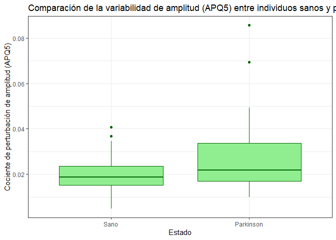
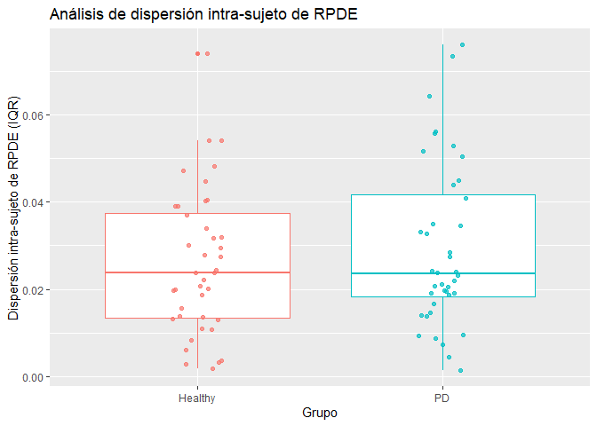
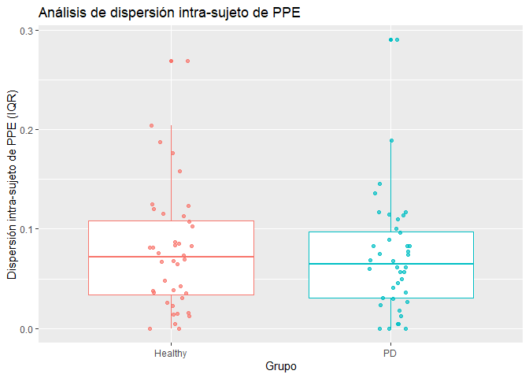

Análisis del Dataset *Parkinson Replicated Acoustic Features*
================
Elena Barro León, Raúl Bonillo Pulido y Paula Merino Purificacion
2026-01-21

<!-- Antes de comenzar !!!
debes crear el archivo con las referencias de R y los paquetes que vayas a utilizar. Puedes actualizar
el archivo en cualquier momento, sólo copia en la terminal el siguiente código y añade el nuevo
paquete a la lista, se creará un nuevo archivo con las referencias en el formato adecuado "BibTeX".
De forma automática incluye la referencia de R-->
<!-- Para poder cambiar el diseño de mi archivo HTLM utilizo lenguaje CSS que  controla la apariencia del contenido: colores, tipografía, márgenes, bordes, alineación, entre otros aspectos. -->

<!-- knitr::write_bib(c(.packages(), 'dplyr', 'ggplot2', 'knitr', readxl'), 'libraries.bib') -->

## Introducción

### 1.1 El Parkinson

La **Enfermedad de Parkinson (EP)** es el segundo trastorno
neurodegenerativo más común, afectando significativamente a la población
mayor de 65 años en Europa. [^1]

Ante la necesidad de métodos diagnósticos complementarios, las
grabaciones de voz se han postulado como un biomarcador potencial no
invasivo y de bajo coste. Esto se debe a que la EP provoca disfonía, que
se caracteriza por inestabilidad del tono y el volumen.[^2]

### 1.2 Los datos

<!-- cargamos las librerias que vamos a utilizar. Como queremos que el código se ejecute, pero no que aparezca en el documento final, excluímos los avisos y mensajes echo=FALSE (Elimina el código, solo sale el resultado), warning=FALSE (No aparece el error ni el mensaje de error), message=FALSE (Se ejecuta el código pero no aparece el mensaje) -->
<!-- Leemos los datos que vamos a utilizar. Como queremos que el código se ejecute, pero no que aparezca en el documento final, excluímos los avisos y mensajes echo=FALSE (Elimina el código, solo sale el resultado), warning=FALSE (No aparece el error ni el mensaje de error), message=FALSE (Se ejecuta el código pero no aparece el mensaje) -->
<!-- Se comprueba la existencia de datos perdidos en el conjunto de datos. Como queremos que el código se ejecute, pero no que aparezca en el documento final, excluímos los avisos y mensajes:  echo=FALSE (Elimina el código, solo sale el resultado), warning=FALSE (No aparece el error ni el mensaje de error), message=FALSE (Se ejecuta el código pero no aparece el mensaje)  El resultado indica que no hay valores perdidos, por lo que se utilizan todas las observaciones disponibles en el análisis. -->

| ID | Recording | Status | Gender | Jitter_rel | Jitter_abs | Jitter_RAP | Jitter_PPQ | Shim_loc | Shim_dB | Shim_APQ3 | Shim_APQ5 | Shi_APQ11 | HNR05 | HNR15 | HNR25 | HNR35 | HNR38 | RPDE | DFA | PPE | GNE | MFCC0 | MFCC1 | MFCC2 | MFCC3 | MFCC4 | MFCC5 | MFCC6 | MFCC7 | MFCC8 | MFCC9 | MFCC10 | MFCC11 | MFCC12 | Delta0 | Delta1 | Delta2 | Delta3 | Delta4 | Delta5 | Delta6 | Delta7 | Delta8 | Delta9 | Delta10 | Delta11 | Delta12 |
|:--:|:--:|:--:|:--:|:--:|:--:|:--:|:--:|:--:|:--:|:--:|:--:|:--:|:--:|:--:|:--:|:--:|:--:|:--:|:--:|:--:|:--:|:--:|:--:|:--:|:--:|:--:|:--:|:--:|:--:|:--:|:--:|:--:|:--:|:--:|:--:|:--:|:--:|:--:|:--:|:--:|:--:|:--:|:--:|:--:|:--:|:--:|:--:|
| CONT-01 | 1 | 0 | 1 | 0.255 | 0.000 | 0.001 | 0.002 | 0.030 | 0.263 | 0.017 | 0.020 | 0.022 | 5.943 | 6.073 | 7.188 | 7.762 | 7.753 | 0.250 | 0.599 | 0.005 | 0.900 | 1.319 | 1.336 | 1.302 | 1.329 | 1.284 | 1.209 | 1.239 | 1.277 | 1.332 | 1.347 | 1.367 | 1.402 | 1.393 | 1.397 | 1.372 | 1.390 | 140.770 | 1.417 | 1.380 | 1.420 | 1.451 | 1.440 | 1.403 | 1.405 | 1.416 | 1.354 |
| CONT-01 | 2 | 0 | 1 | 0.370 | 0.000 | 0.002 | 0.002 | 0.023 | 0.202 | 0.013 | 0.014 | 0.017 | 5.983 | 6.265 | 7.437 | 7.998 | 8.026 | 0.271 | 0.581 | 0.076 | 0.887 | 1.215 | 1.221 | 1.265 | 1.187 | 1.256 | 1.246 | 1.283 | 1.302 | 1.308 | 1.316 | 1.370 | 1.373 | 1.344 | 1.302 | 1.347 | 1.365 | 1.331 | 1.227 | 121.337 | 1.352 | 135.424 | 1.365 | 1.322 | 1.314 | 1.318 | 1.323 |
| CONT-01 | 3 | 0 | 1 | 0.235 | 0.000 | 0.001 | 0.002 | 0.019 | 0.167 | 0.011 | 0.013 | 0.013 | 5.729 | 6.185 | 7.366 | 7.893 | 7.903 | 0.204 | 0.601 | 0.005 | 0.889 | 1.426 | 1.220 | 1.344 | 1.346 | 1.339 | 1.334 | 1.391 | 1.349 | 1.349 | 1.340 | 1.362 | 1.313 | 1.277 | 1.312 | 1.352 | 1.243 | 1.412 | 132.467 | 1.276 | 1.429 | 1.455 | 1.368 | 1.438 | 1.388 | 1.305 | 1.305 |
| CONT-02 | 1 | 0 | 0 | 0.293 | 0.000 | 0.001 | 0.001 | 0.025 | 0.209 | 0.015 | 0.016 | 0.018 | 621.795 | 6.867 | 7.983 | 843.676 | 8.425 | 0.261 | 0.625 | 0.031 | 0.876 | 1.495 | 160.298 | 1.572 | 1.498 | 1.561 | 1.590 | 1.626 | 1.645 | 1.666 | 161.848 | 1.493 | 1.459 | 1.383 | 1.379 | 1.217 | 1.309 | 1.501 | 1.534 | 1.323 | 1.496 | 1.472 | 1.643 | 1.551 | 1.638 | 1.604 | 1.621 |
| CONT-02 | 2 | 0 | 0 | 0.231 | 0.000 | 0.001 | 0.001 | 0.013 | 0.116 | 0.006 | 0.008 | 0.011 | 6.753 | 7.497 | 8.572 | 9.103 | 9.114 | 0.222 | 0.602 | 0.036 | 0.902 | 1.516 | 1.581 | 1.542 | 1.613 | 1.501 | 1.258 | 1.385 | 1.452 | 1.498 | 1.421 | 1.557 | 1.187 | 1.576 | 1.252 | 157.733 | 1.583 | 1.508 | 133.451 | 1.610 | 1.685 | 1.417 | 1.574 | 164.008 | 1.533 | 1.297 | 1.382 |
| CONT-02 | 3 | 0 | 0 | 0.165 | 0.000 | 0.001 | 0.001 | 0.011 | 0.095 | 0.006 | 0.007 | 0.009 | 7.077 | 7.662 | 8.806 | 9.282 | 9.308 | 0.251 | 0.557 | 0.006 | 0.847 | 155.166 | 1.500 | 1.464 | 146.422 | 1.383 | 162.544 | 1.708 | 1.738 | 1.420 | 1.710 | 1.310 | 1.552 | 1.458 | 1.677 | 1.437 | 1.497 | 1.480 | 1.675 | 1.373 | 1.709 | 1.444 | 13.834 | 1.625 | 1.651 | 1.652 | 1.427 |
| CONT-03 | 1 | 0 | 1 | 0.225 | 0.000 | 0.001 | 0.001 | 0.017 | 0.148 | 0.010 | 0.011 | 0.013 | 762.689 | 7.733 | 8.621 | 9.612 | 9.772 | 0.262 | 0.573 | 0.006 | 0.982 | 1.501 | 1.011 | 0.859 | 1.448 | 1.694 | 1.637 | 1.568 | 141.278 | 1.737 | 1.702 | 1.593 | 1.379 | 1.384 | 1.698 | 1.471 | 1.406 | 1.712 | 1.419 | 150.182 | 1.503 | 1.486 | 1.648 | 134.595 | 1.741 | 1.828 | 1.655 |
| CONT-03 | 2 | 0 | 1 | 0.231 | 0.000 | 0.001 | 0.002 | 0.018 | 0.158 | 0.009 | 0.012 | 0.014 | 6.411 | 6.545 | 747.709 | 8.423 | 8.570 | 0.201 | 0.579 | 0.039 | 0.986 | 1.490 | 1.232 | 142.799 | 1.476 | 1.527 | 1.419 | 1.463 | 1.499 | 1.346 | 1.570 | 1.482 | 1.492 | 1.410 | 1.444 | 1.515 | 1.308 | 1.535 | 162.797 | 1.332 | 1.254 | 159.874 | 1.297 | 1.526 | 1.647 | 1.662 | 160.965 |
| CONT-03 | 3 | 0 | 1 | 0.229 | 0.000 | 0.001 | 0.002 | 0.020 | 0.176 | 0.011 | 0.013 | 0.016 | 8.051 | 7.955 | 8.908 | 9.762 | 989.459 | 0.198 | 0.619 | 0.082 | 0.961 | 1.427 | 1.617 | 1.435 | 1.477 | 1.512 | 1.503 | 1.460 | 1.319 | 1.455 | 1.314 | 1.596 | 1.370 | 1.442 | 1.408 | 1.353 | 1.626 | 1.620 | 1.431 | 1.598 | 1.394 | 1.459 | 1.313 | 144.746 | 13.547 | 1.585 | 1.334 |
| CONT-04 | 1 | 0 | 1 | 1.310 | 0.000 | 0.008 | 0.006 | 0.031 | 0.271 | 0.019 | 0.016 | 0.020 | 6.862 | 7.818 | 8.949 | 9.691 | 983.105 | 0.295 | 0.743 | 0.782 | 0.908 | 1.577 | 107.300 | 0.920 | 1.547 | 15.144 | 1.571 | 1.573 | 1.592 | 1.494 | 1.585 | 1.540 | 1.591 | 1.454 | 1.598 | 1.526 | 1.362 | 1.541 | 1.347 | 152.614 | 1.428 | 1.516 | 1.491 | 157.952 | 1.374 | 1.550 | 1.572 |
| CONT-04 | 2 | 0 | 1 | 10.647 | 0.000 | 0.006 | 0.006 | 0.024 | 0.212 | 0.013 | 0.014 | 0.020 | 8.230 | 9.061 | 1.028 | 1.099 | 1.112 | 0.292 | 0.766 | 0.656 | 0.905 | 1.549 | 1.606 | 1.592 | 1.530 | 1.617 | 1.547 | 1.590 | 1.508 | 1.453 | 151.944 | 1.535 | 156.697 | 1.560 | 1.549 | 1.512 | 1.462 | 139.627 | 1.424 | 1.442 | 1.437 | 1.531 | 1.453 | 1.555 | 11.953 | 1.555 | 1.695 |
| CONT-04 | 3 | 0 | 1 | 10.417 | 0.000 | 0.006 | 0.006 | 0.023 | 0.200 | 0.012 | 0.014 | 0.019 | 7.562 | 8.554 | 9.759 | 10.500 | 1.063 | 0.290 | 0.765 | 0.819 | 0.868 | 1.666 | 1.709 | 1.709 | 1.737 | 1.712 | 1.678 | 13.388 | 1.501 | 1.616 | 1.779 | 169.327 | 1.729 | 1.674 | 1.666 | 1.554 | 1.540 | 1.615 | 1.570 | 1.635 | 1.535 | 1.712 | 1.450 | 1.773 | 1.529 | 1.760 | 1.478 |
| CONT-05 | 1 | 0 | 0 | 0.790 | 0.000 | 0.004 | 0.005 | 0.039 | 0.333 | 0.021 | 0.025 | 0.035 | 7.897 | 9.221 | 1.053 | 113.153 | 1.148 | 0.319 | 0.767 | 0.257 | 0.913 | 1.373 | 125.122 | 1.540 | 1.552 | 1.747 | 1.686 | 1.302 | 1.351 | 1.351 | 1.260 | 1.483 | 1.498 | 1.567 | 1.640 | 1.334 | 1.397 | 1.346 | 1.221 | 1.441 | 1.518 | 1.584 | 16.285 | 1.385 | 1.426 | 151.507 | 1.305 |
| CONT-05 | 2 | 0 | 0 | 0.530 | 0.000 | 0.002 | 0.003 | 0.035 | 0.304 | 0.019 | 0.022 | 0.027 | 7.415 | 8.659 | 9.964 | 1.084 | 1.105 | 0.331 | 0.742 | 0.011 | 0.949 | 1.444 | 1.509 | 1.512 | 1.276 | 1.321 | 1.376 | 1.292 | 1.565 | 1.627 | 1.664 | 1.631 | 1.673 | 1.443 | 1.355 | 1.505 | 1.323 | 1.497 | 1.625 | 1.774 | 1.505 | 1.872 | 1.295 | 1.464 | 1.375 | 135.803 | 1.662 |
| CONT-05 | 3 | 0 | 0 | 0.484 | 0.000 | 0.002 | 0.003 | 0.033 | 0.288 | 0.017 | 0.020 | 0.028 | 6.011 | 7.269 | 8.591 | 9.370 | 9.534 | 0.319 | 0.747 | 0.011 | 0.939 | 1.369 | 1.394 | 1.637 | 1.595 | 1.672 | 1.439 | 1.492 | 1.248 | 0.978 | 1.508 | 1.616 | 1.610 | 1.746 | 140.826 | 1.507 | 1.410 | 1.341 | 16.514 | 1.721 | 1.670 | 1.801 | 1.300 | 1.545 | 1.316 | 137.779 | 1.687 |
| CONT-06 | 1 | 0 | 1 | 0.405 | 0.000 | 0.002 | 0.002 | 0.016 | 0.137 | 0.009 | 0.010 | 0.011 | 5.935 | 6.448 | 763.427 | 818.554 | 8.337 | 0.283 | 0.637 | 0.246 | 0.966 | 139.347 | 1.292 | 1.158 | 1.464 | 1.483 | 1.279 | 1.449 | 1.232 | 1.339 | 1.371 | 1.312 | 1.436 | 1.484 | 1.483 | 1.508 | 146.466 | 1.239 | 1.469 | 122.406 | 130.753 | 13.938 | 135.923 | 1.429 | 1.331 | 1.408 | 1.359 |
| CONT-06 | 2 | 0 | 1 | 0.415 | 0.000 | 0.002 | 0.003 | 0.023 | 0.200 | 0.013 | 0.014 | 0.015 | 6.583 | 7.301 | 8.562 | 9.151 | 9.297 | 0.291 | 0.668 | 0.252 | 0.942 | 132.957 | 0.817 | 0.667 | 137.597 | 1.485 | 155.913 | 1.450 | 1.563 | 137.229 | 1.456 | 144.474 | 148.211 | 1.550 | 1.490 | 1.519 | 1.510 | 1.493 | 1.440 | 1.521 | 130.619 | 163.923 | 1.331 | 1.529 | 1.409 | 1.477 | 1.433 |
| CONT-06 | 3 | 0 | 1 | 0.548 | 0.000 | 0.003 | 0.003 | 0.048 | 0.415 | 0.029 | 0.032 | 0.033 | 4.705 | 5.661 | 6.851 | 7.393 | 7.520 | 0.373 | 0.695 | 0.277 | 0.925 | 1.399 | 1.274 | 1.273 | 1.277 | 1.355 | 142.104 | 1.331 | 141.842 | 1.187 | 1.479 | 1.218 | 1.347 | 1.382 | 1.335 | 1.434 | 1.331 | 1.579 | 1.320 | 1.556 | 1.194 | 1.528 | 1.188 | 1.385 | 136.005 | 1.347 | 1.456 |
| CONT-07 | 1 | 0 | 0 | 0.528 | 0.000 | 0.003 | 0.003 | 0.056 | 0.490 | 0.031 | 0.036 | 0.045 | 8.350 | 8.689 | 9.680 | 1.063 | 1.091 | 0.325 | 0.635 | 0.513 | 0.946 | 1.662 | 1.503 | 1.717 | 1.526 | 142.326 | 1.618 | 1.196 | 1.614 | 1.835 | 1.396 | 1.443 | 1.616 | 1.564 | 1.728 | 137.402 | 1.725 | 1.434 | 1.523 | 118.633 | 1.800 | 1.190 | 1.706 | 1.514 | 1.612 | 1.790 | 1.649 |
| CONT-07 | 2 | 0 | 0 | 0.643 | 0.000 | 0.003 | 0.004 | 0.047 | 0.408 | 0.026 | 0.030 | 0.034 | 7.239 | 7.505 | 8.408 | 9.261 | 9.577 | 0.366 | 0.603 | 0.379 | 0.973 | 1.691 | 1.718 | 1.757 | 1.635 | 1.724 | 1.242 | 1.507 | 1.311 | 138.737 | 1.418 | 1.486 | 1.543 | 1.602 | 1.680 | 1.730 | 1.664 | 1.707 | 1.591 | 1.545 | 1.553 | 1.549 | 149.749 | 1.538 | 1.536 | 1.534 | 1.552 |
| CONT-07 | 3 | 0 | 0 | 0.458 | 0.000 | 0.002 | 0.003 | 0.040 | 0.350 | 0.022 | 0.027 | 0.031 | 6.878 | 7.174 | 8.139 | 8.994 | 9.350 | 0.341 | 0.614 | 0.435 | 0.982 | 1.649 | 1.534 | 1.682 | 1.601 | 1.519 | 1.252 | 1.660 | 1.361 | 1.639 | 172.591 | 16.103 | 1.789 | 1.764 | 1.764 | 1.371 | 1.638 | 1.301 | 1.495 | 1.540 | 1.444 | 161.939 | 158.917 | 1.384 | 1.583 | 1.585 | 1.367 |
| CONT-08 | 1 | 0 | 1 | 0.584 | 0.000 | 0.003 | 0.004 | 0.045 | 0.378 | 0.028 | 0.025 | 0.027 | 5.714 | 5.865 | 6.947 | 7.658 | 782.285 | 0.305 | 0.620 | 0.209 | 0.900 | 1.426 | 1.083 | 0.965 | 141.906 | 1.411 | 1.465 | 1.382 | 1.344 | 1.355 | 1.324 | 1.508 | 1.381 | 143.742 | 127.914 | 1.378 | 127.221 | 1.411 | 1.409 | 1.427 | 1.451 | 1.241 | 1.428 | 1.232 | 1.300 | 1.449 | 1.347 |
| CONT-08 | 2 | 0 | 1 | 0.633 | 0.000 | 0.003 | 0.004 | 0.023 | 0.201 | 0.013 | 0.015 | 0.018 | 5.735 | 5.686 | 6.697 | 7.493 | 7.560 | 0.307 | 0.583 | 0.261 | 0.916 | 1.431 | 1.394 | 1.424 | 1.440 | 1.381 | 142.657 | 1.408 | 1.414 | 1.398 | 1.351 | 1.383 | 1.435 | 1.417 | 1.407 | 1.381 | 1.388 | 1.428 | 1.408 | 1.427 | 1.360 | 1.435 | 1.356 | 1.371 | 1.371 | 1.369 | 1.372 |
| CONT-08 | 3 | 0 | 1 | 0.408 | 0.000 | 0.002 | 0.002 | 0.032 | 0.279 | 0.019 | 0.019 | 0.022 | 5.945 | 5.662 | 663.139 | 7.312 | 7.367 | 0.252 | 0.577 | 0.011 | 0.913 | 1.222 | 1.326 | 1.363 | 1.267 | 1.358 | 1.393 | 1.312 | 1.369 | 1.360 | 1.400 | 1.384 | 1.312 | 1.418 | 1.427 | 140.865 | 1.352 | 1.389 | 1.367 | 1.417 | 1.421 | 1.433 | 1.332 | 135.365 | 1.369 | 141.817 | 141.089 |
| CONT-09 | 1 | 0 | 0 | 0.534 | 0.000 | 0.003 | 0.003 | 0.053 | 0.456 | 0.029 | 0.033 | 0.042 | 7.147 | 7.594 | 876.384 | 9.203 | 9.313 | 0.379 | 0.713 | 0.079 | 0.889 | 1.247 | 1.239 | 1.174 | 1.247 | 1.201 | 1.198 | 1.238 | 1.287 | 1.263 | 1.259 | 1.256 | 1.222 | 124.822 | 1.157 | 1.160 | 117.806 | 1.205 | 1.247 | 116.694 | 1.254 | 1.214 | 1.160 | 116.774 | 109.022 | 1.192 | 1.166 |
| CONT-09 | 2 | 0 | 0 | 0.680 | 0.000 | 0.004 | 0.004 | 0.061 | 0.542 | 0.035 | 0.035 | 0.048 | 5.479 | 5.841 | 6.905 | 7.388 | 7.437 | 0.406 | 0.682 | 0.160 | 0.871 | 1.142 | 1.162 | 1.201 | 1.144 | 1.142 | 1.162 | 1.092 | 1.132 | 1.053 | 1.162 | 1.096 | 1.071 | 1.155 | 116.777 | 1.069 | 1.158 | 1.185 | 1.130 | 1.187 | 1.094 | 1.108 | 1.117 | 1.153 | 1.117 | 1.131 | 1.157 |
| CONT-09 | 3 | 0 | 0 | 0.503 | 0.000 | 0.002 | 0.003 | 0.057 | 0.492 | 0.032 | 0.036 | 0.041 | 6.855 | 7.404 | 8.573 | 9.036 | 9.102 | 0.392 | 0.691 | 0.076 | 0.895 | 1.262 | 1.296 | 1.319 | 1.356 | 1.299 | 1.293 | 1.289 | 1.248 | 127.851 | 1.265 | 1.249 | 1.221 | 1.178 | 1.351 | 125.359 | 1.270 | 1.371 | 1.256 | 1.347 | 1.363 | 1.271 | 1.241 | 1.189 | 1.397 | 1.192 | 1.290 |
| CONT-10 | 1 | 0 | 1 | 0.192 | 0.000 | 0.001 | 0.001 | 0.016 | 0.135 | 0.008 | 0.010 | 0.014 | 8.794 | 8.503 | 9.559 | 1.008 | 1.025 | 0.188 | 0.471 | 0.050 | 0.961 | 1.593 | 1.191 | 0.984 | 1.414 | 1.777 | 1.493 | 1.370 | 1.555 | 1.483 | 130.906 | 1.690 | 1.406 | 1.533 | 1.656 | 1.573 | 1.706 | 151.831 | 1.565 | 1.484 | 1.740 | 1.335 | 1.527 | 1.554 | 1.326 | 1.744 | 1.472 |
| CONT-10 | 2 | 0 | 1 | 0.245 | 0.000 | 0.001 | 0.002 | 0.012 | 0.101 | 0.006 | 0.007 | 0.009 | 837.328 | 8.386 | 9.411 | 9.951 | 1.011 | 0.187 | 0.505 | 0.005 | 0.945 | 1.643 | 1.475 | 1.312 | 149.470 | 1.646 | 1.352 | 1.258 | 1.619 | 1.260 | 1.570 | 1.394 | 1.610 | 1.519 | 149.822 | 1.487 | 1.490 | 1.489 | 1.419 | 1.541 | 1.291 | 1.634 | 1.416 | 1.551 | 1.484 | 1.430 | 1.559 |
| CONT-10 | 3 | 0 | 1 | 0.203 | 0.000 | 0.001 | 0.001 | 0.021 | 0.179 | 0.009 | 0.011 | 0.021 | 6.804 | 6.810 | 7.820 | 8.252 | 8.396 | 0.204 | 0.518 | 0.005 | 0.959 | 1.532 | 0.953 | 0.813 | 1.630 | 1.511 | 171.216 | 1.349 | 1.492 | 1.478 | 1.613 | 1.716 | 1.600 | 1.716 | 1.563 | 16.606 | 1.541 | 1.719 | 1.570 | 1.728 | 1.514 | 1.568 | 1.644 | 1.555 | 1.442 | 1.545 | 1.264 |
| CONT-11 | 1 | 0 | 0 | 0.600 | 0.000 | 0.003 | 0.004 | 0.073 | 0.630 | 0.043 | 0.044 | 0.049 | 5.305 | 5.668 | 6.716 | 7.413 | 7.592 | 0.465 | 0.668 | 0.370 | 0.850 | 1.231 | 112.254 | 1.114 | 1.260 | 1.121 | 1.199 | 1.076 | 1.207 | 1.164 | 129.455 | 1.197 | 1.121 | 1.186 | 115.300 | 1.219 | 1.076 | 1.243 | 1.163 | 1.241 | 1.221 | 115.450 | 1.178 | 1.116 | 1.172 | 123.659 | 1.202 |
| CONT-11 | 2 | 0 | 0 | 0.412 | 0.000 | 0.002 | 0.002 | 0.046 | 0.400 | 0.026 | 0.031 | 0.034 | 6.380 | 6.522 | 7.338 | 8.043 | 8.248 | 0.317 | 0.591 | 0.292 | 0.923 | 1.334 | 1.243 | 131.991 | 1.307 | 1.362 | 1.363 | 1.351 | 1.236 | 1.265 | 1.336 | 1.327 | 1.328 | 1.305 | 1.281 | 1.307 | 1.296 | 1.346 | 1.328 | 1.225 | 1.226 | 1.186 | 1.325 | 1.252 | 1.330 | 1.368 | 1.276 |
| CONT-11 | 3 | 0 | 0 | 0.531 | 0.000 | 0.003 | 0.003 | 0.055 | 0.508 | 0.030 | 0.036 | 0.040 | 525.872 | 5.485 | 6.418 | 7.227 | 7.438 | 0.385 | 0.600 | 0.300 | 0.929 | 1.129 | 1.039 | 12.245 | 1.019 | 1.135 | 1.106 | 0.995 | 0.654 | 1.139 | 1.175 | 1.274 | 1.228 | 1.208 | 1.159 | 1.239 | 130.432 | 1.232 | 1.276 | 1.200 | 1.335 | 1.280 | 1.350 | 134.824 | 1.349 | 1.348 | 1.371 |
| CONT-12 | 1 | 0 | 0 | 0.514 | 0.000 | 0.003 | 0.003 | 0.026 | 0.225 | 0.014 | 0.015 | 0.020 | 5.901 | 68.330 | 7.950 | 866.497 | 8.804 | 0.299 | 0.724 | 0.265 | 0.905 | 1.168 | 1.082 | 1.092 | 1.106 | 1.256 | 1.267 | 1.178 | 1.284 | 1.119 | 122.254 | 12.164 | 1.073 | 1.274 | 1.093 | 1.292 | 1.329 | 121.850 | 1.369 | 1.212 | 1.287 | 1.073 | 1.305 | 1.129 | 1.280 | 1.281 | 1.206 |
| CONT-12 | 2 | 0 | 0 | 1.660 | 0.000 | 0.010 | 0.009 | 0.055 | 0.517 | 0.031 | 0.033 | 0.037 | 7.897 | 884.534 | 1.014 | 1.095 | 1.105 | 0.372 | 0.722 | 0.505 | 0.883 | 1.380 | 1.416 | 1.270 | 1.654 | 1.329 | 1.503 | 1.231 | 1.590 | 1.259 | 154.908 | 14.125 | 1.490 | 1.455 | 1.401 | 1.420 | 1.171 | 1.499 | 1.224 | 1.487 | 1.195 | 1.543 | 1.200 | 1.510 | 1.189 | 1.482 | 1.231 |
| CONT-12 | 3 | 0 | 0 | 11.401 | 0.000 | 0.006 | 0.006 | 0.042 | 0.380 | 0.023 | 0.024 | 0.032 | 1.012 | 1.096 | 1.207 | 1.282 | 1.299 | 0.380 | 0.760 | 0.397 | 0.894 | 1.565 | 1.038 | 0.901 | 1.518 | 1.551 | 1.572 | 1.616 | 1.574 | 1.505 | 1.473 | 1.534 | 1.530 | 1.543 | 1.445 | 1.315 | 1.445 | 1.359 | 141.833 | 145.329 | 1.223 | 1.437 | 1.179 | 1.457 | 1.133 | 1.522 | 1.177 |
| CONT-13 | 1 | 0 | 1 | 0.198 | 0.000 | 0.001 | 0.002 | 0.021 | 0.180 | 0.010 | 0.013 | 0.018 | 6.473 | 6.642 | 7.695 | 8.232 | 831.917 | 0.218 | 0.494 | 0.005 | 0.950 | 1.470 | 0.800 | 0.675 | 1.440 | 1.449 | 1.397 | 147.568 | 1.398 | 1.450 | 1.425 | 1.409 | 1.426 | 1.472 | 1.395 | 1.459 | 1.392 | 1.481 | 1.412 | 1.464 | 1.454 | 1.465 | 134.915 | 1.443 | 1.421 | 1.414 | 1.422 |
| CONT-13 | 2 | 0 | 1 | 0.200 | 0.000 | 0.001 | 0.002 | 0.023 | 0.211 | 0.011 | 0.015 | 0.021 | 6.176 | 6.549 | 7.564 | 7.993 | 8.113 | 0.199 | 0.512 | 0.005 | 0.938 | 1.370 | 1.325 | 1.396 | 1.207 | 1.389 | 1.331 | 1.375 | 1.421 | 1.391 | 1.388 | 1.358 | 1.413 | 1.193 | 1.406 | 1.395 | 1.406 | 1.354 | 1.229 | 1.448 | 1.214 | 1.468 | 1.240 | 1.400 | 1.459 | 1.364 | 1.370 |
| CONT-13 | 3 | 0 | 1 | 0.192 | 0.000 | 0.001 | 0.002 | 0.019 | 0.170 | 0.010 | 0.012 | 0.015 | 6.244 | 6.420 | 752.684 | 8.072 | 817.860 | 0.227 | 0.540 | 0.005 | 0.938 | 1.430 | 1.328 | 1.415 | 1.402 | 1.331 | 1.399 | 1.350 | 1.398 | 1.418 | 1.431 | 1.274 | 1.377 | 1.331 | 1.203 | 1.391 | 1.279 | 1.189 | 1.407 | 1.289 | 1.212 | 1.380 | 1.302 | 119.648 | 1.345 | 1.269 | 1.194 |
| CONT-14 | 1 | 0 | 1 | 0.497 | 0.000 | 0.003 | 0.003 | 0.033 | 0.285 | 0.018 | 0.020 | 0.025 | 4.404 | 4.676 | 5.582 | 6.096 | 6.196 | 0.306 | 0.650 | 0.290 | 0.883 | 1.154 | 1.115 | 1.167 | 1.105 | 1.170 | 1.167 | 1.121 | 1.136 | 1.117 | 1.162 | 1.128 | 1.158 | 111.141 | 1.143 | 1.157 | 1.223 | 1.115 | 1.254 | 1.196 | 1.091 | 1.142 | 1.077 | 111.208 | 1.177 | 1.133 | 1.144 |
| CONT-14 | 2 | 0 | 1 | 0.536 | 0.000 | 0.002 | 0.003 | 0.027 | 0.236 | 0.014 | 0.017 | 0.023 | 6.000 | 6.570 | 7.821 | 841.777 | 8.641 | 0.334 | 0.651 | 0.394 | 0.905 | 1.327 | 1.551 | 1.394 | 1.249 | 1.443 | 12.626 | 128.502 | 1.481 | 1.308 | 1.419 | 1.590 | 1.539 | 1.440 | 1.407 | 1.485 | 1.479 | 1.493 | 1.342 | 144.690 | 1.401 | 147.889 | 1.414 | 1.503 | 1.433 | 155.357 | 1.543 |
| CONT-14 | 3 | 0 | 1 | 0.720 | 0.000 | 0.004 | 0.004 | 0.033 | 0.282 | 0.018 | 0.019 | 0.025 | 6.446 | 7.053 | 8.218 | 8.847 | 9.003 | 0.354 | 0.666 | 0.426 | 0.904 | 1.404 | 0.951 | 0.801 | 1.506 | 1.323 | 1.431 | 1.381 | 1.346 | 13.842 | 1.409 | 1.429 | 1.372 | 113.997 | 144.303 | 1.245 | 1.410 | 144.086 | 1.295 | 1.489 | 1.390 | 142.127 | 14.589 | 1.415 | 1.485 | 144.068 | 1.481 |
| CONT-15 | 1 | 0 | 0 | 0.633 | 0.000 | 0.003 | 0.004 | 0.027 | 0.236 | 0.015 | 0.017 | 0.022 | 6.049 | 7.154 | 8.365 | 9.053 | 9.122 | 0.357 | 0.699 | 0.215 | 0.967 | 1.554 | 1.510 | 1.449 | 1.403 | 1.397 | 1.562 | 1.226 | 144.964 | 1.384 | 1.588 | 1.359 | 1.536 | 1.420 | 1.491 | 1.454 | 1.526 | 149.162 | 1.498 | 1.485 | 1.487 | 1.474 | 1.492 | 1.429 | 1.358 | 1.291 | 1.352 |
| CONT-15 | 2 | 0 | 0 | 0.326 | 0.000 | 0.001 | 0.002 | 0.031 | 0.266 | 0.019 | 0.017 | 0.020 | 5.612 | 6.893 | 8.122 | 8.863 | 9.067 | 0.283 | 0.717 | 0.010 | 0.902 | 1.448 | 12.177 | 1.374 | 1.405 | 136.163 | 1.403 | 1.363 | 1.441 | 1.450 | 1.395 | 1.431 | 1.392 | 1.502 | 1.482 | 1.334 | 1.525 | 1.466 | 1.473 | 1.448 | 1.542 | 1.497 | 1.405 | 134.442 | 1.376 | 1.459 | 1.373 |
| CONT-15 | 3 | 0 | 0 | 0.344 | 0.000 | 0.002 | 0.002 | 0.025 | 0.218 | 0.014 | 0.015 | 0.019 | 4.692 | 5.629 | 67.891 | 755.816 | 7.670 | 0.310 | 0.683 | 0.039 | 0.967 | 0.854 | 1.448 | 1.486 | 1.312 | 1.419 | 1.331 | 1.382 | 141.740 | 1.452 | 1.477 | 1.472 | 1.532 | 134.990 | 1.292 | 1.372 | 13.240 | 1.461 | 1.416 | 1.441 | 147.385 | 1.474 | 1.498 | 1.486 | 1.472 | 1.405 | 1.291 |
| CONT-16 | 1 | 0 | 0 | 0.407 | 0.000 | 0.002 | 0.002 | 0.029 | 0.251 | 0.016 | 0.016 | 0.022 | 5.999 | 6.797 | 7.989 | 8.705 | 8.790 | 0.266 | 0.726 | 0.265 | 0.892 | 1.389 | 1.228 | 1.315 | 1.182 | 1.352 | 1.154 | 1.307 | 1.235 | 1.307 | 1.192 | 1.327 | 1.230 | 133.703 | 13.491 | 1.305 | 1.353 | 1.137 | 1.313 | 1.175 | 1.290 | 1.385 | 1.403 | 1.330 | 1.311 | 1.367 | 1.285 |
| CONT-16 | 2 | 0 | 0 | 0.511 | 0.000 | 0.003 | 0.003 | 0.037 | 0.326 | 0.022 | 0.020 | 0.024 | 5.613 | 6.720 | 7.794 | 8.518 | 8.578 | 0.294 | 0.722 | 0.428 | 0.907 | 1.286 | 1.366 | 1.323 | 1.303 | 1.313 | 1.189 | 1.291 | 1.129 | 1.247 | 1.268 | 1.189 | 1.330 | 1.144 | 1.315 | 1.125 | 1.245 | 1.289 | 1.107 | 1.197 | 1.326 | 1.087 | 1.172 | 1.301 | 1.152 | 117.335 | 1.193 |
| CONT-16 | 3 | 0 | 0 | 0.308 | 0.000 | 0.002 | 0.002 | 0.037 | 0.311 | 0.022 | 0.021 | 0.025 | 643.297 | 734.518 | 8.470 | 9.326 | 9.465 | 0.246 | 0.725 | 0.284 | 0.917 | 1.432 | 1.208 | 1.423 | 1.196 | 1.300 | 1.468 | 1.206 | 1.288 | 1.324 | 121.640 | 1.441 | 1.189 | 146.780 | 1.235 | 1.351 | 1.307 | 1.172 | 1.465 | 1.165 | 1.451 | 1.212 | 129.100 | 137.237 | 1.213 | 1.415 | 149.444 |
| CONT-17 | 1 | 0 | 1 | 0.932 | 0.000 | 0.006 | 0.005 | 0.065 | 0.559 | 0.038 | 0.034 | 0.040 | 6.756 | 7.110 | 8.333 | 8.833 | 8.996 | 0.384 | 0.556 | 0.358 | 0.950 | 1.524 | 1.563 | 1.490 | 1.351 | 149.398 | 1.415 | 145.982 | 1.485 | 1.459 | 1.323 | 1.241 | 1.459 | 134.554 | 1.442 | 160.372 | 1.452 | 1.585 | 1.501 | 1.562 | 1.496 | 1.324 | 13.870 | 1.366 | 1.475 | 1.551 | 1.567 |
| CONT-17 | 2 | 0 | 1 | 0.259 | 0.000 | 0.001 | 0.002 | 0.030 | 0.260 | 0.016 | 0.019 | 0.023 | 5.605 | 6.043 | 7.314 | 7.872 | 7.972 | 0.295 | 0.529 | 0.061 | 0.912 | 159.598 | 1.588 | 1.514 | 1.415 | 1.543 | 1.467 | 1.422 | 1.617 | 1.519 | 1.570 | 1.525 | 1.512 | 1.466 | 1.438 | 1.611 | 1.568 | 155.107 | 1.443 | 1.530 | 1.400 | 1.510 | 1.555 | 1.580 | 1.533 | 156.685 | 1.425 |
| CONT-17 | 3 | 0 | 1 | 0.270 | 0.000 | 0.001 | 0.001 | 0.025 | 0.215 | 0.012 | 0.015 | 0.020 | 474.232 | 5.198 | 6.389 | 677.179 | 6.886 | 0.288 | 0.565 | 0.041 | 0.889 | 1.258 | 1.279 | 1.185 | 124.574 | 127.669 | 1.275 | 1.236 | 1.290 | 1.294 | 1.333 | 1.202 | 1.365 | 1.361 | 1.334 | 1.345 | 1.340 | 1.281 | 1.338 | 1.220 | 1.275 | 1.299 | 131.101 | 1.347 | 1.324 | 1.349 | 1.356 |
| CONT-18 | 1 | 0 | 0 | 0.228 | 0.000 | 0.001 | 0.002 | 0.028 | 0.246 | 0.017 | 0.018 | 0.021 | 5.211 | 5.683 | 691.175 | 773.934 | 7.928 | 0.240 | 0.600 | 0.370 | 0.927 | 1.444 | 1.441 | 1.818 | 1.617 | 1.654 | 160.934 | 1.369 | 1.733 | 1.502 | 1.478 | 154.158 | 1.676 | 1.363 | 1.623 | 151.097 | 1.452 | 1.767 | 1.739 | 1.596 | 1.387 | 1.454 | 147.494 | 1.509 | 1.471 | 1.716 | 1.269 |
| CONT-18 | 2 | 0 | 0 | 0.229 | 0.000 | 0.001 | 0.001 | 0.025 | 0.223 | 0.015 | 0.016 | 0.019 | 5.117 | 5.717 | 6.888 | 7.680 | 78.306 | 0.250 | 0.601 | 0.353 | 0.929 | 1.263 | 1.351 | 1.501 | 1.391 | 1.341 | 1.358 | 1.465 | 129.083 | 1.280 | 1.603 | 1.510 | 1.485 | 1.465 | 1.285 | 1.515 | 1.505 | 142.497 | 1.609 | 1.373 | 156.068 | 142.286 | 1.372 | 1.448 | 1.326 | 1.359 | 1.524 |
| CONT-18 | 3 | 0 | 0 | 0.219 | 0.000 | 0.001 | 0.001 | 0.030 | 0.263 | 0.017 | 0.019 | 0.021 | 4.828 | 5.377 | 6.585 | 7.404 | 7.612 | 0.271 | 0.591 | 0.274 | 0.952 | 1.366 | 1.491 | 1.294 | 1.653 | 1.619 | 1.536 | 1.449 | 1.661 | 1.582 | 158.069 | 1.416 | 1.506 | 1.629 | 156.214 | 1.421 | 1.638 | 1.448 | 1.466 | 1.559 | 1.287 | 1.597 | 1.747 | 1.475 | 1.573 | 1.623 | 1.712 |
| CONT-19 | 1 | 0 | 0 | 0.259 | 0.000 | 0.001 | 0.002 | 0.031 | 0.258 | 0.017 | 0.020 | 0.024 | 7.123 | 716.440 | 8.145 | 8.623 | 8.721 | 0.283 | 0.536 | 0.032 | 0.929 | 1.510 | 1.468 | 1.497 | 1.445 | 1.383 | 1.522 | 1.446 | 1.514 | 1.470 | 1.478 | 1.541 | 155.503 | 1.494 | 152.838 | 1.556 | 1.503 | 1.519 | 1.531 | 1.317 | 1.196 | 1.535 | 1.192 | 1.348 | 1.310 | 1.284 | 1.441 |
| CONT-19 | 2 | 0 | 0 | 0.217 | 0.000 | 0.001 | 0.001 | 0.020 | 0.173 | 0.011 | 0.013 | 0.016 | 5.515 | 583.989 | 6.762 | 7.422 | 7.498 | 0.233 | 0.583 | 0.005 | 0.933 | 1.400 | 1.160 | 1.073 | 1.377 | 1.339 | 1.321 | 1.328 | 1.261 | 1.358 | 136.299 | 1.406 | 125.756 | 1.370 | 1.386 | 1.201 | 1.329 | 1.394 | 1.232 | 1.244 | 1.385 | 1.228 | 1.282 | 1.318 | 1.300 | 1.388 | 1.467 |
| CONT-19 | 3 | 0 | 0 | 0.291 | 0.000 | 0.002 | 0.002 | 0.022 | 0.191 | 0.012 | 0.014 | 0.016 | 6.906 | 6.885 | 7.848 | 8.463 | 860.761 | 0.223 | 0.624 | 0.078 | 0.900 | 1.357 | 13.954 | 138.905 | 1.354 | 1.268 | 1.382 | 1.251 | 128.255 | 1.376 | 1.351 | 1.382 | 1.319 | 1.429 | 137.749 | 1.341 | 137.363 | 141.648 | 1.414 | 1.339 | 1.366 | 1.402 | 1.412 | 1.419 | 1.430 | 1.439 | 1.425 |
| CONT-20 | 1 | 0 | 0 | 0.756 | 0.000 | 0.004 | 0.004 | 0.039 | 0.340 | 0.020 | 0.025 | 0.033 | 5.966 | 6.603 | 7.764 | 8.137 | 8.240 | 0.402 | 0.580 | 0.181 | 0.963 | 1.326 | 1.004 | 0.841 | 1.287 | 1.346 | 130.458 | 1.368 | 1.360 | 1.327 | 1.349 | 1.323 | 1.326 | 1.399 | 1.336 | 1.322 | 1.325 | 1.243 | 1.216 | 1.344 | 1.160 | 1.224 | 1.224 | 1.258 | 1.278 | 1.207 | 1.138 |
| CONT-20 | 2 | 0 | 0 | 0.589 | 0.000 | 0.003 | 0.003 | 0.030 | 0.261 | 0.016 | 0.017 | 0.024 | 6.034 | 6.781 | 7.963 | 8.354 | 8.430 | 0.402 | 0.560 | 0.085 | 0.960 | 1.261 | 1.261 | 1.231 | 1.278 | 1.365 | 1.348 | 1.390 | 127.375 | 1.374 | 1.369 | 1.327 | 1.319 | 1.346 | 1.347 | 136.180 | 1.333 | 1.337 | 1.410 | 1.406 | 1.457 | 1.328 | 1.386 | 1.324 | 1.443 | 1.302 | 1.312 |
| CONT-20 | 3 | 0 | 0 | 0.410 | 0.000 | 0.002 | 0.002 | 0.030 | 0.258 | 0.013 | 0.017 | 0.027 | 7.432 | 829.823 | 9.548 | 9.959 | 1.004 | 0.405 | 0.584 | 0.010 | 0.949 | 1.461 | 100.935 | 0.963 | 1.434 | 1.416 | 1.451 | 1.526 | 1.517 | 1.575 | 1.559 | 1.565 | 1.500 | 1.483 | 1.417 | 1.390 | 1.503 | 1.488 | 1.498 | 1.506 | 1.483 | 1.525 | 1.520 | 1.528 | 1.521 | 1.508 | 1.500 |
| CONT-21 | 1 | 0 | 1 | 0.215 | 0.000 | 0.001 | 0.002 | 0.017 | 0.150 | 0.009 | 0.011 | 0.014 | 6.541 | 678.663 | 7.977 | 8.633 | 8.779 | 0.252 | 0.545 | 0.006 | 0.948 | 1.480 | 1.465 | 1.649 | 1.606 | 1.614 | 1.638 | 168.180 | 1.732 | 1.395 | 1.558 | 1.673 | 1.649 | 165.753 | 1.587 | 1.605 | 1.296 | 1.556 | 138.196 | 1.328 | 1.428 | 1.529 | 1.471 | 1.625 | 1.740 | 1.562 | 1.565 |
| CONT-21 | 2 | 0 | 1 | 0.274 | 0.000 | 0.002 | 0.002 | 0.024 | 0.211 | 0.014 | 0.015 | 0.018 | 5.922 | 6.067 | 721.250 | 7.829 | 7.974 | 0.251 | 0.540 | 0.006 | 0.935 | 1.491 | 1.530 | 1.661 | 1.689 | 1.455 | 1.595 | 1.638 | 1.383 | 1.478 | 1.499 | 1.634 | 1.634 | 1.685 | 1.674 | 1.719 | 1.651 | 1.531 | 1.563 | 1.734 | 1.542 | 1.536 | 1.305 | 1.569 | 1.264 | 1.468 | 1.349 |
| CONT-21 | 3 | 0 | 1 | 0.308 | 0.000 | 0.002 | 0.002 | 0.018 | 0.159 | 0.010 | 0.012 | 0.014 | 5.967 | 6.190 | 7.428 | 8.050 | 8.172 | 0.246 | 0.563 | 0.034 | 0.912 | 1.374 | 1.550 | 1.752 | 1.770 | 1.585 | 156.262 | 1.723 | 1.598 | 1.610 | 1.674 | 1.765 | 1.762 | 1.496 | 1.677 | 178.086 | 1.575 | 1.537 | 1.626 | 1.401 | 1.581 | 1.318 | 1.640 | 1.651 | 1.531 | 155.113 | 166.956 |
| CONT-22 | 1 | 0 | 0 | 0.615 | 0.000 | 0.003 | 0.004 | 0.024 | 0.207 | 0.012 | 0.014 | 0.022 | 6.741 | 7.453 | 8.703 | 9.595 | 9.800 | 0.332 | 0.622 | 0.301 | 0.906 | 1.370 | 1.195 | 1.105 | 1.520 | 1.406 | 154.593 | 1.361 | 160.546 | 1.439 | 1.561 | 1.440 | 160.048 | 1.362 | 1.533 | 1.332 | 1.535 | 1.374 | 1.549 | 1.421 | 1.461 | 1.727 | 1.534 | 1.532 | 1.399 | 1.499 | 1.422 |
| CONT-22 | 2 | 0 | 0 | 0.384 | 0.000 | 0.002 | 0.002 | 0.041 | 0.325 | 0.023 | 0.023 | 0.033 | 7.258 | 7.717 | 8.884 | 9.551 | 9.743 | 0.345 | 0.583 | 0.453 | 0.912 | 1.712 | 1.601 | 1.492 | 158.109 | 1.564 | 1.464 | 1.617 | 1.555 | 1.611 | 1.568 | 1.585 | 142.848 | 1.550 | 1.339 | 1.557 | 1.526 | 1.413 | 1.636 | 1.535 | 149.089 | 1.565 | 172.721 | 1.611 | 1.632 | 1.582 | 152.738 |
| CONT-22 | 3 | 0 | 0 | 0.372 | 0.000 | 0.002 | 0.002 | 0.030 | 0.250 | 0.016 | 0.019 | 0.023 | 7.574 | 8.060 | 9.315 | 9.998 | 1.020 | 0.282 | 0.588 | 0.304 | 0.902 | 1.602 | 1.052 | 0.889 | 1.512 | 1.480 | 1.475 | 1.332 | 1.527 | 1.440 | 1.436 | 1.421 | 1.602 | 1.526 | 1.386 | 1.595 | 1.487 | 1.459 | 1.408 | 1.501 | 1.503 | 1.584 | 1.630 | 1.492 | 1.549 | 1.410 | 1.460 |
| CONT-23 | 1 | 0 | 0 | 0.454 | 0.000 | 0.002 | 0.003 | 0.045 | 0.393 | 0.025 | 0.029 | 0.034 | 7.721 | 8.257 | 9.318 | 102.659 | 1.056 | 0.332 | 0.600 | 0.330 | 0.983 | 1.459 | 1.813 | 1.298 | 1.630 | 1.516 | 1.676 | 1.770 | 1.509 | 1.844 | 1.463 | 1.524 | 1.823 | 1.320 | 1.792 | 1.848 | 174.201 | 1.698 | 1.770 | 1.539 | 1.465 | 1.400 | 1.327 | 1.882 | 145.084 | 1.651 | 1.267 |
| CONT-23 | 2 | 0 | 0 | 0.480 | 0.000 | 0.002 | 0.003 | 0.043 | 0.366 | 0.023 | 0.026 | 0.031 | 7.654 | 8.160 | 9.271 | 1.024 | 1.048 | 0.337 | 0.571 | 0.351 | 0.969 | 1.438 | 1.744 | 1.457 | 1.536 | 164.446 | 1.475 | 1.646 | 1.560 | 1.894 | 1.531 | 17.843 | 1.750 | 1.708 | 0.859 | 1.212 | 1.839 | 1.332 | 1.710 | 1.300 | 162.203 | 1.591 | 1.611 | 1.591 | 143.964 | 1.745 | 1.663 |
| CONT-23 | 3 | 0 | 0 | 0.392 | 0.000 | 0.002 | 0.002 | 0.036 | 0.316 | 0.020 | 0.022 | 0.030 | 7.040 | 7.343 | 8.489 | 9.528 | 9.802 | 0.316 | 0.548 | 0.299 | 0.962 | 1.687 | 1.790 | 158.135 | 1.655 | 1.552 | 1.656 | 1.514 | 1.542 | 1.415 | 158.756 | 1.351 | 1.554 | 1.364 | 1.625 | 1.669 | 1.897 | 1.561 | 1.804 | 163.481 | 176.106 | 1.596 | 1.690 | 1.478 | 1.186 | 1.835 | 1.462 |
| CONT-24 | 1 | 0 | 1 | 0.201 | 0.000 | 0.001 | 0.001 | 0.025 | 0.220 | 0.014 | 0.015 | 0.019 | 5.208 | 5.250 | 6.165 | 6.713 | 6.876 | 0.259 | 0.529 | 0.006 | 0.905 | 1.208 | 1.279 | 1.211 | 1.301 | 1.339 | 131.219 | 1.312 | 1.288 | 1.311 | 1.323 | 1.280 | 1.313 | 13.325 | 1.320 | 129.004 | 1.275 | 1.317 | 1.294 | 136.064 | 1.338 | 1.366 | 1.287 | 1.340 | 1.366 | 1.301 | 1.362 |
| CONT-24 | 2 | 0 | 1 | 0.312 | 0.000 | 0.002 | 0.002 | 0.031 | 0.275 | 0.017 | 0.019 | 0.027 | 4.606 | 4.637 | 5.604 | 6.173 | 6.329 | 0.246 | 0.548 | 0.237 | 0.911 | 1.315 | 121.531 | 1.178 | 1.275 | 1.169 | 1.235 | 1.290 | 1.275 | 1.299 | 1.323 | 1.185 | 1.355 | 1.156 | 1.272 | 1.281 | 1.284 | 1.284 | 1.290 | 1.244 | 127.311 | 120.031 | 1.292 | 1.304 | 132.896 | 126.520 | 1.351 |
| CONT-24 | 3 | 0 | 1 | 0.299 | 0.000 | 0.002 | 0.002 | 0.036 | 0.319 | 0.021 | 0.022 | 0.026 | 5.285 | 5.418 | 654.119 | 7.256 | 7.382 | 0.286 | 0.585 | 0.229 | 0.928 | 1.238 | 1.421 | 1.260 | 1.435 | 1.230 | 1.410 | 1.212 | 1.444 | 1.368 | 1.418 | 1.424 | 1.358 | 128.274 | 1.344 | 130.535 | 1.330 | 133.187 | 1.265 | 1.305 | 1.314 | 138.128 | 1.424 | 1.421 | 1.427 | 1.347 | 141.902 |
| CONT-25 | 1 | 0 | 0 | 0.663 | 0.000 | 0.003 | 0.004 | 0.038 | 0.330 | 0.021 | 0.024 | 0.031 | 6.678 | 7.688 | 8.712 | 8.864 | 8.986 | 0.340 | 0.706 | 0.486 | 0.875 | 1.247 | 1.397 | 1.397 | 1.267 | 1.411 | 1.392 | 1.460 | 1.450 | 1.345 | 1.380 | 1.349 | 1.391 | 1.210 | 1.364 | 1.360 | 127.394 | 1.374 | 1.341 | 1.415 | 1.312 | 1.215 | 1.505 | 1.255 | 1.405 | 1.333 | 1.271 |
| CONT-25 | 2 | 0 | 0 | 0.379 | 0.000 | 0.002 | 0.002 | 0.040 | 0.347 | 0.020 | 0.025 | 0.041 | 7.127 | 8.089 | 9.135 | 9.421 | 9.612 | 0.304 | 0.630 | 0.711 | 0.919 | 1.539 | 1.539 | 152.458 | 1.495 | 1.547 | 145.261 | 1.577 | 1.578 | 1.553 | 1.625 | 1.547 | 157.004 | 1.345 | 1.548 | 1.487 | 1.552 | 1.410 | 158.464 | 1.507 | 1.516 | 1.488 | 1.494 | 1.472 | 1.530 | 1.614 | 1.577 |
| CONT-25 | 3 | 0 | 0 | 0.381 | 0.000 | 0.002 | 0.002 | 0.036 | 0.314 | 0.018 | 0.022 | 0.032 | 643.395 | 737.580 | 8.310 | 8.629 | 8.810 | 0.285 | 0.634 | 0.514 | 0.904 | 1.251 | 152.923 | 1.500 | 1.501 | 1.489 | 1.353 | 1.563 | 1.281 | 1.549 | 1.566 | 1.326 | 1.580 | 124.209 | 1.526 | 1.546 | 1.381 | 1.498 | 1.440 | 1.506 | 146.672 | 1.493 | 1.571 | 1.353 | 1.472 | 1.395 | 1.485 |
| CONT-26 | 1 | 0 | 1 | 0.212 | 0.000 | 0.001 | 0.002 | 0.028 | 0.238 | 0.015 | 0.020 | 0.018 | 5.148 | 5.579 | 6.642 | 7.530 | 7.642 | 0.339 | 0.560 | 0.005 | 0.947 | 1.614 | 0.973 | 0.806 | 1.642 | 1.751 | 1.478 | 1.753 | 173.937 | 1.747 | 1.626 | 154.702 | 1.583 | 173.203 | 1.600 | 1.319 | 0.640 | 1.406 | 1.332 | 1.336 | 1.392 | 1.403 | 1.361 | 1.383 | 1.479 | 1.547 | 1.292 |
| CONT-26 | 2 | 0 | 1 | 0.148 | 0.000 | 0.001 | 0.001 | 0.016 | 0.138 | 0.009 | 0.011 | 0.012 | 5.820 | 630.658 | 7.283 | 8.068 | 8.164 | 0.231 | 0.537 | 0.005 | 0.965 | 160.965 | 1.631 | 1.478 | 1.567 | 1.462 | 1.542 | 1.359 | 1.475 | 164.806 | 1.638 | 1.441 | 1.620 | 1.628 | 141.985 | 1.459 | 1.621 | 1.364 | 1.473 | 1.626 | 1.559 | 1.621 | 1.442 | 1.483 | 1.676 | 1.424 | 1.524 |
| CONT-26 | 3 | 0 | 1 | 0.204 | 0.000 | 0.001 | 0.001 | 0.024 | 0.213 | 0.013 | 0.017 | 0.016 | 5.555 | 600.376 | 6.979 | 786.412 | 801.132 | 0.299 | 0.543 | 0.005 | 0.980 | 1.577 | 1.662 | 1.518 | 138.588 | 1.430 | 1.611 | 1.648 | 1.481 | 1.740 | 1.485 | 1.348 | 1.597 | 149.163 | 1.651 | 1.702 | 1.712 | 1.549 | 137.939 | 1.661 | 1.430 | 1.699 | 1.704 | 1.762 | 1.515 | 1.539 | 159.563 |
| CONT-27 | 1 | 0 | 0 | 0.892 | 0.000 | 0.005 | 0.005 | 0.048 | 0.424 | 0.027 | 0.028 | 0.036 | 7.941 | 9.001 | 1.026 | 1.096 | 1.109 | 0.348 | 0.745 | 0.250 | 0.916 | 1.597 | 0.793 | 0.717 | 1.512 | 1.533 | 1.479 | 1.398 | 1.502 | 1.558 | 1.582 | 1.652 | 1.646 | 1.600 | 1.640 | 1.600 | 1.608 | 1.655 | 1.731 | 1.627 | 1.426 | 1.635 | 1.712 | 127.986 | 1.575 | 1.522 | 1.480 |
| CONT-27 | 2 | 0 | 0 | 10.081 | 0.000 | 0.004 | 0.005 | 0.058 | 0.511 | 0.033 | 0.036 | 0.047 | 6.765 | 7.875 | 9.096 | 9.744 | 985.787 | 0.407 | 0.766 | 0.258 | 0.923 | 129.309 | 139.123 | 1.298 | 1.437 | 1.379 | 1.385 | 1.379 | 1.362 | 1.369 | 1.409 | 1.434 | 1.419 | 1.373 | 1.387 | 1.352 | 1.252 | 1.350 | 1.335 | 1.246 | 1.333 | 1.399 | 1.407 | 1.424 | 1.392 | 1.429 | 1.426 |
| CONT-27 | 3 | 0 | 0 | 10.435 | 0.000 | 0.003 | 0.005 | 0.052 | 0.454 | 0.028 | 0.030 | 0.041 | 7.151 | 8.260 | 9.517 | 1.023 | 1.036 | 0.426 | 0.729 | 0.111 | 0.892 | 1.496 | 1.180 | 1.241 | 1.406 | 1.386 | 1.360 | 139.538 | 124.013 | 1.479 | 124.923 | 1.285 | 1.407 | 1.398 | 1.422 | 1.404 | 1.435 | 1.223 | 1.333 | 13.375 | 1.299 | 1.365 | 1.452 | 1.455 | 1.505 | 1.263 | 1.255 |
| CONT-28 | 1 | 0 | 1 | 0.148 | 0.000 | 0.001 | 0.001 | 0.008 | 0.071 | 0.003 | 0.004 | 0.007 | 8.528 | 9.290 | 1.033 | 110.244 | 1.119 | 0.226 | 0.628 | 0.005 | 0.957 | 1.707 | 1.747 | 1.676 | 173.496 | 1.628 | 1.499 | 1.527 | 1.490 | 1.378 | 1.687 | 1.234 | 1.454 | 1.525 | 166.392 | 1.470 | 1.715 | 1.762 | 16.553 | 1.785 | 1.483 | 1.518 | 1.426 | 1.400 | 1.343 | 1.370 | 1.782 |
| CONT-28 | 2 | 0 | 1 | 0.230 | 0.000 | 0.001 | 0.002 | 0.012 | 0.106 | 0.006 | 0.006 | 0.010 | 7.868 | 8.372 | 9.358 | 9.937 | 1.013 | 0.236 | 0.614 | 0.005 | 0.971 | 1.285 | 1.655 | 1.709 | 1.479 | 161.548 | 1.666 | 1.691 | 1.619 | 162.508 | 154.852 | 1.577 | 1.529 | 1.436 | 140.147 | 1.528 | 1.290 | 1.268 | 1.636 | 1.567 | 1.619 | 1.642 | 1.510 | 1.501 | 157.858 | 1.632 | 1.614 |
| CONT-28 | 3 | 0 | 1 | 0.242 | 0.000 | 0.001 | 0.002 | 0.007 | 0.065 | 0.004 | 0.004 | 0.006 | 7.551 | 8.123 | 9.192 | 9.764 | 987.883 | 0.264 | 0.583 | 0.015 | 0.987 | 1.822 | 1.810 | 181.009 | 1.825 | 1.840 | 183.132 | 1.793 | 1.861 | 1.807 | 1.784 | 1.827 | 1.841 | 1.805 | 1.837 | 1.805 | 1.657 | 1.546 | 1.448 | 1.364 | 1.540 | 1.208 | 1.629 | 1.626 | 1.710 | 1.738 | 1.746 |
| CONT-29 | 1 | 0 | 1 | 0.547 | 0.000 | 0.003 | 0.003 | 0.033 | 0.318 | 0.014 | 0.018 | 0.030 | 8.041 | 8.174 | 939.724 | 9.895 | 100.375 | 0.342 | 0.533 | 0.219 | 0.935 | 1.533 | 1.511 | 1.538 | 1.544 | 1.503 | 1.435 | 1.429 | 1.300 | 1.329 | 1.279 | 1.364 | 1.388 | 1.460 | 1.454 | 140.152 | 1.438 | 1.425 | 1.440 | 1.462 | 1.416 | 1.309 | 1.279 | 132.930 | 131.151 | 1.403 | 1.443 |
| CONT-29 | 2 | 0 | 1 | 0.300 | 0.000 | 0.002 | 0.002 | 0.026 | 0.223 | 0.011 | 0.015 | 0.025 | 5.869 | 6.064 | 7.240 | 7.688 | 782.127 | 0.252 | 0.532 | 0.018 | 0.927 | 1.208 | 1.453 | 1.238 | 1.519 | 1.422 | 1.420 | 1.289 | 1.392 | 1.409 | 1.332 | 1.310 | 1.300 | 1.324 | 1.240 | 1.298 | 1.315 | 1.351 | 1.154 | 1.323 | 1.133 | 1.317 | 1.379 | 1.401 | 1.217 | 1.338 | 1.149 |
| CONT-29 | 3 | 0 | 1 | 0.276 | 0.000 | 0.001 | 0.002 | 0.027 | 0.234 | 0.013 | 0.016 | 0.027 | 6.475 | 6.733 | 795.526 | 8.411 | 855.055 | 0.248 | 0.537 | 0.005 | 0.925 | 1.444 | 1.223 | 1.349 | 1.205 | 1.292 | 1.392 | 1.356 | 1.216 | 1.377 | 1.170 | 1.234 | 1.392 | 1.260 | 1.384 | 1.265 | 1.284 | 1.313 | 1.351 | 1.192 | 1.298 | 1.198 | 1.247 | 1.382 | 1.361 | 1.378 | 1.330 |
| CONT-30 | 1 | 0 | 1 | 0.373 | 0.000 | 0.002 | 0.002 | 0.032 | 0.277 | 0.019 | 0.016 | 0.021 | 77.500 | 7.916 | 8.914 | 9.804 | 9.953 | 0.244 | 0.528 | 0.170 | 0.960 | 1.621 | 1.454 | 1.477 | 1.493 | 1.442 | 1.574 | 1.573 | 1.259 | 1.500 | 1.249 | 1.351 | 1.605 | 1.477 | 1.297 | 1.446 | 1.354 | 1.490 | 1.575 | 1.564 | 1.501 | 130.098 | 1.536 | 1.333 | 1.640 | 1.636 | 1.674 |
| CONT-30 | 2 | 0 | 1 | 0.837 | 0.000 | 0.005 | 0.004 | 0.038 | 0.347 | 0.022 | 0.020 | 0.024 | 9.569 | 9.825 | 108.734 | 1.162 | 1.177 | 0.325 | 0.521 | 0.150 | 0.926 | 1.399 | 0.740 | 0.569 | 134.708 | 1.620 | 1.340 | 1.535 | 1.358 | 1.591 | 1.415 | 171.112 | 12.744 | 1.558 | 1.437 | 1.514 | 172.168 | 16.232 | 1.513 | 166.035 | 1.526 | 138.298 | 1.698 | 1.405 | 1.621 | 1.522 | 1.720 |
| CONT-30 | 3 | 0 | 1 | 0.929 | 0.000 | 0.006 | 0.005 | 0.054 | 0.439 | 0.033 | 0.025 | 0.030 | 6.698 | 6.986 | 8.161 | 8.864 | 8.978 | 0.245 | 0.573 | 0.280 | 0.906 | 1.510 | 1.529 | 1.459 | 1.271 | 1.532 | 1.245 | 1.398 | 1.531 | 1.224 | 1.559 | 1.260 | 1.421 | 151.527 | 1.229 | 1.537 | 1.261 | 1.445 | 1.387 | 1.503 | 1.351 | 1.525 | 1.536 | 1.275 | 1.431 | 1.297 | 1.428 |
| CONT-31 | 1 | 0 | 1 | 0.641 | 0.000 | 0.004 | 0.003 | 0.025 | 0.222 | 0.014 | 0.014 | 0.021 | 7.274 | 7.999 | 9.360 | 1.004 | 1.011 | 0.318 | 0.661 | 0.517 | 0.866 | 1.593 | 1.807 | 1.351 | 1.730 | 1.668 | 1.707 | 1.707 | 1.378 | 1.575 | 1.576 | 149.302 | 1.281 | 1.167 | 1.422 | 1.231 | 1.441 | 1.641 | 1.658 | 152.277 | 1.582 | 1.637 | 1.646 | 1.434 | 1.307 | 1.690 | 1.392 |
| CONT-31 | 2 | 0 | 1 | 0.372 | 0.000 | 0.002 | 0.002 | 0.015 | 0.134 | 0.007 | 0.009 | 0.014 | 7.969 | 8.757 | 1.009 | 1.080 | 1.087 | 0.259 | 0.698 | 0.436 | 0.893 | 1.407 | 1.104 | 0.936 | 1.763 | 1.648 | 1.317 | 1.632 | 1.433 | 1.680 | 158.322 | 1.367 | 1.646 | 152.354 | 1.682 | 1.535 | 17.199 | 1.542 | 1.455 | 1.770 | 1.514 | 1.701 | 151.930 | 1.702 | 1.618 | 1.409 | 1.569 |
| CONT-31 | 3 | 0 | 1 | 0.466 | 0.000 | 0.002 | 0.003 | 0.015 | 0.127 | 0.007 | 0.008 | 0.012 | 8.612 | 9.400 | 1.072 | 1.148 | 1.156 | 0.278 | 0.688 | 0.109 | 0.868 | 170.657 | 118.756 | 1.072 | 1.636 | 1.758 | 1.642 | 1.787 | 1.666 | 1.689 | 1.777 | 1.765 | 1.738 | 1.715 | 1.720 | 176.642 | 1.734 | 1.774 | 1.745 | 1.708 | 1.597 | 1.738 | 1.736 | 1.752 | 1.644 | 1.713 | 1.565 |
| CONT-32 | 1 | 0 | 1 | 0.687 | 0.000 | 0.004 | 0.004 | 0.048 | 0.374 | 0.027 | 0.025 | 0.033 | 8.422 | 8.721 | 9.786 | 108.757 | 1.105 | 0.340 | 0.594 | 0.377 | 0.937 | 15.219 | 1.624 | 1.585 | 1.595 | 1.563 | 167.098 | 1.716 | 1.675 | 1.860 | 1.704 | 1.869 | 1.743 | 1.831 | 1.510 | 1.818 | 14.956 | 1.685 | 1.748 | 1.596 | 1.819 | 1.669 | 1.778 | 165.278 | 1.644 | 1.774 | 1.722 |
| CONT-32 | 2 | 0 | 1 | 0.424 | 0.000 | 0.002 | 0.002 | 0.023 | 0.199 | 0.010 | 0.012 | 0.018 | 7.802 | 8.164 | 9.366 | 1.060 | 1.082 | 0.313 | 0.586 | 0.326 | 0.950 | 1.737 | 139.855 | 1.699 | 1.794 | 1.661 | 1.976 | 2.000 | 1.852 | 1.918 | 1.642 | 2.071 | 158.504 | 2.029 | 1.925 | 1.691 | 1.979 | 1.513 | 1.953 | 1.572 | 1.621 | 1.813 | 1.692 | 1.943 | 1.623 | 1.918 | 1.930 |
| CONT-32 | 3 | 0 | 1 | 0.332 | 0.000 | 0.001 | 0.002 | 0.028 | 0.257 | 0.014 | 0.016 | 0.024 | 711.394 | 7.150 | 8.278 | 9.532 | 9.735 | 0.321 | 0.549 | 0.863 | 0.971 | 1.800 | 1.835 | 1.864 | 1.847 | 1.738 | 195.748 | 1.497 | 2.016 | 1.669 | 2.039 | 19.105 | 1.983 | 1.991 | 2.028 | 202.128 | 1.966 | 1.860 | 2.038 | 168.998 | 1.988 | 1.619 | 1.920 | 1.352 | 1.949 | 1.730 | 1.910 |
| CONT-33 | 1 | 0 | 0 | 0.892 | 0.000 | 0.005 | 0.005 | 0.053 | 0.465 | 0.031 | 0.032 | 0.035 | 7.867 | 8.901 | 9.932 | 106.426 | 1.075 | 0.336 | 0.784 | 0.404 | 0.872 | 108.712 | 0.931 | 0.794 | 1.239 | 1.334 | 1.344 | 1.133 | 1.351 | 1.154 | 1.249 | 1.252 | 1.196 | 1.333 | 1.214 | 12.034 | 1.296 | 1.048 | 1.292 | 1.143 | 1.108 | 1.277 | 1.105 | 1.303 | 1.093 | 1.286 | 1.168 |
| CONT-33 | 2 | 0 | 0 | 0.809 | 0.000 | 0.005 | 0.004 | 0.063 | 0.562 | 0.037 | 0.040 | 0.042 | 6.652 | 762.543 | 8.661 | 9.324 | 9.434 | 0.362 | 0.758 | 0.577 | 0.859 | 1.329 | 0.808 | 0.655 | 1.340 | 1.164 | 1.182 | 1.363 | 1.212 | 1.312 | 1.237 | 126.590 | 1.362 | 1.235 | 1.335 | 1.359 | 1.259 | 1.382 | 1.210 | 1.169 | 133.659 | 1.171 | 1.129 | 1.269 | 1.269 | 1.196 | 1.229 |
| CONT-33 | 3 | 0 | 0 | 0.641 | 0.000 | 0.003 | 0.004 | 0.042 | 0.370 | 0.024 | 0.025 | 0.027 | 7.599 | 8.694 | 9.715 | 1.043 | 1.053 | 0.313 | 0.777 | 0.538 | 0.869 | 1.177 | 1.419 | 1.177 | 1.148 | 1.404 | 1.193 | 115.161 | 1.405 | 1.193 | 1.117 | 1.432 | 1.197 | 1.116 | 14.286 | 1.173 | 1.090 | 1.441 | 1.154 | 1.178 | 1.352 | 128.035 | 12.019 | 1.341 | 1.355 | 1.272 | 1.354 |
| CONT-34 | 1 | 0 | 0 | 0.554 | 0.000 | 0.003 | 0.003 | 0.039 | 0.337 | 0.021 | 0.024 | 0.027 | 7.230 | 836.319 | 9.470 | 9.917 | 1.003 | 0.289 | 0.699 | 0.595 | 0.869 | 1.337 | 1.660 | 1.444 | 1.558 | 1.425 | 1.585 | 164.156 | 164.021 | 1.631 | 1.398 | 1.687 | 1.551 | 1.500 | 136.355 | 1.595 | 1.622 | 1.522 | 1.610 | 1.546 | 1.619 | 153.035 | 1.529 | 1.557 | 1.615 | 1.542 | 1.512 |
| CONT-34 | 2 | 0 | 0 | 0.680 | 0.000 | 0.004 | 0.004 | 0.043 | 0.382 | 0.024 | 0.027 | 0.030 | 6.700 | 7.619 | 8.766 | 9.133 | 928.849 | 0.300 | 0.666 | 0.556 | 0.885 | 1.574 | 1.630 | 1.545 | 1.520 | 1.394 | 144.411 | 159.999 | 1.316 | 145.874 | 1.509 | 137.915 | 1.613 | 1.344 | 1.364 | 1.451 | 1.516 | 1.435 | 1.307 | 135.809 | 1.547 | 1.280 | 1.400 | 1.442 | 1.420 | 1.554 | 1.292 |
| CONT-34 | 3 | 0 | 0 | 0.530 | 0.000 | 0.003 | 0.003 | 0.044 | 0.380 | 0.025 | 0.027 | 0.031 | 7.047 | 7.710 | 8.837 | 9.240 | 9.422 | 0.278 | 0.654 | 0.908 | 0.887 | 1.584 | 1.632 | 1.573 | 1.550 | 1.566 | 1.446 | 1.637 | 1.355 | 1.511 | 1.326 | 1.522 | 149.619 | 1.478 | 1.525 | 1.512 | 161.352 | 1.635 | 1.609 | 1.561 | 1.576 | 1.476 | 1.621 | 1.543 | 1.596 | 130.665 | 1.520 |
| CONT-35 | 1 | 0 | 0 | 0.499 | 0.000 | 0.002 | 0.003 | 0.058 | 0.503 | 0.034 | 0.037 | 0.041 | 6.775 | 7.153 | 8.259 | 9.247 | 952.361 | 0.340 | 0.591 | 0.070 | 0.971 | 1.590 | 1.532 | 1.445 | 1.555 | 1.239 | 1.510 | 1.257 | 1.581 | 1.570 | 1.489 | 1.318 | 155.811 | 1.251 | 1.350 | 1.536 | 1.628 | 1.585 | 1.529 | 157.939 | 162.017 | 1.490 | 1.548 | 1.611 | 1.508 | 1.545 | 1.565 |
| CONT-35 | 2 | 0 | 0 | 0.297 | 0.000 | 0.001 | 0.002 | 0.057 | 0.481 | 0.033 | 0.037 | 0.045 | 7.748 | 8.324 | 9.580 | 1.064 | 1.094 | 0.353 | 0.554 | 0.010 | 0.961 | 1.552 | 1.381 | 1.557 | 1.454 | 1.566 | 1.430 | 1.533 | 1.576 | 1.576 | 1.425 | 1.481 | 1.584 | 1.631 | 1.628 | 1.699 | 1.479 | 1.582 | 1.624 | 1.572 | 1.553 | 160.744 | 1.686 | 1.517 | 1.590 | 15.619 | 1.418 |
| CONT-35 | 3 | 0 | 0 | 0.323 | 0.000 | 0.001 | 0.002 | 0.076 | 0.674 | 0.044 | 0.048 | 0.059 | 7.137 | 7.538 | 8.696 | 9.717 | 1.002 | 0.327 | 0.557 | 0.009 | 0.963 | 1.537 | 1.467 | 1.534 | 1.616 | 1.568 | 1.391 | 1.539 | 1.404 | 1.581 | 1.556 | 1.437 | 1.298 | 1.433 | 1.354 | 1.510 | 1.540 | 1.511 | 1.562 | 1.575 | 1.472 | 1.551 | 1.586 | 1.632 | 1.627 | 1.656 | 156.344 |
| CONT-36 | 1 | 0 | 0 | 0.481 | 0.000 | 0.002 | 0.003 | 0.028 | 0.245 | 0.015 | 0.017 | 0.023 | 6.672 | 7.319 | 8.585 | 9.577 | 9.698 | 0.334 | 0.647 | 0.262 | 0.928 | 1.552 | 1.494 | 1.526 | 147.719 | 1.500 | 1.637 | 1.612 | 1.590 | 1.619 | 1.302 | 1.695 | 1.399 | 1.666 | 143.405 | 1.622 | 1.450 | 1.619 | 1.326 | 1.614 | 129.549 | 1.623 | 1.482 | 1.582 | 1.479 | 1.334 | 1.616 |
| CONT-36 | 2 | 0 | 0 | 0.435 | 0.000 | 0.002 | 0.003 | 0.023 | 0.205 | 0.012 | 0.014 | 0.020 | 6.414 | 7.130 | 8.545 | 9.593 | 9.725 | 0.327 | 0.629 | 0.236 | 0.946 | 1.456 | 128.841 | 1.671 | 172.351 | 1.804 | 1.684 | 1.727 | 1.481 | 1.812 | 1.533 | 1.769 | 1.515 | 1.514 | 154.490 | 1.445 | 1.703 | 1.365 | 1.735 | 1.475 | 1.698 | 1.717 | 1.338 | 1.699 | 1.473 | 1.722 | 1.742 |
| CONT-36 | 3 | 0 | 0 | 0.435 | 0.000 | 0.002 | 0.003 | 0.023 | 0.205 | 0.012 | 0.014 | 0.020 | 6.414 | 7.130 | 8.545 | 9.593 | 9.725 | 0.327 | 0.629 | 0.236 | 0.946 | 1.456 | 128.841 | 1.671 | 172.351 | 1.804 | 1.684 | 1.727 | 1.481 | 1.812 | 1.533 | 1.769 | 1.515 | 1.514 | 154.490 | 1.445 | 1.703 | 1.365 | 1.735 | 1.475 | 1.698 | 1.717 | 1.338 | 1.699 | 1.473 | 1.722 | 1.742 |
| CONT-37 | 1 | 0 | 0 | 0.844 | 0.000 | 0.004 | 0.005 | 0.036 | 0.329 | 0.019 | 0.022 | 0.034 | 6.817 | 7.304 | 865.956 | 9.486 | 95.815 | 0.416 | 0.571 | 0.482 | 0.975 | 1.318 | 1.504 | 1.652 | 1.723 | 1.785 | 1.820 | 1.761 | 1.623 | 1.889 | 1.662 | 1.344 | 1.455 | 1.431 | 1.686 | 1.802 | 1.830 | 1.777 | 1.615 | 1.655 | 1.734 | 1.380 | 1.676 | 1.349 | 1.763 | 1.659 | 1.676 |
| CONT-37 | 2 | 0 | 0 | 0.587 | 0.000 | 0.002 | 0.003 | 0.021 | 0.183 | 0.011 | 0.013 | 0.017 | 6.711 | 7.235 | 8.528 | 9.348 | 9.433 | 0.376 | 0.577 | 0.410 | 0.983 | 1.445 | 1.664 | 1.340 | 1.431 | 1.725 | 1.579 | 1.595 | 181.595 | 1.553 | 1.493 | 1.663 | 142.041 | 132.050 | 1.501 | 1.374 | 1.508 | 1.476 | 1.374 | 154.649 | 1.660 | 1.394 | 1.523 | 1.661 | 1.390 | 1.433 | 1.532 |
| CONT-37 | 3 | 0 | 0 | 0.610 | 0.000 | 0.002 | 0.003 | 0.022 | 0.192 | 0.010 | 0.014 | 0.024 | 6.215 | 6.921 | 8.337 | 9.197 | 9.292 | 0.381 | 0.575 | 0.316 | 0.967 | 1.438 | 1.605 | 1.432 | 1.649 | 140.524 | 1.553 | 1.407 | 1.446 | 1.732 | 1.450 | 1.414 | 1.693 | 1.411 | 1.673 | 1.353 | 1.622 | 161.725 | 1.511 | 1.651 | 156.665 | 16.819 | 1.526 | 1.740 | 1.699 | 1.622 | 1.743 |
| CONT-38 | 1 | 0 | 0 | 0.404 | 0.000 | 0.002 | 0.002 | 0.023 | 0.199 | 0.013 | 0.014 | 0.018 | 6.058 | 6.518 | 7.745 | 8.224 | 8.336 | 0.302 | 0.600 | 0.261 | 0.932 | 1.511 | 151.425 | 155.386 | 1.524 | 1.625 | 1.545 | 1.472 | 1.615 | 1.561 | 1.572 | 1.558 | 1.560 | 1.545 | 1.267 | 1.432 | 131.041 | 1.224 | 1.470 | 1.372 | 1.240 | 143.761 | 1.373 | 1.418 | 1.502 | 145.723 | 1.511 |
| CONT-38 | 2 | 0 | 0 | 0.372 | 0.000 | 0.002 | 0.002 | 0.022 | 0.194 | 0.011 | 0.014 | 0.020 | 6.366 | 6.721 | 792.960 | 8.266 | 8.375 | 0.384 | 0.548 | 0.268 | 0.934 | 1.667 | 136.602 | 1.509 | 1.724 | 1.696 | 1.506 | 1.620 | 1.710 | 1.510 | 1.325 | 1.642 | 1.428 | 1.553 | 1.674 | 1.716 | 1.679 | 1.638 | 1.407 | 1.700 | 169.231 | 1.547 | 1.583 | 1.259 | 1.527 | 1.229 | 1.455 |
| CONT-38 | 3 | 0 | 0 | 0.182 | 0.000 | 0.001 | 0.001 | 0.016 | 0.141 | 0.008 | 0.010 | 0.015 | 571.695 | 6.050 | 7.174 | 7.570 | 7.762 | 0.276 | 0.516 | 0.100 | 0.973 | 1.572 | 1.496 | 15.339 | 1.504 | 1.371 | 1.308 | 1.540 | 1.501 | 1.525 | 1.357 | 1.572 | 1.297 | 1.536 | 1.464 | 1.536 | 1.476 | 1.541 | 1.427 | 1.517 | 1.498 | 155.997 | 1.533 | 1.459 | 1.473 | 1.532 | 1.304 |
| CONT-39 | 1 | 0 | 0 | 0.434 | 0.000 | 0.002 | 0.002 | 0.023 | 0.200 | 0.011 | 0.014 | 0.023 | 5.664 | 5.744 | 6.782 | 7.439 | 7.693 | 0.365 | 0.532 | 0.513 | 0.977 | 1.653 | 1.795 | 1.613 | 1.802 | 1.714 | 1.730 | 1.548 | 1.489 | 1.700 | 1.616 | 1.646 | 1.770 | 1.589 | 1.831 | 1.748 | 1.894 | 1.589 | 1.810 | 1.416 | 1.777 | 173.993 | 1.324 | 1.702 | 1.307 | 1.638 | 1.760 |
| CONT-39 | 2 | 0 | 0 | 0.900 | 0.000 | 0.005 | 0.004 | 0.050 | 0.463 | 0.025 | 0.028 | 0.048 | 7.859 | 7.912 | 8.915 | 951.580 | 9.746 | 0.424 | 0.529 | 0.888 | 0.965 | 1.761 | 160.460 | 1.437 | 1.740 | 149.598 | 1.754 | 1.480 | 156.486 | 1.732 | 1.274 | 1.637 | 1.342 | 1.370 | 1.557 | 1.313 | 1.625 | 15.843 | 1.498 | 1.429 | 1.558 | 1.435 | 1.524 | 1.527 | 1.604 | 1.526 | 1.652 |
| CONT-39 | 3 | 0 | 0 | 0.843 | 0.000 | 0.002 | 0.002 | 0.038 | 0.339 | 0.016 | 0.023 | 0.045 | 6.865 | 6.861 | 7.853 | 849.519 | 8.740 | 0.444 | 0.515 | 0.717 | 0.972 | 1.706 | 1.774 | 1.566 | 1.857 | 1.464 | 1.806 | 1.321 | 1.830 | 1.629 | 1.449 | 1.638 | 1.747 | 1.674 | 1.382 | 1.581 | 1.469 | 1.407 | 1.596 | 1.760 | 1.346 | 1.676 | 1.805 | 145.541 | 1.819 | 1.650 | 1.646 |
| CONT-40 | 1 | 0 | 1 | 0.565 | 0.000 | 0.003 | 0.004 | 0.053 | 0.451 | 0.030 | 0.032 | 0.033 | 7.754 | 7.638 | 8.578 | 9.174 | 9.241 | 0.288 | 0.489 | 0.143 | 0.937 | 1.590 | 1.597 | 1.312 | 1.362 | 1.476 | 1.320 | 1.400 | 1.335 | 1.466 | 1.541 | 1.465 | 1.450 | 160.853 | 1.560 | 1.545 | 1.558 | 1.518 | 121.810 | 139.272 | 1.276 | 1.356 | 1.505 | 1.337 | 154.275 | 1.327 | 1.408 |
| CONT-40 | 2 | 0 | 1 | 0.292 | 0.000 | 0.002 | 0.002 | 0.032 | 0.280 | 0.018 | 0.020 | 0.022 | 7.128 | 7.117 | 808.804 | 8.612 | 8.733 | 0.260 | 0.474 | 0.005 | 0.974 | 1.430 | 1.590 | 148.335 | 1.443 | 1.433 | 1.434 | 1.263 | 1.424 | 1.388 | 1.247 | 1.492 | 1.363 | 1.309 | 1.530 | 1.429 | 1.513 | 1.465 | 1.469 | 158.187 | 1.553 | 1.491 | 1.517 | 1.418 | 1.369 | 1.243 | 1.578 |
| CONT-40 | 3 | 0 | 1 | 0.386 | 0.000 | 0.002 | 0.002 | 0.044 | 0.395 | 0.025 | 0.028 | 0.030 | 7.410 | 7.300 | 8.163 | 8.671 | 8.743 | 0.304 | 0.463 | 0.010 | 0.969 | 1.629 | 1.593 | 1.432 | 1.317 | 1.212 | 1.461 | 1.291 | 1.423 | 1.539 | 1.445 | 1.340 | 1.560 | 1.399 | 1.563 | 1.567 | 1.621 | 143.917 | 1.653 | 1.553 | 1.532 | 1.303 | 1.297 | 14.546 | 1.301 | 158.642 | 1.439 |
| PARK-01 | 1 | 1 | 0 | 0.571 | 0.000 | 0.003 | 0.003 | 0.040 | 0.351 | 0.024 | 0.025 | 0.027 | 527.493 | 5.903 | 711.932 | 7.791 | 7.736 | 0.245 | 0.660 | 0.561 | 0.882 | 1.317 | 1.349 | 1.198 | 1.336 | 1.222 | 1.289 | 1.357 | 1.333 | 1.251 | 124.523 | 1.309 | 1.274 | 1.310 | 1.284 | 1.290 | 1.299 | 1.292 | 1.274 | 1.226 | 1.294 | 125.005 | 1.336 | 1.165 | 1.324 | 1.401 | 1.340 |
| PARK-01 | 2 | 1 | 0 | 18.769 | 0.000 | 0.012 | 0.008 | 0.073 | 0.631 | 0.046 | 0.034 | 0.042 | 5.224 | 5.829 | 7.059 | 7.714 | 7.683 | 0.357 | 0.627 | 0.508 | 0.888 | 1.241 | 1.297 | 1.346 | 1.270 | 1.314 | 1.225 | 1.209 | 1.193 | 1.220 | 1.224 | 1.223 | 123.029 | 1.216 | 1.239 | 1.214 | 1.142 | 1.266 | 1.159 | 1.219 | 1.209 | 1.188 | 1.293 | 1.135 | 1.182 | 1.339 | 1.223 |
| PARK-01 | 3 | 1 | 0 | 0.779 | 0.000 | 0.005 | 0.005 | 0.025 | 0.219 | 0.013 | 0.017 | 0.019 | 5.554 | 6.142 | 7.251 | 8.105 | 8.082 | 0.283 | 0.609 | 0.548 | 0.902 | 1.367 | 1.497 | 1.559 | 1.374 | 1.537 | 1.278 | 1.367 | 1.572 | 1.482 | 1.557 | 159.068 | 1.523 | 1.596 | 1.275 | 1.476 | 1.304 | 1.591 | 1.459 | 1.430 | 1.536 | 1.342 | 1.432 | 1.496 | 1.417 | 1.506 | 1.392 |
| PARK-02 | 1 | 1 | 0 | 0.281 | 0.000 | 0.001 | 0.002 | 0.026 | 0.236 | 0.012 | 0.015 | 0.025 | 8.419 | 8.482 | 9.390 | 10.030 | 102.788 | 0.247 | 0.516 | 0.005 | 0.914 | 138.823 | 1.383 | 1.523 | 1.465 | 1.705 | 1.528 | 1.441 | 1.459 | 1.753 | 140.519 | 14.697 | 1.766 | 1.299 | 1.569 | 1.677 | 1.748 | 1.810 | 1.539 | 1.403 | 1.432 | 1.585 | 1.477 | 1.475 | 1.603 | 1.784 | 1.408 |
| PARK-02 | 2 | 1 | 0 | 0.379 | 0.000 | 0.002 | 0.002 | 0.035 | 0.308 | 0.018 | 0.023 | 0.031 | 7.058 | 7.296 | 8.114 | 8.859 | 9.105 | 0.233 | 0.554 | 0.022 | 0.921 | 142.626 | 1.538 | 1.526 | 1.606 | 1.769 | 1.560 | 1.449 | 1.312 | 1.467 | 1.512 | 141.860 | 13.230 | 1.742 | 1.565 | 160.892 | 1.342 | 1.430 | 1.436 | 1.399 | 1.358 | 1.754 | 1.616 | 1.759 | 1.347 | 1.357 | 1.597 |
| PARK-02 | 3 | 1 | 0 | 0.329 | 0.000 | 0.002 | 0.002 | 0.038 | 0.332 | 0.020 | 0.025 | 0.035 | 7.105 | 7.205 | 812.167 | 8.908 | 9.197 | 0.252 | 0.533 | 0.119 | 0.946 | 1.621 | 1.467 | 1.387 | 1.767 | 1.703 | 1.594 | 180.302 | 1.759 | 163.118 | 1.624 | 1.572 | 1.545 | 1.560 | 1.686 | 1.615 | 1.569 | 162.249 | 1.839 | 1.334 | 1.703 | 1.341 | 1.528 | 1.677 | 1.707 | 1.689 | 1.745 |
| PARK-03 | 1 | 1 | 0 | 0.671 | 0.000 | 0.004 | 0.004 | 0.111 | 1.013 | 0.059 | 0.080 | 0.097 | 6.006 | 6.308 | 7.470 | 8.010 | 8.169 | 0.374 | 0.553 | 0.394 | 0.917 | 1.517 | 1.634 | 1.371 | 0.728 | 1.465 | 144.054 | 1.581 | 1.311 | 1.511 | 1.419 | 1.565 | 159.739 | 1.543 | 150.324 | 1.386 | 1.405 | 1.393 | 1.470 | 1.468 | 1.556 | 138.958 | 1.518 | 1.555 | 1.366 | 1.454 | 1.563 |
| PARK-03 | 2 | 1 | 0 | 12.251 | 0.000 | 0.007 | 0.008 | 0.171 | 14.696 | 0.095 | 0.121 | 0.142 | 6.377 | 6.838 | 7.888 | 8.250 | 8.416 | 0.476 | 0.583 | 0.622 | 0.905 | 132.181 | 1.181 | 1.244 | 1.197 | 1.217 | 1.346 | 1.230 | 127.989 | 1.350 | 1.271 | 1.230 | 1.244 | 137.233 | 1.386 | 129.899 | 1.224 | 1.356 | 1.269 | 1.245 | 117.444 | 1.368 | 1.355 | 1.384 | 1.229 | 1.477 | 1.263 |
| PARK-03 | 3 | 1 | 0 | 0.739 | 0.000 | 0.004 | 0.005 | 0.086 | 0.747 | 0.047 | 0.057 | 0.067 | 6.322 | 6.913 | 8.015 | 8.499 | 868.007 | 0.372 | 0.608 | 0.396 | 0.906 | 1.394 | 1.209 | 1.427 | 1.255 | 1.492 | 1.308 | 1.265 | 1.300 | 1.284 | 1.312 | 1.160 | 1.260 | 1.294 | 1.389 | 1.364 | 1.221 | 1.256 | 1.426 | 1.322 | 1.477 | 1.284 | 1.520 | 1.408 | 1.476 | 1.445 | 1.534 |
| PARK-04 | 1 | 1 | 0 | 0.225 | 0.000 | 0.001 | 0.001 | 0.015 | 0.132 | 0.008 | 0.009 | 0.014 | 7.166 | 7.253 | 8.291 | 8.815 | 9.064 | 0.219 | 0.548 | 0.029 | 0.971 | 1.805 | 1.666 | 1.790 | 1.416 | 1.773 | 1.519 | 1.860 | 1.641 | 1.729 | 1.366 | 138.844 | 1.642 | 1.516 | 1.614 | 1.786 | 1.726 | 1.546 | 1.480 | 1.560 | 1.542 | 167.333 | 1.825 | 1.493 | 1.586 | 1.633 | 1.380 |
| PARK-04 | 2 | 1 | 0 | 0.477 | 0.000 | 0.003 | 0.003 | 0.038 | 0.343 | 0.022 | 0.021 | 0.026 | 8.016 | 7.731 | 878.325 | 926.005 | 9.448 | 0.268 | 0.577 | 0.248 | 0.940 | 1.660 | 1.396 | 1.561 | 1.545 | 1.671 | 1.613 | 1.514 | 148.452 | 1.323 | 1.586 | 1.254 | 1.692 | 1.328 | 1.636 | 1.412 | 1.518 | 1.535 | 1.408 | 1.706 | 1.526 | 1.597 | 1.566 | 1.459 | 1.464 | 1.603 | 1.346 |
| PARK-04 | 3 | 1 | 0 | 0.276 | 0.000 | 0.002 | 0.002 | 0.019 | 0.167 | 0.010 | 0.012 | 0.014 | 650.834 | 6.720 | 7.714 | 8.261 | 8.512 | 0.249 | 0.584 | 0.181 | 0.964 | 1.949 | 1.366 | 1.928 | 1.296 | 1.501 | 1.382 | 1.430 | 1.921 | 1.723 | 1.801 | 1.713 | 154.565 | 151.249 | 1.651 | 1.524 | 163.770 | 1.421 | 1.788 | 1.434 | 1.876 | 1.442 | 1.830 | 1.413 | 1.920 | 1.415 | 1.857 |
| PARK-05 | 1 | 1 | 0 | 0.235 | 0.000 | 0.001 | 0.001 | 0.014 | 0.124 | 0.007 | 0.009 | 0.013 | 578.316 | 6.428 | 752.683 | 8.275 | 843.974 | 0.229 | 0.627 | 0.234 | 0.891 | 1.272 | 1.306 | 1.577 | 1.308 | 1.365 | 1.418 | 1.323 | 1.534 | 1.520 | 141.024 | 1.421 | 1.596 | 136.461 | 1.326 | 159.489 | 1.354 | 1.441 | 1.457 | 1.345 | 1.565 | 1.346 | 1.326 | 1.620 | 1.277 | 1.363 | 1.551 |
| PARK-05 | 2 | 1 | 0 | 0.406 | 0.000 | 0.002 | 0.002 | 0.017 | 0.144 | 0.008 | 0.010 | 0.014 | 4.714 | 5.231 | 6.253 | 6.767 | 6.885 | 0.277 | 0.594 | 0.150 | 0.905 | 1.341 | 0.909 | 0.746 | 1.293 | 1.339 | 135.110 | 1.331 | 1.467 | 1.407 | 1.437 | 1.428 | 1.415 | 1.403 | 1.502 | 1.371 | 1.381 | 1.345 | 144.740 | 1.451 | 130.678 | 1.479 | 1.019 | 0.883 | 0.784 | 1.504 | 1.447 |
| PARK-05 | 3 | 1 | 0 | 0.375 | 0.000 | 0.002 | 0.002 | 0.025 | 0.220 | 0.013 | 0.016 | 0.023 | 3.441 | 3.829 | 4.767 | 511.823 | 5.236 | 0.261 | 0.589 | 0.351 | 0.944 | 1.245 | 1.136 | 1.151 | 1.201 | 1.180 | 1.195 | 1.240 | 1.248 | 1.215 | 1.240 | 1.243 | 1.201 | 1.316 | 124.463 | 1.240 | 1.369 | 1.229 | 1.054 | 0.881 | 123.882 | 1.269 | 1.358 | 1.252 | 1.277 | 1.376 | 1.276 |
| PARK-06 | 1 | 1 | 1 | 0.469 | 0.000 | 0.003 | 0.003 | 0.030 | 0.253 | 0.017 | 0.018 | 0.022 | 4.442 | 4.616 | 5.441 | 6.214 | 6.316 | 0.233 | 0.569 | 0.067 | 0.913 | 1.254 | 1.473 | 1.285 | 1.379 | 0.771 | 0.665 | 1.202 | 1.333 | 1.316 | 1.407 | 1.276 | 1.412 | 1.428 | 1.161 | 1.412 | 1.153 | 1.434 | 1.455 | 1.420 | 1.478 | 1.240 | 13.502 | 1.244 | 1.327 | 1.231 | 1.297 |
| PARK-06 | 2 | 1 | 1 | 0.232 | 0.000 | 0.001 | 0.002 | 0.019 | 0.161 | 0.011 | 0.012 | 0.013 | 5.569 | 5.587 | 6.360 | 6.984 | 7.032 | 0.267 | 0.549 | 0.005 | 0.925 | 1.457 | 1.543 | 1.564 | 1.250 | 1.310 | 127.800 | 1.348 | 1.564 | 1.285 | 1.552 | 139.586 | 1.426 | 1.328 | 1.279 | 0.647 | 1.151 | 1.396 | 1.546 | 1.418 | 1.526 | 155.276 | 1.514 | 1.510 | 0.822 | 0.643 | 142.127 |
| PARK-06 | 3 | 1 | 1 | 0.351 | 0.000 | 0.002 | 0.002 | 0.024 | 0.207 | 0.014 | 0.015 | 0.017 | 5.006 | 5.101 | 5.901 | 6.599 | 6.674 | 0.250 | 0.559 | 0.036 | 0.919 | 1.355 | 1.508 | 1.424 | 1.315 | 1.040 | 0.972 | 12.754 | 1.449 | 1.300 | 1.479 | 1.336 | 1.419 | 1.378 | 1.220 | 1.029 | 1.152 | 1.415 | 1.500 | 1.419 | 1.502 | 1.396 | 1.432 | 1.377 | 1.074 | 0.937 | 1.359 |
| PARK-07 | 1 | 1 | 1 | 0.289 | 0.000 | 0.002 | 0.002 | 0.023 | 0.190 | 0.013 | 0.014 | 0.015 | 7.443 | 7.275 | 8.124 | 8.782 | 8.906 | 0.228 | 0.537 | 0.014 | 0.930 | 1.482 | 13.938 | 1.484 | 1.429 | 1.216 | 1.473 | 1.150 | 1.288 | 1.359 | 1.277 | 1.434 | 1.495 | 1.507 | 147.100 | 1.267 | 134.203 | 1.219 | 1.439 | 1.424 | 145.170 | 1.390 | 1.301 | 1.305 | 1.346 | 1.433 | 1.377 |
| PARK-07 | 2 | 1 | 1 | 0.232 | 0.000 | 0.001 | 0.002 | 0.019 | 0.161 | 0.011 | 0.012 | 0.013 | 5.551 | 5.573 | 6.350 | 6.976 | 7.025 | 0.267 | 0.549 | 0.005 | 0.925 | 1.459 | 1.544 | 1.563 | 1.250 | 1.310 | 1.277 | 134.931 | 1.563 | 1.286 | 155.396 | 1.395 | 1.425 | 1.327 | 1.279 | 0.647 | 1.151 | 1.396 | 1.543 | 1.418 | 1.522 | 1.552 | 1.509 | 1.509 | 0.822 | 0.643 | 1.420 |
| PARK-07 | 3 | 1 | 1 | 0.215 | 0.000 | 0.001 | 0.001 | 0.029 | 0.249 | 0.016 | 0.018 | 0.020 | 6.150 | 5.878 | 6.855 | 7.510 | 7.507 | 0.239 | 0.495 | 0.005 | 0.862 | 1.330 | 1.404 | 1.248 | 122.836 | 1.366 | 1.168 | 1.195 | 1.354 | 1.156 | 1.259 | 1.281 | 1.228 | 1.351 | 1.194 | 1.382 | 123.472 | 1.354 | 1.341 | 1.374 | 1.294 | 1.374 | 1.339 | 1.214 | 1.382 | 1.158 | 120.932 |
| PARK-08 | 1 | 1 | 0 | 0.333 | 0.000 | 0.002 | 0.002 | 0.019 | 0.165 | 0.010 | 0.012 | 0.016 | 5.826 | 6.246 | 7.403 | 8.011 | 8.106 | 0.303 | 0.615 | 0.232 | 0.914 | 136.359 | 1.336 | 1.321 | 1.354 | 1.385 | 1.358 | 1.329 | 1.409 | 1.386 | 135.206 | 1.332 | 1.348 | 1.348 | 1.423 | 1.384 | 1.388 | 1.382 | 1.393 | 1.387 | 1.348 | 1.440 | 1.342 | 1.402 | 1.351 | 1.450 | 133.077 |
| PARK-08 | 2 | 1 | 0 | 0.447 | 0.000 | 0.002 | 0.003 | 0.036 | 0.311 | 0.020 | 0.025 | 0.029 | 5.900 | 6.502 | 7.579 | 8.073 | 8.229 | 0.302 | 0.637 | 0.275 | 0.903 | 1.241 | 132.124 | 1.384 | 1.311 | 1.265 | 1.139 | 1.368 | 1.136 | 1.341 | 1.325 | 1.391 | 1.341 | 1.330 | 1.332 | 1.156 | 1.260 | 1.222 | 1.292 | 1.285 | 1.278 | 1.201 | 1.304 | 1.286 | 136.333 | 1.276 | 1.282 |
| PARK-08 | 3 | 1 | 0 | 0.270 | 0.000 | 0.001 | 0.002 | 0.033 | 0.281 | 0.018 | 0.023 | 0.030 | 5.851 | 6.297 | 7.296 | 7.905 | 8.025 | 0.300 | 0.623 | 0.152 | 0.900 | 1.140 | 1.156 | 125.261 | 1.139 | 1.296 | 1.249 | 1.298 | 1.251 | 1.174 | 1.308 | 123.751 | 1.306 | 1.228 | 124.564 | 1.156 | 1.240 | 1.202 | 1.280 | 1.208 | 125.138 | 1.283 | 128.835 | 1.174 | 1.195 | 1.235 | 1.220 |
| PARK-09 | 1 | 1 | 0 | 0.396 | 0.000 | 0.002 | 0.002 | 0.033 | 0.293 | 0.020 | 0.020 | 0.024 | 5.252 | 5.898 | 7.018 | 7.633 | 7.772 | 0.329 | 0.631 | 0.369 | 0.910 | 131.100 | 1.450 | 1.380 | 1.350 | 1.385 | 1.271 | 1.352 | 1.295 | 1.359 | 1.414 | 118.805 | 1.402 | 1.317 | 1.396 | 1.444 | 1.449 | 1.398 | 1.406 | 1.240 | 1.416 | 1.376 | 1.425 | 140.814 | 1.258 | 1.394 | 131.843 |
| PARK-09 | 2 | 1 | 0 | 0.407 | 0.000 | 0.002 | 0.002 | 0.021 | 0.182 | 0.011 | 0.012 | 0.018 | 5.084 | 5.783 | 6.955 | 7.418 | 7.663 | 0.291 | 0.637 | 0.467 | 0.923 | 1.358 | 1.348 | 1.360 | 1.302 | 1.309 | 1.285 | 132.489 | 1.272 | 1.326 | 1.161 | 1.342 | 1.304 | 1.332 | 1.313 | 1.201 | 1.317 | 1.183 | 13.585 | 1.284 | 1.290 | 1.260 | 1.263 | 1.343 | 1.258 | 1.284 | 128.289 |
| PARK-09 | 3 | 1 | 0 | 0.429 | 0.000 | 0.002 | 0.002 | 0.030 | 0.259 | 0.016 | 0.017 | 0.024 | 485.527 | 5.425 | 6.506 | 7.085 | 7.244 | 0.306 | 0.628 | 0.318 | 0.923 | 1.224 | 1.219 | 1.194 | 1.165 | 1.244 | 1.292 | 1.246 | 1.195 | 1.240 | 1.214 | 1.282 | 1.189 | 1.228 | 1.191 | 1.081 | 1.228 | 1.116 | 1.115 | 1.254 | 1.146 | 1.084 | 1.252 | 1.148 | 1.245 | 121.623 | 1.268 |
| PARK-10 | 1 | 1 | 0 | 0.623 | 0.000 | 0.004 | 0.004 | 0.034 | 0.302 | 0.019 | 0.021 | 0.026 | 4.947 | 5.367 | 6.181 | 6.792 | 6.931 | 0.262 | 0.616 | 0.223 | 0.914 | 1.268 | 1.250 | 1.236 | 125.144 | 1.296 | 1.324 | 1.173 | 1.166 | 1.219 | 1.298 | 1.288 | 1.228 | 1.286 | 1.238 | 127.510 | 1.274 | 1.298 | 1.271 | 1.313 | 1.277 | 1.315 | 1.286 | 1.272 | 1.256 | 1.269 | 1.229 |
| PARK-10 | 2 | 1 | 0 | 14.727 | 0.000 | 0.009 | 0.009 | 0.088 | 0.768 | 0.051 | 0.055 | 0.060 | 4.610 | 5.031 | 5.904 | 6.608 | 6.797 | 0.390 | 0.627 | 0.450 | 0.879 | 1.050 | 1.062 | 1.013 | 1.030 | 1.040 | 1.072 | 1.028 | 1.075 | 0.999 | 1.016 | 0.989 | 1.014 | 1.062 | 1.073 | 1.030 | 1.102 | 1.147 | 1.151 | 1.030 | 1.066 | 1.030 | 1.104 | 1.084 | 1.072 | 1.063 | 0.986 |
| PARK-10 | 3 | 1 | 0 | 0.728 | 0.000 | 0.004 | 0.004 | 0.052 | 0.467 | 0.030 | 0.033 | 0.037 | 3.826 | 4.284 | 5.027 | 5.644 | 5.800 | 0.319 | 0.653 | 0.268 | 0.894 | 1.127 | 1.111 | 1.169 | 1.143 | 1.192 | 1.234 | 1.105 | 1.133 | 1.142 | 1.165 | 1.077 | 1.056 | 1.194 | 115.370 | 116.484 | 1.085 | 1.140 | 109.785 | 1.104 | 112.192 | 112.956 | 1.162 | 1.106 | 1.044 | 1.068 | 1.072 |
| PARK-11 | 1 | 1 | 0 | 0.497 | 0.000 | 0.003 | 0.003 | 0.041 | 0.355 | 0.024 | 0.024 | 0.028 | 6.259 | 7.068 | 8.245 | 8.793 | 8.936 | 0.281 | 0.717 | 0.611 | 0.885 | 1.340 | 125.206 | 1.272 | 1.353 | 1.344 | 1.321 | 1.216 | 1.175 | 1.295 | 1.161 | 1.299 | 1.242 | 1.198 | 131.088 | 1.149 | 1.316 | 1.363 | 1.235 | 1.343 | 1.124 | 136.899 | 1.322 | 127.849 | 131.914 | 1.176 | 1.323 |
| PARK-11 | 2 | 1 | 0 | 0.480 | 0.000 | 0.002 | 0.003 | 0.030 | 0.259 | 0.016 | 0.020 | 0.024 | 6.499 | 7.439 | 8.705 | 9.230 | 9.349 | 0.310 | 0.733 | 0.340 | 0.888 | 1.267 | 1.121 | 122.727 | 1.195 | 1.223 | 1.354 | 1.304 | 1.230 | 12.379 | 1.287 | 1.247 | 1.172 | 1.387 | 119.632 | 1.171 | 1.345 | 1.266 | 1.344 | 124.985 | 1.310 | 1.323 | 1.241 | 1.274 | 1.293 | 1.167 | 1.310 |
| PARK-11 | 3 | 1 | 0 | 0.482 | 0.000 | 0.002 | 0.003 | 0.031 | 0.268 | 0.017 | 0.018 | 0.026 | 6.446 | 7.275 | 8.492 | 9.176 | 9.303 | 0.285 | 0.710 | 0.500 | 0.875 | 1.375 | 129.337 | 1.478 | 1.351 | 1.397 | 1.399 | 1.322 | 1.403 | 1.316 | 1.187 | 1.460 | 1.258 | 1.401 | 1.327 | 1.278 | 1.421 | 1.317 | 1.417 | 1.339 | 133.835 | 1.432 | 1.241 | 1.398 | 1.280 | 1.406 | 1.298 |
| PARK-12 | 1 | 1 | 1 | 1.326 | 0.000 | 0.007 | 0.008 | 0.046 | 0.394 | 0.028 | 0.028 | 0.029 | 3.562 | 3.959 | 4.929 | 5.479 | 5.508 | 0.340 | 0.643 | 0.341 | 0.891 | 1.101 | 1.118 | 1.026 | 1.044 | 1.090 | 1.106 | 1.113 | 1.110 | 1.127 | 1.118 | 1.115 | 1.114 | 1.120 | 1.096 | 107.382 | 1.135 | 1.029 | 1.038 | 1.092 | 1.044 | 1.040 | 1.133 | 1.088 | 1.072 | 1.168 | 1.128 |
| PARK-12 | 2 | 1 | 1 | 0.973 | 0.000 | 0.006 | 0.005 | 0.043 | 0.376 | 0.026 | 0.025 | 0.030 | 3.148 | 3.529 | 439.420 | 4.986 | 5.092 | 0.359 | 0.625 | 0.269 | 0.890 | 1.069 | 1.196 | 110.772 | 1.152 | 1.030 | 1.050 | 114.452 | 1.043 | 1.072 | 1.162 | 103.705 | 0.981 | 1.036 | 0.962 | 1.079 | 1.004 | 1.074 | 0.983 | 0.980 | 0.903 | 1.072 | 1.024 | 1.008 | 1.001 | 1.065 | 1.092 |
| PARK-12 | 3 | 1 | 1 | 1.149 | 0.000 | 0.007 | 0.006 | 0.044 | 0.385 | 0.027 | 0.026 | 0.029 | 3.355 | 3.744 | 4.661 | 5.232 | 5.300 | 0.349 | 0.634 | 0.305 | 0.891 | 1.085 | 1.157 | 1.066 | 1.098 | 1.060 | 1.078 | 1.129 | 1.077 | 109.994 | 114.047 | 1.076 | 1.047 | 1.078 | 1.029 | 1.076 | 1.069 | 1.052 | 1.010 | 1.036 | 0.974 | 1.056 | 1.079 | 1.048 | 1.037 | 1.116 | 1.110 |
| PARK-13 | 1 | 1 | 1 | 0.601 | 0.000 | 0.003 | 0.004 | 0.050 | 0.420 | 0.028 | 0.032 | 0.036 | 580.380 | 594.252 | 6.909 | 7.278 | 7.288 | 0.274 | 0.596 | 0.097 | 0.895 | 1.119 | 1.113 | 104.502 | 1.131 | 1.162 | 11.223 | 1.091 | 1.073 | 1.104 | 1.055 | 1.076 | 1.086 | 1.080 | 1.047 | 1.084 | 1.089 | 1.142 | 1.086 | 1.101 | 109.379 | 1.084 | 1.070 | 1.033 | 1.066 | 1.029 | 1.078 |
| PARK-13 | 2 | 1 | 1 | 0.912 | 0.000 | 0.005 | 0.005 | 0.062 | 0.549 | 0.036 | 0.039 | 0.042 | 6.498 | 6.540 | 7.418 | 7.817 | 7.823 | 0.375 | 0.595 | 0.210 | 0.893 | 0.938 | 0.936 | 0.882 | 0.926 | 0.895 | 0.963 | 0.891 | 0.942 | 0.898 | 0.890 | 0.970 | 0.899 | 0.983 | 0.944 | 1.005 | 0.970 | 0.963 | 0.951 | 1.005 | 0.976 | 0.765 | 0.853 | 1.026 | 0.979 | 1.008 | 1.077 |
| PARK-13 | 3 | 1 | 1 | 0.849 | 0.000 | 0.005 | 0.005 | 0.055 | 0.481 | 0.032 | 0.032 | 0.037 | 5.796 | 6.031 | 6.918 | 7.260 | 7.217 | 0.315 | 0.650 | 0.263 | 0.883 | 1.011 | 1.001 | 0.968 | 1.003 | 1.069 | 0.957 | 0.976 | 1.028 | 1.001 | 1.017 | 0.994 | 0.998 | 0.999 | 0.970 | 0.980 | 1.053 | 0.978 | 0.972 | 0.985 | 1.012 | 1.007 | 1.081 | 1.002 | 1.020 | 1.063 | 0.998 |
| PARK-14 | 1 | 1 | 0 | 0.597 | 0.000 | 0.003 | 0.003 | 0.029 | 0.257 | 0.017 | 0.017 | 0.020 | 6.166 | 7.109 | 8.081 | 8.568 | 8.610 | 0.305 | 0.752 | 0.347 | 0.865 | 1.086 | 1.360 | 116.627 | 1.045 | 1.368 | 1.072 | 1.075 | 1.322 | 1.127 | 1.052 | 1.324 | 1.123 | 1.081 | 135.999 | 1.140 | 1.148 | 1.307 | 1.074 | 1.422 | 1.028 | 1.222 | 1.072 | 1.042 | 1.263 | 1.083 | 1.160 |
| PARK-14 | 2 | 1 | 0 | 0.409 | 0.000 | 0.002 | 0.002 | 0.020 | 0.175 | 0.011 | 0.012 | 0.015 | 8.582 | 9.582 | 1.056 | 1.106 | 1.114 | 0.264 | 0.732 | 0.233 | 0.884 | 107.169 | 1.383 | 1.062 | 1.242 | 1.260 | 1.126 | 1.394 | 1.086 | 1.200 | 1.466 | 1.239 | 1.090 | 1.368 | 1.034 | 1.226 | 1.214 | 111.868 | 1.411 | 1.035 | 1.274 | 1.153 | 1.137 | 1.166 | 1.072 | 1.181 | 1.069 |
| PARK-14 | 3 | 1 | 0 | 0.730 | 0.000 | 0.003 | 0.004 | 0.020 | 0.176 | 0.011 | 0.013 | 0.015 | 7.577 | 8.653 | 9.571 | 1.001 | 1.007 | 0.321 | 0.753 | 0.298 | 0.882 | 1.070 | 1.097 | 1.320 | 1.042 | 1.244 | 1.328 | 1.141 | 1.074 | 1.284 | 1.014 | 1.320 | 1.319 | 126.374 | 1.127 | 1.129 | 1.309 | 1.070 | 1.172 | 1.459 | 1.164 | 102.489 | 1.377 | 0.979 | 1.317 | 1.040 | 11.095 |
| PARK-15 | 1 | 1 | 0 | 0.884 | 0.000 | 0.005 | 0.005 | 0.065 | 0.577 | 0.039 | 0.036 | 0.043 | 6.365 | 6.765 | 7.852 | 8.209 | 8.313 | 0.394 | 0.716 | 0.445 | 0.878 | 1.146 | 1.300 | 1.153 | 144.689 | 1.182 | 1.376 | 1.226 | 1.170 | 1.379 | 126.604 | 1.326 | 1.473 | 1.199 | 1.252 | 1.318 | 1.202 | 1.413 | 130.055 | 1.195 | 1.370 | 1.291 | 1.253 | 1.428 | 1.184 | 1.215 | 1.306 |
| PARK-15 | 2 | 1 | 0 | 0.655 | 0.000 | 0.003 | 0.004 | 0.071 | 0.598 | 0.040 | 0.046 | 0.054 | 6.551 | 6.740 | 7.678 | 8.006 | 8.091 | 0.405 | 0.667 | 0.611 | 0.880 | 0.988 | 0.977 | 1.125 | 1.106 | 1.015 | 1.153 | 1.104 | 1.151 | 1.101 | 1.072 | 1.033 | 1.048 | 1.142 | 1.115 | 1.044 | 1.064 | 1.067 | 1.077 | 1.036 | 1.064 | 1.162 | 1.188 | 1.167 | 117.615 | 1.168 | 1.140 |
| PARK-15 | 3 | 1 | 0 | 0.498 | 0.000 | 0.002 | 0.003 | 0.060 | 0.463 | 0.032 | 0.038 | 0.043 | 7.572 | 7.723 | 8.685 | 8.998 | 9.148 | 0.390 | 0.627 | 0.486 | 0.889 | 131.083 | 1.358 | 1.285 | 1.321 | 1.192 | 1.278 | 1.364 | 1.243 | 1.219 | 1.352 | 1.101 | 1.158 | 1.319 | 1.198 | 1.251 | 1.138 | 1.185 | 1.235 | 1.223 | 116.206 | 1.209 | 1.131 | 122.884 | 1.229 | 1.221 | 1.206 |
| PARK-16 | 1 | 1 | 1 | 0.516 | 0.000 | 0.003 | 0.003 | 0.029 | 0.255 | 0.017 | 0.019 | 0.022 | 5.066 | 5.383 | 6.332 | 6.775 | 6.879 | 0.330 | 0.669 | 0.244 | 0.909 | 1.114 | 1.117 | 1.242 | 1.224 | 1.180 | 1.067 | 1.114 | 1.082 | 1.083 | 1.229 | 1.156 | 1.130 | 1.174 | 117.489 | 1.112 | 1.186 | 1.257 | 1.154 | 1.154 | 1.134 | 1.113 | 1.190 | 1.119 | 1.075 | 1.172 | 1.230 |
| PARK-16 | 2 | 1 | 1 | 0.525 | 0.000 | 0.003 | 0.003 | 0.026 | 0.227 | 0.015 | 0.016 | 0.018 | 5.022 | 5.024 | 5.973 | 6.410 | 6.514 | 0.275 | 0.647 | 0.213 | 0.918 | 1.092 | 1.163 | 1.120 | 1.142 | 1.113 | 107.142 | 1.136 | 1.132 | 1.110 | 1.171 | 1.095 | 1.058 | 105.959 | 1.086 | 1.078 | 1.102 | 1.069 | 1.048 | 1.032 | 1.113 | 1.042 | 1.091 | 1.067 | 1.155 | 1.093 | 1.141 |
| PARK-16 | 3 | 1 | 1 | 0.551 | 0.000 | 0.003 | 0.003 | 0.029 | 0.252 | 0.017 | 0.019 | 0.021 | 4.519 | 4.657 | 5.605 | 6.014 | 6.110 | 0.312 | 0.645 | 0.197 | 0.903 | 1.068 | 1.121 | 1.090 | 1.012 | 1.046 | 1.091 | 1.086 | 1.000 | 1.070 | 1.070 | 1.001 | 1.005 | 1.041 | 1.025 | 1.074 | 1.028 | 0.999 | 0.958 | 1.006 | 1.068 | 1.045 | 1.080 | 1.028 | 1.071 | 1.092 | 1.008 |
| PARK-17 | 1 | 1 | 0 | 16.448 | 0.000 | 0.010 | 0.009 | 0.084 | 0.729 | 0.049 | 0.050 | 0.057 | 4.345 | 4.736 | 5.884 | 6.440 | 6.628 | 0.476 | 0.670 | 0.629 | 0.870 | 1.317 | 1.142 | 1.118 | 1.389 | 1.196 | 1.119 | 1.339 | 1.193 | 110.012 | 1.191 | 122.167 | 103.299 | 1.133 | 1.277 | 1.100 | 1.312 | 1.204 | 1.104 | 1.197 | 1.163 | 111.239 | 1.234 | 1.131 | 1.067 | 1.194 | 114.080 |
| PARK-17 | 2 | 1 | 0 | 0.963 | 0.000 | 0.006 | 0.006 | 0.061 | 0.542 | 0.034 | 0.040 | 0.047 | 4.484 | 4.368 | 5.458 | 5.961 | 6.107 | 0.387 | 0.622 | 0.807 | 0.894 | 1.336 | 1.269 | 1.326 | 1.316 | 1.419 | 0.612 | 0.901 | 1.468 | 1.370 | 1.365 | 1.322 | 1.332 | 1.339 | 1.355 | 1.421 | 0.628 | 1.102 | 1.404 | 1.334 | 137.871 | 1.349 | 1.312 | 1.302 | 1.355 | 1.418 | 1.354 |
| PARK-17 | 3 | 1 | 0 | 13.356 | 0.000 | 0.008 | 0.007 | 0.093 | 0.803 | 0.052 | 0.059 | 0.073 | 5.489 | 549.235 | 6.610 | 7.100 | 7.300 | 0.409 | 0.627 | 0.764 | 0.892 | 116.174 | 1.223 | 126.869 | 1.231 | 1.312 | 1.340 | 1.288 | 1.240 | 1.245 | 1.233 | 1.320 | 1.184 | 1.249 | 1.191 | 1.366 | 135.853 | 1.340 | 1.294 | 1.356 | 1.328 | 1.391 | 1.356 | 1.387 | 1.363 | 1.407 | 1.226 |
| PARK-18 | 1 | 1 | 0 | 14.865 | 0.000 | 0.009 | 0.008 | 0.115 | 0.943 | 0.071 | 0.060 | 0.069 | 6.051 | 5.555 | 6.383 | 7.084 | 7.207 | 0.434 | 0.510 | 0.443 | 0.964 | 1.189 | 1.235 | 1.232 | 1.213 | 1.291 | 128.055 | 1.249 | 1.287 | 1.332 | 129.313 | 1.352 | 1.266 | 1.327 | 1.303 | 129.198 | 1.258 | 133.647 | 12.288 | 1.325 | 1.238 | 1.256 | 1.337 | 1.233 | 1.357 | 1.264 | 1.234 |
| PARK-18 | 2 | 1 | 0 | 68.382 | 0.001 | 0.044 | 0.065 | 0.086 | 0.760 | 0.046 | 0.063 | 0.080 | 5.724 | 5.627 | 6.599 | 7.258 | 7.437 | 0.471 | 0.522 | 0.690 | 0.947 | 1.220 | 1.225 | 1.245 | 1.214 | 1.210 | 1.238 | 1.275 | 1.242 | 1.194 | 1.180 | 1.268 | 1.192 | 1.245 | 1.180 | 1.182 | 1.165 | 1.177 | 1.233 | 1.249 | 128.169 | 1.283 | 1.299 | 1.352 | 1.257 | 1.268 | 1.228 |
| PARK-18 | 3 | 1 | 0 | 0.559 | 0.000 | 0.003 | 0.003 | 0.034 | 0.315 | 0.019 | 0.019 | 0.027 | 603.630 | 5.785 | 6.578 | 6.988 | 716.984 | 0.325 | 0.476 | 0.110 | 0.963 | 1.269 | 117.303 | 1.176 | 1.292 | 1.112 | 1.226 | 1.192 | 1.155 | 1.243 | 1.043 | 1.264 | 1.243 | 111.080 | 1.263 | 1.118 | 1.135 | 1.258 | 1.202 | 113.329 | 1.142 | 1.179 | 1.100 | 1.183 | 1.303 | 1.227 | 1.055 |
| PARK-19 | 1 | 1 | 1 | 0.207 | 0.000 | 0.001 | 0.002 | 0.029 | 0.253 | 0.017 | 0.018 | 0.020 | 3.047 | 2.993 | 3.578 | 4.136 | 4.308 | 0.204 | 0.513 | 0.004 | 0.951 | 1.116 | 1.131 | 1.106 | 1.113 | 1.062 | 1.091 | 1.092 | 1.113 | 1.122 | 1.093 | 1.050 | 10.985 | 1.038 | 1.165 | 1.063 | 1.066 | 1.151 | 1.014 | 1.110 | 104.658 | 1.030 | 1.158 | 1.058 | 1.150 | 114.914 | 1.143 |
| PARK-19 | 2 | 1 | 1 | 0.203 | 0.000 | 0.001 | 0.001 | 0.022 | 0.193 | 0.013 | 0.013 | 0.016 | 5.018 | 4.644 | 5.232 | 5.545 | 5.668 | 0.179 | 0.502 | 0.004 | 0.952 | 1.158 | 1.166 | 1.100 | 1.186 | 1.064 | 1.173 | 1.106 | 1.152 | 1.162 | 1.136 | 125.637 | 1.204 | 116.852 | 1.118 | 1.173 | 1.073 | 1.170 | 1.069 | 1.137 | 1.115 | 1.118 | 1.149 | 1.090 | 1.116 | 1.170 | 1.096 |
| PARK-19 | 3 | 1 | 1 | 0.168 | 0.000 | 0.001 | 0.001 | 0.026 | 0.224 | 0.015 | 0.016 | 0.018 | 5.283 | 4.956 | 5.575 | 6.013 | 6.180 | 0.163 | 0.487 | 0.004 | 0.953 | 1.256 | 1.311 | 117.647 | 1.305 | 1.265 | 1.334 | 1.328 | 1.239 | 1.302 | 1.306 | 1.277 | 1.237 | 1.227 | 1.287 | 1.297 | 1.243 | 1.184 | 118.967 | 1.170 | 1.267 | 1.163 | 1.232 | 115.377 | 116.295 | 1.204 | 1.191 |
| PARK-20 | 1 | 1 | 0 | 0.456 | 0.000 | 0.002 | 0.003 | 0.032 | 0.271 | 0.017 | 0.021 | 0.025 | 7.792 | 8.553 | 9.616 | 1.033 | 1.049 | 0.231 | 0.605 | 0.474 | 0.910 | 1.695 | 1.553 | 1.607 | 1.660 | 1.600 | 1.366 | 1.657 | 1.569 | 1.554 | 1.724 | 1.266 | 1.801 | 1.501 | 1.646 | 1.850 | 1.536 | 1.552 | 1.308 | 1.653 | 1.562 | 1.564 | 1.720 | 1.472 | 1.663 | 1.571 | 1.689 |
| PARK-20 | 2 | 1 | 0 | 0.663 | 0.000 | 0.004 | 0.004 | 0.043 | 0.401 | 0.024 | 0.029 | 0.034 | 7.872 | 8.810 | 9.812 | 1.039 | 1.060 | 0.258 | 0.627 | 0.665 | 0.921 | 1.555 | 1.474 | 1.828 | 1.596 | 1.657 | 1.659 | 1.575 | 1.683 | 1.323 | 1.556 | 1.418 | 1.656 | 147.288 | 1.814 | 1.563 | 163.730 | 1.559 | 1.391 | 1.735 | 1.672 | 1.634 | 1.782 | 1.562 | 1.583 | 1.486 | 1.474 |
| PARK-20 | 3 | 1 | 0 | 0.684 | 0.000 | 0.004 | 0.004 | 0.040 | 0.360 | 0.022 | 0.026 | 0.031 | 8.497 | 8.893 | 9.913 | 1.054 | 106.086 | 0.269 | 0.641 | 0.765 | 0.909 | 170.593 | 1.640 | 1.680 | 1.599 | 1.356 | 1.703 | 1.562 | 1.655 | 1.545 | 1.666 | 14.595 | 1.533 | 1.552 | 1.651 | 1.524 | 1.680 | 1.638 | 1.597 | 143.109 | 1.632 | 16.598 | 1.665 | 163.434 | 1.729 | 1.689 | 1.679 |
| PARK-21 | 1 | 1 | 0 | 0.327 | 0.000 | 0.001 | 0.002 | 0.037 | 0.323 | 0.021 | 0.022 | 0.027 | 4.144 | 4.286 | 5.366 | 5.892 | 592.377 | 0.341 | 0.506 | 0.307 | 0.867 | 1.344 | 1.284 | 129.799 | 1.294 | 1.191 | 1.290 | 1.233 | 1.302 | 1.324 | 1.330 | 129.819 | 1.190 | 1.267 | 1.295 | 1.187 | 1.273 | 1.359 | 1.233 | 138.803 | 1.385 | 1.362 | 1.290 | 1.218 | 1.373 | 1.265 | 1.374 |
| PARK-21 | 2 | 1 | 0 | 0.359 | 0.000 | 0.002 | 0.002 | 0.046 | 0.401 | 0.026 | 0.030 | 0.035 | 3.767 | 3.890 | 4.716 | 5.302 | 5.338 | 0.325 | 0.496 | 0.271 | 0.886 | 1.291 | 1.225 | 1.262 | 1.224 | 1.218 | 1.208 | 1.180 | 1.207 | 128.973 | 1.322 | 1.309 | 1.348 | 1.342 | 1.263 | 1.267 | 1.255 | 1.262 | 1.264 | 1.240 | 1.301 | 1.272 | 1.086 | 1.188 | 1.226 | 1.083 | 1.163 |
| PARK-21 | 3 | 1 | 0 | 0.257 | 0.000 | 0.001 | 0.002 | 0.021 | 0.184 | 0.011 | 0.014 | 0.017 | 4.589 | 4.452 | 5.402 | 5.900 | 5.974 | 0.297 | 0.466 | 0.141 | 0.886 | 1.348 | 1.302 | 1.351 | 1.169 | 1.278 | 1.160 | 1.266 | 1.142 | 1.241 | 1.166 | 1.229 | 1.244 | 1.134 | 124.331 | 1.202 | 1.218 | 1.231 | 1.219 | 1.233 | 1.236 | 1.192 | 1.265 | 119.390 | 1.277 | 116.257 | 1.219 |
| PARK-22 | 1 | 1 | 0 | 0.224 | 0.000 | 0.001 | 0.002 | 0.030 | 0.263 | 0.017 | 0.019 | 0.025 | 5.572 | 5.522 | 6.100 | 6.633 | 6.837 | 0.215 | 0.411 | 0.005 | 0.964 | 1.419 | 1.194 | 148.826 | 1.357 | 1.315 | 1.117 | 1.255 | 1.129 | 1.343 | 1.356 | 1.352 | 1.382 | 1.205 | 1.209 | 1.133 | 1.480 | 1.371 | 1.268 | 1.256 | 1.373 | 1.314 | 1.374 | 1.321 | 1.396 | 1.195 | 120.084 |
| PARK-22 | 2 | 1 | 0 | 0.206 | 0.000 | 0.001 | 0.001 | 0.027 | 0.237 | 0.014 | 0.017 | 0.023 | 6.489 | 6.591 | 72.779 | 7.802 | 8.074 | 0.237 | 0.429 | 0.005 | 0.963 | 1.385 | 0.726 | 0.596 | 1.394 | 1.192 | 1.461 | 1.400 | 1.337 | 1.290 | 1.305 | 1.194 | 150.716 | 1.372 | 1.315 | 1.301 | 1.489 | 1.263 | 146.154 | 1.320 | 1.512 | 1.210 | 1.374 | 1.460 | 1.557 | 1.360 | 1.327 |
| PARK-22 | 3 | 1 | 0 | 0.154 | 0.000 | 0.001 | 0.001 | 0.024 | 0.212 | 0.012 | 0.015 | 0.021 | 6.192 | 627.207 | 6.890 | 7.450 | 7.731 | 0.209 | 0.429 | 0.005 | 0.968 | 1.431 | 1.346 | 149.170 | 1.439 | 1.379 | 1.495 | 1.266 | 1.361 | 1.459 | 1.318 | 1.402 | 1.368 | 1.494 | 1.196 | 1.439 | 1.195 | 128.768 | 1.514 | 11.987 | 1.347 | 1.464 | 1.465 | 1.281 | 1.325 | 1.411 | 1.331 |
| PARK-23 | 1 | 1 | 1 | 11.972 | 0.000 | 0.007 | 0.008 | 0.031 | 0.329 | 0.018 | 0.019 | 0.021 | 3.859 | 4.367 | 5.223 | 5.567 | 5.635 | 0.361 | 0.600 | 0.177 | 0.919 | 0.934 | 0.941 | 0.984 | 1.005 | 0.999 | 0.993 | 0.967 | 0.944 | 0.926 | 0.949 | 0.930 | 0.982 | 0.966 | 0.972 | 1.006 | 0.976 | 0.976 | 0.943 | 0.964 | 1.012 | 0.953 | 1.013 | 100.260 | 0.978 | 1.025 | 1.030 |
| PARK-23 | 2 | 1 | 1 | 12.028 | 0.000 | 0.006 | 0.008 | 0.033 | 0.445 | 0.019 | 0.020 | 0.025 | 4.989 | 5.313 | 6.116 | 6.532 | 6.634 | 0.379 | 0.552 | 0.118 | 0.909 | 0.994 | 105.679 | 1.012 | 1.034 | 1.076 | 1.013 | 1.013 | 0.975 | 1.051 | 0.960 | 1.027 | 1.042 | 1.036 | 0.991 | 1.039 | 0.999 | 0.994 | 0.994 | 1.010 | 0.980 | 1.012 | 1.058 | 1.048 | 1.046 | 1.055 | 1.037 |
| PARK-23 | 3 | 1 | 1 | 0.515 | 0.000 | 0.003 | 0.003 | 0.033 | 0.286 | 0.019 | 0.021 | 0.023 | 2.667 | 2.627 | 3.315 | 3.649 | 3.690 | 0.362 | 0.504 | 0.026 | 0.959 | 0.921 | 0.874 | 0.871 | 0.882 | 0.880 | 0.906 | 0.891 | 0.861 | 0.840 | 0.824 | 0.814 | 0.846 | 0.853 | 0.922 | 0.882 | 0.846 | 0.843 | 0.876 | 0.840 | 0.891 | 0.874 | 0.908 | 0.901 | 0.920 | 0.926 | 0.835 |
| PARK-24 | 1 | 1 | 1 | 0.672 | 0.000 | 0.003 | 0.004 | 0.045 | 0.392 | 0.026 | 0.026 | 0.035 | 5.376 | 6.407 | 7.476 | 80.934 | 8.219 | 0.335 | 0.755 | 0.332 | 0.878 | 1.109 | 1.183 | 1.274 | 1.253 | 1.249 | 1.325 | 1.185 | 1.172 | 1.242 | 1.082 | 1.115 | 1.173 | 1.067 | 1.073 | 1.243 | 1.158 | 1.361 | 1.295 | 1.170 | 1.166 | 1.319 | 1.214 | 1.194 | 1.312 | 1.173 | 118.750 |
| PARK-24 | 2 | 1 | 1 | 0.647 | 0.000 | 0.004 | 0.004 | 0.035 | 0.302 | 0.020 | 0.019 | 0.023 | 5.869 | 7.050 | 8.096 | 8.571 | 8.767 | 0.287 | 0.762 | 0.251 | 0.898 | 1.030 | 1.180 | 0.991 | 1.203 | 110.720 | 1.084 | 1.178 | 1.034 | 1.117 | 0.992 | 1.059 | 1.100 | 1.089 | 1.221 | 1.068 | 1.278 | 1.138 | 1.169 | 1.328 | 1.159 | 1.139 | 1.331 | 1.184 | 1.271 | 1.305 | 1.162 |
| PARK-24 | 3 | 1 | 1 | 0.557 | 0.000 | 0.003 | 0.003 | 0.038 | 0.325 | 0.022 | 0.021 | 0.026 | 5.981 | 7.196 | 8.200 | 8.730 | 8.865 | 0.300 | 0.770 | 0.267 | 0.885 | 11.667 | 1.127 | 1.263 | 1.097 | 1.339 | 136.369 | 1.197 | 1.105 | 1.302 | 1.090 | 1.270 | 1.258 | 1.071 | 1.085 | 1.182 | 1.026 | 1.287 | 1.117 | 123.026 | 1.237 | 1.072 | 121.379 | 1.044 | 110.106 | 11.889 | 110.660 |
| PARK-25 | 1 | 1 | 0 | 0.984 | 0.000 | 0.005 | 0.006 | 0.066 | 0.595 | 0.036 | 0.039 | 0.051 | 4.435 | 4.983 | 618.555 | 6.623 | 6.691 | 0.461 | 0.669 | 0.489 | 0.893 | 1.281 | 113.028 | 1.300 | 1.172 | 1.222 | 1.234 | 1.270 | 1.146 | 1.146 | 1.210 | 1.168 | 1.207 | 1.282 | 1.051 | 133.194 | 1.162 | 1.266 | 1.327 | 1.099 | 1.296 | 1.022 | 1.158 | 1.264 | 1.083 | 1.284 | 1.182 |
| PARK-25 | 2 | 1 | 0 | 10.755 | 0.000 | 0.006 | 0.006 | 0.055 | 0.487 | 0.031 | 0.032 | 0.041 | 5.731 | 6.722 | 7.966 | 8.304 | 8.374 | 0.392 | 0.745 | 0.335 | 0.882 | 1.212 | 126.351 | 1.205 | 1.201 | 1.236 | 1.243 | 1.203 | 1.169 | 12.872 | 134.138 | 1.269 | 1.306 | 123.526 | 1.241 | 1.218 | 1.196 | 1.208 | 123.365 | 1.263 | 1.169 | 1.156 | 1.057 | 1.225 | 1.200 | 1.210 | 1.246 |
| PARK-25 | 3 | 1 | 0 | 11.667 | 0.000 | 0.007 | 0.006 | 0.053 | 0.463 | 0.031 | 0.032 | 0.034 | 6.034 | 6.788 | 7.958 | 8.240 | 82.913 | 0.395 | 0.716 | 0.369 | 0.883 | 1.251 | 1.282 | 1.242 | 1.238 | 1.227 | 1.188 | 1.220 | 1.181 | 125.883 | 1.215 | 1.247 | 1.186 | 1.147 | 120.580 | 1.241 | 1.305 | 1.126 | 1.255 | 1.150 | 1.170 | 1.205 | 1.035 | 1.112 | 116.865 | 1.144 | 1.219 |
| PARK-26 | 1 | 1 | 1 | 0.716 | 0.000 | 0.003 | 0.004 | 0.043 | 0.402 | 0.022 | 0.025 | 0.032 | 680.793 | 7.191 | 8.343 | 8.575 | 8.653 | 0.349 | 0.599 | 0.207 | 0.867 | 144.214 | 1.423 | 1.414 | 1.459 | 1.378 | 1.291 | 1.403 | 1.383 | 1.406 | 1.360 | 1.401 | 1.381 | 1.373 | 1.333 | 1.100 | 1.295 | 1.203 | 1.290 | 1.316 | 1.324 | 1.357 | 1.304 | 1.302 | 131.820 | 1.277 | 1.355 |
| PARK-26 | 2 | 1 | 1 | 0.898 | 0.000 | 0.005 | 0.005 | 0.049 | 0.445 | 0.026 | 0.031 | 0.034 | 5.938 | 6.303 | 7.380 | 7.603 | 7.690 | 0.356 | 0.594 | 0.243 | 0.879 | 109.445 | 1.272 | 121.981 | 1.236 | 1.185 | 1.152 | 1.231 | 1.200 | 1.327 | 1.278 | 1.263 | 1.245 | 1.238 | 1.116 | 1.083 | 1.158 | 1.168 | 102.842 | 1.090 | 1.087 | 1.089 | 1.158 | 1.144 | 1.209 | 1.194 | 1.207 |
| PARK-26 | 3 | 1 | 1 | 0.901 | 0.000 | 0.005 | 0.005 | 0.046 | 0.406 | 0.026 | 0.029 | 0.031 | 5.464 | 6.071 | 7.199 | 7.422 | 7.530 | 0.391 | 0.598 | 0.225 | 0.878 | 1.328 | 1.123 | 1.272 | 1.207 | 1.269 | 1.267 | 1.303 | 1.321 | 1.341 | 1.127 | 1.340 | 1.212 | 1.340 | 132.652 | 1.387 | 129.281 | 1.321 | 1.314 | 1.350 | 1.295 | 1.288 | 1.297 | 1.410 | 1.344 | 1.284 | 1.280 |
| PARK-27 | 1 | 1 | 1 | 0.241 | 0.000 | 0.002 | 0.002 | 0.023 | 0.199 | 0.012 | 0.015 | 0.016 | 4.804 | 472.212 | 5.774 | 6.114 | 6.230 | 0.270 | 0.515 | 0.004 | 0.916 | 1.253 | 1.269 | 1.268 | 129.171 | 1.219 | 1.138 | 1.244 | 1.161 | 1.274 | 1.172 | 1.273 | 1.347 | 1.292 | 1.310 | 1.309 | 13.525 | 1.261 | 1.304 | 1.192 | 1.237 | 1.250 | 1.277 | 1.261 | 1.266 | 1.203 | 1.211 |
| PARK-27 | 2 | 1 | 1 | 0.223 | 0.000 | 0.001 | 0.001 | 0.020 | 0.179 | 0.011 | 0.014 | 0.014 | 5.190 | 5.252 | 6.322 | 6.550 | 6.650 | 0.206 | 0.524 | 0.004 | 0.951 | 1.414 | 1.406 | 1.427 | 1.429 | 1.450 | 1.309 | 1.391 | 1.330 | 1.347 | 1.347 | 1.443 | 1.433 | 1.362 | 1.380 | 1.424 | 1.426 | 1.261 | 1.376 | 1.402 | 1.368 | 1.251 | 1.420 | 1.445 | 1.465 | 1.213 | 1.340 |
| PARK-27 | 3 | 1 | 1 | 0.193 | 0.000 | 0.001 | 0.001 | 0.033 | 0.289 | 0.019 | 0.021 | 0.022 | 5.183 | 5.374 | 6.436 | 6.632 | 6.750 | 0.273 | 0.545 | 0.005 | 0.919 | 1.303 | 1.263 | 1.230 | 1.319 | 1.320 | 133.221 | 1.229 | 1.271 | 1.295 | 1.307 | 1.296 | 1.357 | 1.328 | 1.369 | 1.364 | 1.327 | 1.317 | 1.348 | 1.361 | 1.340 | 1.334 | 1.381 | 1.326 | 1.368 | 1.299 | 1.321 |
| PARK-28 | 1 | 1 | 0 | 12.541 | 0.000 | 0.007 | 0.008 | 0.059 | 0.528 | 0.033 | 0.039 | 0.047 | 2.906 | 3.302 | 4.362 | 4.954 | 5.063 | 0.383 | 0.635 | 0.548 | 0.915 | 0.905 | 0.861 | 1.000 | 0.755 | 0.928 | 0.803 | 0.971 | 0.867 | 0.934 | 0.845 | 0.845 | 0.823 | 0.887 | 0.854 | 0.875 | 0.958 | 0.849 | 0.950 | 0.855 | 0.914 | 0.956 | 0.880 | 1.008 | 0.855 | 0.900 | 0.891 |
| PARK-28 | 2 | 1 | 0 | 0.971 | 0.000 | 0.005 | 0.006 | 0.042 | 0.391 | 0.024 | 0.026 | 0.030 | 4.785 | 5.253 | 6.263 | 6.929 | 7.043 | 0.353 | 0.626 | 0.458 | 0.931 | 1.102 | 1.144 | 1.123 | 1.131 | 1.143 | 1.154 | 1.112 | 114.216 | 1.075 | 1.163 | 1.068 | 1.075 | 1.098 | 1.116 | 1.112 | 1.126 | 1.157 | 1.210 | 12.074 | 1.123 | 1.182 | 1.155 | 1.146 | 1.123 | 1.223 | 1.126 |
| PARK-28 | 3 | 1 | 0 | 1.099 | 0.000 | 0.006 | 0.007 | 0.060 | 0.544 | 0.036 | 0.036 | 0.041 | 3.017 | 3.780 | 4.704 | 5.341 | 5.428 | 0.392 | 0.720 | 0.836 | 0.854 | 109.813 | 1.037 | 1.096 | 1.045 | 1.056 | 1.094 | 1.083 | 1.090 | 1.068 | 1.165 | 1.096 | 1.077 | 1.157 | 1.102 | 110.498 | 1.142 | 1.082 | 1.149 | 0.976 | 1.085 | 0.994 | 0.891 | 0.968 | 0.927 | 0.951 | 1.000 |
| PARK-29 | 1 | 1 | 0 | 0.528 | 0.000 | 0.003 | 0.003 | 0.045 | 0.388 | 0.025 | 0.029 | 0.033 | 4.653 | 4.989 | 5.795 | 6.316 | 6.501 | 0.330 | 0.652 | 0.292 | 0.894 | 1.202 | 118.828 | 1.219 | 1.198 | 127.015 | 1.261 | 1.204 | 1.196 | 1.274 | 1.254 | 1.063 | 1.136 | 1.167 | 1.122 | 1.194 | 1.191 | 1.131 | 1.123 | 1.134 | 1.151 | 0.988 | 1.055 | 113.627 | 1.070 | 1.124 | 1.206 |
| PARK-29 | 2 | 1 | 0 | 0.389 | 0.000 | 0.002 | 0.002 | 0.040 | 0.341 | 0.022 | 0.026 | 0.029 | 5.294 | 5.599 | 6.565 | 7.027 | 7.168 | 0.321 | 0.614 | 0.234 | 0.901 | 1.292 | 1.198 | 125.897 | 124.964 | 1.252 | 123.137 | 1.211 | 1.183 | 1.110 | 1.160 | 1.219 | 1.205 | 1.242 | 1.246 | 1.286 | 1.252 | 1.213 | 1.272 | 1.262 | 118.525 | 1.194 | 126.988 | 1.333 | 1.263 | 1.254 | 1.226 |
| PARK-29 | 3 | 1 | 0 | 0.485 | 0.000 | 0.002 | 0.003 | 0.037 | 0.320 | 0.020 | 0.024 | 0.028 | 4.617 | 4.855 | 5.768 | 6.260 | 6.375 | 0.323 | 0.648 | 0.172 | 0.903 | 1.171 | 1.161 | 1.131 | 1.110 | 1.133 | 1.229 | 1.127 | 1.123 | 1.149 | 1.097 | 1.089 | 1.165 | 1.166 | 1.233 | 1.210 | 1.177 | 115.160 | 11.301 | 1.144 | 1.063 | 1.095 | 1.187 | 1.187 | 1.156 | 110.743 | 117.434 |
| PARK-30 | 1 | 1 | 0 | 0.746 | 0.000 | 0.004 | 0.005 | 0.038 | 0.333 | 0.022 | 0.023 | 0.027 | 4.100 | 4.795 | 577.606 | 6.354 | 6.538 | 0.345 | 0.699 | 0.636 | 0.881 | 1.167 | 1.261 | 132.004 | 1.261 | 1.257 | 1.224 | 1.098 | 1.282 | 127.640 | 1.312 | 1.204 | 11.312 | 1.292 | 1.112 | 1.107 | 1.306 | 1.226 | 1.205 | 1.145 | 1.194 | 1.224 | 1.183 | 1.189 | 1.140 | 1.204 | 1.252 |
| PARK-30 | 2 | 1 | 0 | 0.759 | 0.000 | 0.004 | 0.005 | 0.041 | 0.355 | 0.023 | 0.027 | 0.033 | 4.067 | 463.595 | 5.772 | 6.376 | 6.518 | 0.329 | 0.675 | 0.648 | 0.885 | 1.199 | 1.378 | 1.383 | 1.336 | 1.196 | 1.186 | 1.301 | 1.192 | 1.321 | 1.323 | 1.184 | 1.383 | 1.204 | 1.266 | 1.341 | 121.695 | 1.269 | 1.243 | 123.052 | 1.384 | 1.127 | 1.112 | 1.344 | 1.224 | 1.353 | 1.352 |
| PARK-30 | 3 | 1 | 0 | 0.681 | 0.000 | 0.003 | 0.004 | 0.046 | 0.400 | 0.025 | 0.029 | 0.039 | 423.618 | 4.813 | 5.906 | 6.547 | 6.708 | 0.303 | 0.661 | 0.589 | 0.896 | 1.202 | 1.333 | 142.770 | 1.357 | 1.363 | 1.385 | 1.231 | 1.362 | 119.709 | 1.338 | 1.312 | 1.234 | 130.905 | 1.245 | 1.290 | 128.110 | 1.388 | 1.354 | 1.189 | 1.399 | 1.257 | 1.313 | 137.421 | 1.193 | 1.393 | 1.171 |
| PARK-31 | 1 | 1 | 0 | 0.584 | 0.000 | 0.003 | 0.003 | 0.027 | 0.233 | 0.016 | 0.017 | 0.018 | 2.222 | 2.910 | 3.787 | 427.355 | 4.195 | 0.286 | 0.612 | 0.239 | 0.896 | 0.916 | 0.839 | 0.858 | 0.923 | 0.903 | 0.898 | 0.993 | 0.882 | 0.855 | 0.874 | 0.883 | 0.957 | 0.897 | 0.898 | 0.894 | 0.858 | 1.000 | 0.914 | 0.984 | 0.963 | 0.919 | 0.944 | 0.965 | 0.954 | 0.959 | 0.933 |
| PARK-31 | 2 | 1 | 0 | 0.414 | 0.000 | 0.002 | 0.003 | 0.026 | 0.219 | 0.014 | 0.015 | 0.017 | 258.178 | 3.200 | 4.004 | 4.386 | 4.286 | 0.276 | 0.600 | 0.005 | 0.872 | 0.953 | 0.930 | 0.955 | 0.914 | 0.922 | 0.928 | 0.866 | 0.946 | 0.996 | 0.939 | 0.873 | 0.903 | 0.909 | 0.897 | 0.948 | 0.850 | 0.918 | 0.876 | 0.927 | 0.860 | 0.870 | 0.837 | 0.919 | 0.932 | 0.898 | 0.894 |
| PARK-31 | 3 | 1 | 0 | 0.308 | 0.000 | 0.002 | 0.002 | 0.020 | 0.174 | 0.012 | 0.012 | 0.013 | 3.265 | 3.788 | 4.652 | 5.026 | 4.992 | 0.220 | 0.599 | 0.005 | 0.868 | 0.899 | 0.893 | 0.923 | 0.896 | 0.957 | 0.991 | 1.000 | 0.947 | 0.968 | 0.949 | 0.953 | 0.975 | 0.969 | 0.914 | 0.987 | 0.945 | 1.000 | 1.082 | 0.992 | 0.991 | 1.024 | 0.991 | 1.003 | 1.035 | 1.017 | 1.090 |
| PARK-32 | 1 | 1 | 1 | 0.793 | 0.000 | 0.005 | 0.004 | 0.042 | 0.364 | 0.025 | 0.026 | 0.028 | 3.145 | 3.136 | 4.042 | 460.231 | 4.671 | 0.317 | 0.578 | 0.235 | 0.897 | 1.055 | 1.104 | 1.058 | 1.067 | 1.017 | 1.102 | 0.993 | 1.064 | 1.080 | 1.026 | 1.051 | 108.127 | 1.021 | 1.050 | 1.052 | 1.047 | 1.112 | 1.027 | 1.120 | 1.049 | 110.427 | 1.111 | 1.155 | 1.150 | 1.073 | 1.112 |
| PARK-32 | 2 | 1 | 1 | 0.560 | 0.000 | 0.003 | 0.003 | 0.037 | 0.322 | 0.021 | 0.023 | 0.027 | 2.668 | 2.763 | 3.640 | 4.104 | 4.260 | 0.300 | 0.566 | 0.042 | 0.903 | 1.007 | 0.950 | 1.012 | 1.017 | 0.981 | 0.999 | 1.037 | 1.033 | 0.980 | 1.025 | 0.967 | 1.078 | 1.003 | 1.033 | 0.910 | 1.028 | 0.955 | 1.014 | 0.980 | 1.014 | 0.936 | 0.943 | 0.934 | 0.972 | 0.971 | 0.950 |
| PARK-32 | 3 | 1 | 1 | 0.684 | 0.000 | 0.004 | 0.004 | 0.032 | 0.275 | 0.018 | 0.021 | 0.023 | 2.725 | 3.054 | 3.914 | 4.361 | 4.509 | 0.278 | 0.638 | 0.234 | 0.871 | 1.010 | 0.976 | 0.916 | 0.934 | 0.982 | 0.973 | 0.979 | 1.029 | 1.013 | 1.001 | 1.000 | 1.001 | 0.971 | 0.924 | 0.876 | 0.967 | 0.931 | 0.958 | 0.973 | 0.975 | 0.901 | 0.939 | 0.940 | 0.942 | 0.956 | 0.978 |
| PARK-33 | 1 | 1 | 0 | 0.533 | 0.000 | 0.003 | 0.003 | 0.068 | 0.592 | 0.039 | 0.043 | 0.049 | 5.722 | 6.390 | 7.610 | 8.335 | 8.460 | 0.381 | 0.661 | 0.240 | 0.911 | 1.483 | 1.462 | 1.226 | 143.682 | 1.213 | 132.707 | 1.328 | 1.208 | 1.465 | 1.186 | 1.351 | 1.402 | 1.299 | 143.743 | 1.422 | 1.350 | 1.313 | 1.406 | 123.935 | 1.429 | 1.308 | 1.354 | 1.395 | 1.244 | 1.259 | 1.416 |
| PARK-33 | 2 | 1 | 0 | 0.591 | 0.000 | 0.003 | 0.004 | 0.049 | 0.415 | 0.027 | 0.031 | 0.033 | 5.576 | 6.240 | 7.405 | 802.582 | 8.175 | 0.335 | 0.679 | 0.239 | 0.907 | 1.364 | 1.334 | 1.390 | 1.333 | 1.338 | 1.303 | 1.297 | 1.438 | 1.342 | 1.321 | 1.354 | 1.235 | 1.230 | 1.281 | 1.193 | 1.365 | 1.354 | 1.381 | 1.222 | 1.290 | 1.294 | 1.303 | 1.370 | 1.354 | 1.234 | 1.354 |
| PARK-33 | 3 | 1 | 0 | 0.582 | 0.000 | 0.003 | 0.003 | 0.050 | 0.438 | 0.028 | 0.032 | 0.035 | 4.459 | 4.962 | 6.102 | 6.731 | 6.927 | 0.354 | 0.671 | 0.248 | 0.923 | 1.297 | 1.318 | 119.112 | 1.397 | 1.247 | 1.215 | 1.340 | 1.230 | 1.422 | 1.299 | 1.386 | 1.281 | 1.293 | 1.268 | 1.311 | 1.284 | 1.342 | 1.313 | 1.260 | 1.193 | 1.404 | 1.202 | 1.294 | 1.281 | 1.229 | 1.323 |
| PARK-34 | 1 | 1 | 0 | 0.450 | 0.000 | 0.002 | 0.003 | 0.041 | 0.360 | 0.024 | 0.025 | 0.027 | 4.231 | 4.995 | 6.092 | 6.660 | 6.862 | 0.324 | 0.724 | 0.690 | 0.913 | 1.262 | 1.331 | 1.186 | 1.264 | 1.324 | 1.245 | 1.278 | 1.190 | 1.387 | 1.235 | 109.967 | 1.319 | 1.184 | 1.353 | 1.277 | 1.227 | 1.365 | 1.226 | 1.319 | 123.735 | 1.199 | 1.406 | 1.289 | 1.303 | 1.230 | 126.176 |
| PARK-34 | 2 | 1 | 0 | 0.418 | 0.000 | 0.002 | 0.003 | 0.036 | 0.316 | 0.022 | 0.020 | 0.021 | 4.502 | 5.324 | 6.329 | 6.824 | 7.042 | 0.313 | 0.732 | 0.554 | 0.899 | 1.316 | 1.174 | 1.187 | 1.398 | 1.255 | 1.260 | 1.161 | 1.209 | 1.281 | 1.252 | 1.288 | 108.932 | 1.155 | 1.224 | 1.210 | 1.217 | 1.132 | 105.622 | 1.254 | 122.457 | 112.575 | 116.511 | 1.153 | 1.334 | 13.152 | 1.289 |
| PARK-34 | 3 | 1 | 0 | 0.447 | 0.000 | 0.002 | 0.003 | 0.033 | 0.287 | 0.020 | 0.019 | 0.021 | 4.947 | 5.871 | 6.886 | 7.371 | 7.567 | 0.296 | 0.746 | 0.686 | 0.915 | 1.339 | 133.278 | 1.321 | 1.321 | 1.303 | 1.284 | 130.291 | 1.287 | 1.302 | 130.744 | 1.285 | 1.293 | 1.317 | 122.621 | 1.328 | 1.336 | 1.346 | 1.312 | 1.282 | 1.300 | 1.293 | 1.326 | 1.335 | 1.259 | 1.295 | 130.684 |
| PARK-35 | 1 | 1 | 0 | 25.788 | 0.000 | 0.015 | 0.015 | 0.193 | 17.476 | 0.113 | 0.112 | 0.131 | 5.019 | 547.265 | 6.601 | 7.376 | 7.634 | 0.536 | 0.644 | 0.727 | 0.907 | 1.339 | 1.242 | 1.309 | 1.276 | 1.288 | 1.314 | 1.185 | 1.130 | 1.264 | 1.237 | 113.624 | 1.288 | 1.228 | 1.115 | 1.287 | 125.197 | 1.229 | 1.326 | 1.299 | 114.725 | 1.202 | 1.200 | 1.220 | 1.282 | 1.207 | 1.272 |
| PARK-35 | 2 | 1 | 0 | 10.292 | 0.000 | 0.005 | 0.007 | 0.069 | 0.640 | 0.038 | 0.040 | 0.051 | 614.254 | 6.773 | 777.119 | 8.276 | 8.485 | 0.424 | 0.708 | 0.590 | 0.885 | 1.088 | 1.301 | 1.100 | 1.091 | 117.488 | 1.136 | 1.213 | 1.176 | 1.204 | 1.299 | 1.109 | 1.345 | 1.065 | 1.129 | 1.147 | 1.078 | 1.208 | 115.859 | 1.163 | 1.183 | 1.084 | 1.065 | 1.232 | 1.144 | 1.200 | 1.255 |
| PARK-35 | 3 | 1 | 0 | 17.917 | 0.000 | 0.010 | 0.012 | 0.087 | 0.776 | 0.049 | 0.056 | 0.060 | 4.833 | 553.546 | 6.509 | 7.252 | 7.468 | 0.530 | 0.716 | 0.624 | 0.855 | 1.212 | 1.311 | 1.169 | 1.262 | 1.366 | 1.156 | 1.237 | 1.177 | 1.239 | 1.275 | 122.957 | 1.346 | 1.024 | 0.621 | 0.929 | 1.146 | 1.227 | 1.244 | 1.217 | 1.220 | 1.334 | 1.334 | 1.037 | 0.777 | 122.868 | 1.229 |
| PARK-36 | 1 | 1 | 1 | 0.601 | 0.000 | 0.004 | 0.003 | 0.036 | 0.314 | 0.022 | 0.021 | 0.023 | 2.978 | 2.861 | 3.760 | 4.104 | 4.235 | 0.290 | 0.494 | 0.229 | 0.962 | 1.113 | 1.036 | 1.080 | 1.087 | 1.056 | 1.058 | 1.105 | 1.040 | 1.059 | 1.059 | 1.072 | 1.075 | 107.615 | 1.063 | 1.007 | 105.472 | 103.018 | 1.096 | 1.055 | 1.019 | 1.023 | 1.014 | 1.006 | 1.063 | 1.076 | 1.077 |
| PARK-36 | 2 | 1 | 1 | 0.771 | 0.000 | 0.005 | 0.004 | 0.056 | 0.431 | 0.035 | 0.029 | 0.034 | 3.308 | 3.215 | 389.936 | 4.179 | 4.265 | 0.396 | 0.524 | 0.147 | 0.938 | 0.770 | 0.764 | 0.861 | 0.842 | 0.876 | 0.881 | 0.829 | 0.850 | 0.875 | 0.893 | 0.854 | 0.863 | 0.844 | 0.762 | 0.797 | 0.766 | 0.766 | 0.840 | 0.742 | 0.760 | 0.830 | 0.763 | 0.812 | 0.870 | 0.772 | 0.748 |
| PARK-36 | 3 | 1 | 1 | 0.720 | 0.000 | 0.005 | 0.004 | 0.044 | 0.368 | 0.026 | 0.025 | 0.030 | 3.481 | 3.342 | 407.025 | 4.387 | 4.484 | 0.337 | 0.490 | 0.239 | 0.986 | 0.983 | 0.989 | 0.957 | 0.949 | 0.916 | 0.983 | 0.961 | 1.040 | 1.030 | 1.097 | 1.036 | 0.987 | 1.018 | 1.012 | 1.030 | 0.990 | 0.993 | 1.001 | 0.969 | 0.998 | 0.983 | 0.992 | 0.969 | 1.040 | 0.993 | 0.975 |
| PARK-37 | 1 | 1 | 1 | 0.648 | 0.000 | 0.004 | 0.004 | 0.040 | 0.350 | 0.022 | 0.026 | 0.030 | 5.806 | 629.339 | 7.603 | 7.976 | 8.112 | 0.297 | 0.637 | 0.247 | 0.876 | 1.301 | 1.379 | 1.179 | 1.349 | 1.410 | 1.368 | 1.176 | 1.413 | 1.181 | 1.345 | 1.369 | 1.276 | 1.113 | 1.368 | 1.132 | 1.322 | 1.332 | 1.300 | 1.384 | 133.094 | 1.424 | 1.220 | 1.268 | 1.390 | 1.204 | 1.194 |
| PARK-37 | 2 | 1 | 1 | 0.521 | 0.000 | 0.003 | 0.003 | 0.052 | 0.449 | 0.029 | 0.032 | 0.035 | 5.304 | 5.823 | 702.594 | 7.431 | 7.570 | 0.311 | 0.647 | 0.250 | 0.871 | 1.169 | 1.240 | 1.263 | 1.280 | 1.339 | 1.143 | 1.288 | 1.130 | 1.121 | 1.248 | 1.179 | 1.172 | 1.238 | 1.234 | 1.314 | 1.179 | 1.148 | 1.305 | 115.459 | 1.132 | 1.285 | 116.608 | 1.071 | 1.261 | 1.029 | 1.238 |
| PARK-37 | 3 | 1 | 1 | 11.783 | 0.000 | 0.007 | 0.006 | 0.149 | 13.756 | 0.093 | 0.078 | 0.084 | 5.074 | 546.311 | 6.797 | 7.216 | 7.339 | 0.449 | 0.621 | 0.369 | 0.862 | 1.386 | 1.273 | 1.360 | 1.318 | 136.355 | 1.411 | 1.429 | 138.322 | 1.317 | 127.298 | 1.328 | 1.351 | 1.187 | 1.264 | 1.411 | 1.377 | 1.262 | 1.267 | 1.255 | 1.252 | 1.275 | 1.314 | 1.372 | 1.355 | 1.337 | 1.391 |
| PARK-38 | 1 | 1 | 1 | 0.200 | 0.000 | 0.001 | 0.001 | 0.025 | 0.216 | 0.014 | 0.016 | 0.019 | 4.634 | 4.590 | 5.520 | 6.054 | 6.205 | 0.265 | 0.566 | 0.029 | 0.962 | 1.214 | 0.735 | 0.581 | 1.347 | 1.316 | 1.261 | 1.257 | 1.286 | 1.250 | 13.454 | 1.369 | 1.111 | 1.279 | 1.096 | 1.323 | 1.251 | 1.186 | 1.200 | 1.227 | 1.127 | 135.365 | 1.321 | 1.408 | 1.343 | 1.425 | 1.226 |
| PARK-38 | 2 | 1 | 1 | 0.274 | 0.000 | 0.002 | 0.002 | 0.028 | 0.240 | 0.016 | 0.017 | 0.021 | 3.663 | 3.911 | 4.801 | 5.252 | 5.347 | 0.334 | 0.609 | 0.031 | 0.890 | 0.981 | 0.976 | 1.009 | 0.984 | 1.033 | 0.990 | 0.976 | 1.022 | 0.995 | 0.997 | 0.980 | 1.037 | 0.977 | 1.039 | 0.996 | 1.023 | 1.001 | 1.010 | 101.708 | 1.018 | 1.033 | 1.069 | 1.077 | 0.960 | 1.010 | 0.997 |
| PARK-38 | 3 | 1 | 1 | 0.244 | 0.000 | 0.001 | 0.002 | 0.033 | 0.287 | 0.020 | 0.020 | 0.022 | 341.478 | 3.634 | 4.490 | 4.983 | 5.093 | 0.311 | 0.577 | 0.006 | 0.909 | 1.134 | 1.150 | 1.050 | 1.125 | 1.085 | 1.096 | 1.125 | 1.131 | 115.166 | 1.132 | 1.112 | 1.080 | 1.131 | 1.142 | 1.084 | 1.104 | 114.562 | 1.112 | 108.193 | 1.099 | 1.106 | 1.117 | 1.114 | 1.149 | 1.117 | 1.091 |
| PARK-39 | 1 | 1 | 0 | 0.287 | 0.000 | 0.002 | 0.002 | 0.014 | 0.120 | 0.007 | 0.008 | 0.011 | 3.002 | 3.175 | 4.040 | 4.644 | 473.840 | 0.297 | 0.598 | 0.012 | 0.965 | 1.119 | 1.101 | 1.100 | 1.145 | 1.155 | 1.140 | 1.148 | 1.151 | 1.155 | 1.147 | 1.130 | 1.142 | 1.139 | 1.120 | 1.127 | 1.154 | 1.132 | 1.137 | 1.130 | 1.106 | 1.090 | 1.092 | 1.110 | 1.098 | 1.112 | 1.097 |
| PARK-39 | 2 | 1 | 0 | 0.576 | 0.000 | 0.004 | 0.005 | 0.017 | 0.149 | 0.009 | 0.010 | 0.015 | 2.853 | 2.862 | 3.777 | 4.316 | 4.408 | 0.216 | 0.593 | 0.168 | 0.930 | 1.145 | 1.143 | 1.117 | 1.149 | 113.702 | 1.146 | 1.137 | 1.122 | 1.170 | 1.112 | 113.491 | 1.127 | 107.102 | 1.111 | 1.084 | 1.149 | 1.116 | 110.451 | 1.099 | 1.080 | 1.154 | 1.117 | 1.167 | 1.132 | 1.107 | 1.109 |
| PARK-39 | 3 | 1 | 0 | 0.233 | 0.000 | 0.001 | 0.001 | 0.018 | 0.167 | 0.008 | 0.012 | 0.015 | 3.361 | 3.626 | 4.552 | 5.213 | 5.341 | 0.221 | 0.570 | 0.246 | 0.959 | 1.097 | 111.739 | 1.102 | 1.108 | 1.101 | 1.055 | 1.093 | 1.097 | 1.092 | 1.099 | 111.968 | 104.867 | 1.112 | 1.112 | 1.130 | 1.057 | 1.107 | 1.083 | 1.101 | 1.114 | 1.090 | 11.407 | 1.126 | 1.158 | 1.096 | 1.141 |
| PARK-40 | 1 | 1 | 0 | 0.269 | 0.000 | 0.001 | 0.002 | 0.028 | 0.242 | 0.016 | 0.015 | 0.021 | 5.685 | 6.466 | 7.661 | 8.279 | 8.350 | 0.264 | 0.652 | 0.711 | 0.914 | 1.372 | 1.351 | 1.362 | 136.746 | 127.420 | 1.364 | 1.384 | 1.270 | 1.387 | 1.368 | 139.119 | 1.310 | 134.173 | 1.283 | 1.370 | 1.410 | 1.335 | 1.385 | 1.281 | 1.367 | 1.319 | 1.367 | 1.343 | 1.374 | 1.383 | 1.456 |
| PARK-40 | 2 | 1 | 0 | 0.454 | 0.000 | 0.003 | 0.002 | 0.065 | 0.580 | 0.041 | 0.028 | 0.038 | 6.009 | 6.756 | 79.713 | 8.682 | 8.738 | 0.342 | 0.639 | 0.737 | 0.904 | 1.296 | 1.269 | 1.314 | 1.335 | 1.319 | 1.348 | 1.272 | 1.436 | 137.763 | 1.396 | 1.329 | 1.385 | 1.331 | 1.313 | 1.402 | 1.295 | 1.327 | 1.349 | 1.461 | 1.350 | 1.346 | 1.415 | 136.193 | 1.331 | 1.423 | 1.307 |
| PARK-40 | 3 | 1 | 0 | 0.347 | 0.000 | 0.002 | 0.002 | 0.020 | 0.171 | 0.011 | 0.012 | 0.016 | 5.654 | 631.963 | 7.502 | 8.162 | 8.241 | 0.254 | 0.624 | 0.637 | 0.921 | 1.376 | 1.365 | 1.355 | 1.280 | 1.410 | 1.255 | 1.352 | 1.323 | 1.305 | 1.377 | 1.310 | 1.455 | 1.366 | 13.868 | 1.421 | 1.392 | 1.440 | 1.327 | 1.531 | 1.471 | 1.445 | 1.415 | 1.304 | 1.395 | 1.315 | 142.253 |

Tabla 1: Ocho primeras filas (todas las columnas)

El conjunto de datos contiene 240 filas y 48 columnas. Sin embargo,
estas 240 filas no son datos independientes sino que 3 réplicas de 80
individuos.

### 1.3 Hipótesis

**1. Jitter_rel**

El **jitter relativo** es el indicador primario de la inestabilidad del
tono de la voz. Mide el desorden o la irregularidad ciclo a ciclo en la
duración de las vibraciones de las cuerdas vocales. Un Jitter Relativo
alto se interpreta como una alteración en el mecanismo de la fonación.

- *H0*: No existen diferencias significativas en la distribución
  jitter_rel entre el grupo control (sanos) y grupo Parkinson.
- *H1*: Existen diferencias en la distribución del jitter_rel entre el
  grupo control (sanos) y grupo Parkinson.

**2. Jitter_abs**

El **Jitter Absoluto** mide la misma irregularidad en la vibración de
las cuerdas vocales, pero la expresa en unidades de tiempo (milisegundos
o microsegundos). Mide la diferencia media de tiempo entre la duración
de un ciclo de vibración vocal y el siguiente.

- *H0*: No existen diferencias significativas en la distribución del
  Jitter Absoluto (Jitter_abs) entre el grupo Control (sanos) y el grupo
  Parkinson.
- *H1*: Existe una diferencia significativa en la distribución del
  Jitter Absoluto (Jitter_abs) entre el grupo Control (sanos) y el grupo
  Parkinson.

**3. Jitter_RAP**

El **Jitter RAP** (perturbación media relativa ) es una medida avanzada
de la inestabilidad vocal que busca ser más precisa y confiable que el
Jitter Relativo o Absoluto.

La clave de su fiabilidad es el ‘suavizado’: el RAP no mira cada ciclo
vocal por separado, sino que calcula la variación promedio del tono
basándose en tres ciclos consecutivos de la voz, permitiendo filtrar el
ruido y los pequeños errores de medición aleatorios.

- *H0*: No existen diferencias significativas en la distribución del
  Jitter RAP entre el grupo Control (Sanos) y el grupo Parkinson.
- *H1*: Existe una diferencia significativa en la distribución del
  Jitter RAP entre el grupo Control y el grupo Parkinson.

**4. Jitter_PPQ**

El **Jitter PPQ** mide la variación promedio del período vocal,
suavizada sobre cinco ciclos consecutivos. Este promediado extenso es
crucial, porque filtra y minimiza el impacto del ruido y los errores
accidentales de la grabación, lo que resulta en un indicador de
inestabilidad mucho más estable y preciso.

- *H0*: No existen diferencias significativas en la distribución del
  Jitter PPQ entre el grupo Control (Sanos) y el grupo Parkinson.
- *H1*: Existe una diferencia significativa en la distribución del
  Jitter PPQ entre el grupo Control y el grupo Parkinson.

**5. Shimmer dB**

**Shim_dB** mide la perturbación de la amplitud de la voz en decibelios,
reflejando variaciones absolutas de la intensidad vocal entre ciclos
consecutivos.

- *H0*: La perturbación de la amplitud medida por Shim_dB es similar
  entre individuos sanos y pacientes con Parkinson, indicando que la
  regularidad de la voz no se ve afectada por la enfermedad.

- *H1*: La perturbación de la amplitud medida por Shim_dB difiere entre
  individuos sanos y pacientes con Parkinson, reflejando mayor
  irregularidad vocal en estos últimos.

**6. Shimmer loc**

**Shim_loc** mide la perturbación local de la amplitud, evaluando las
variaciones de amplitud entre ciclos consecutivos de manera muy sensible
a cambios puntuales.

- *H0*: No hay diferencias significativas en Shim_loc entre individuos
  sanos y pacientes con Parkinson

- *H1*: Existen diferencias significativas en Shim_loc entre individuos
  sanos y pacientes con Parkinson, reflejando mayor irregularidad en la
  voz de los pacientes.

**7. Shimmer APQ3**

**Shim_APQ3** calcula el cociente de perturbación de amplitud promedio
sobre tres ciclos consecutivos, proporcionando una medida más estable
que Shim_loc y menos sensible a fluctuaciones aisladas.

- *H0*: No hay diferencias significativas en Shim_APQ3 entre individuos
  sanos y pacientes con Parkinson.

- *H1*: Existen diferencias en Shim_APQ3 entre individuos sanos y
  pacientes con Parkinson, reflejando mayor irregularidad vocal en los
  pacientes.

**8. Shimmer APQ5**

**Shim_APQ5** es el cociente de perturbación de amplitud promedio sobre
cinco ciclos consecutivos, proporcionando una medida de la variabilidad
de la amplitud más estable y menos sensible a fluctuaciones extremas.

- *H0*: La perturbación de la amplitud medida por Shim_APQ5 es similar
  entre individuos sanos y pacientes con Parkinson, indicando que la
  regularidad de la voz no se ve afectada por la enfermedad.

- *H1*: La perturbación de la amplitud medida por Shim_APQ5 difiere
  entre individuos sanos y pacientes con Parkinson, reflejando mayor
  irregularidad vocal en estos últimos.

**9. Shimmer APQ11**

**Shim_APQ11** calcula la perturbación promedio sobre once ciclos
consecutivos, proporcionando la medida más estable y global de la
irregularidad de la amplitud vocal.

- *H0*: No hay diferencias significativas en Shim_APQ11 entre individuos
  sanos y pacientes con Parkinson.

- *H1*: Existen diferencias significativas en Shim_APQ11 entre
  individuos sanos y pacientes con Parkinson, reflejando mayor
  irregularidad vocal en los pacientes.

**10. Análisis Univariante de las variables no lineales**

La voz humana presenta una **dinámica inherentemente no lineal**,
resultado de la interacción compleja entre el control neuromotor y la
vibración laríngea. En este contexto, *PPE* cuantifica la
imprevisibilidad de la señal vocal, *RPDE* evalúa el grado de
regularidad del periodo de vibración, y *DFA* describe la organización
temporal de las fluctuaciones a largo plazo. Estas métricas permiten
caracterizar **alteraciones dinámicas sutiles** que no se reflejan en
**medidas lineales tradicionales**, siendo especialmente relevantes para
el estudio de la voz en la enfermedad de Parkinson.

- *H0:* Las medidas no lineales de complejidad vocal no presentan
  diferencias significativas entre los grupos control y PD.

- *H1:* Las medidas no lineales de complejidad vocal son mayores en
  sujetos con Parkinson con respecto a los sujetos control.

**11. Análisis de la variabilidad intra-sujeto**

Dado que las variables no lineales describen propiedades dinámicas de la
señal vocal que pueden manifestarse de forma intermitente y no uniforme,
la ausencia de diferencias en los promedios sugiere que las alteraciones
podrían expresarse principalmente a través de la dinámica temporal
interna y no como un cambio sistemático del valor medio. En este
contexto, resulta especialmente relevante el análisis de la variabilidad
intra-sujeto, ya que permite explorar posibles diferencias en la
estabilidad y organización dinámica de la voz que quedan ocultas al
resumir la señal mediante un único valor promedio.

- *H0:* Los sujetos con Parkinson no presentan variabilidad intra-sujeto
  significativa en las métricas vocales con respecto a los controles
  sanos.

- *H1:* Los sujetos con Parkinson presentan una mayor variabilidad
  intra-sujeto en las métricas vocales que los controles sanos.

## Materiales

El presente estudio en el conjunto de datos recopilados por
[kaggle](https://www.kaggle.com/datasets/hugosouza/parkinson-replicated-acoustic-features-dataset/data).

Durante la revisión del conjunto de datos se detectaron inconsistencias
en el formato numérico de algunas variables, ya que el carácter punto
(.) se utilizaba tanto como separador decimal como separador de miles.
En varios casos se observaron valores con múltiples puntos y sin un
criterio uniforme claramente documentado en el artículo original. Ante
esta situación, se adoptó un criterio homogéneo para el preprocesamiento
de los datos, tomando como referencia el primer punto en aquellos
valores donde actuaba como separador de miles, con el objetivo de
garantizar una representación numérica coherente para el análisis
estadístico posterior.

Hemos usado R (Wickham, Hester, and Bryan 2025) para leer los datos.
Hemos usado dplyr (Wickham et al. 2023), ggplot2 (Wickham et al. 2024),
R studio (R Core Team 2024) para trabajar con los datos, effsize
(Torchiano 2020), DT (Xie et al. 2025) para crear tablas interactivas y
kableExtra (Zhu 2024) para personalizar las tablas.

## Métodos

### 3.1 Procesamiento de los datos

Dado que cada individuo contaba con tres réplicas de características
extraídas de grabaciones de voz pertenecientes al mismo sujeto, estas no
pueden considerarse observaciones independientes. Por ello, los datos
fueron agrupados por individuo **ID**, **género** y **estado clínico**.
Para cada sujeto se calculó la **media de las réplicas**, que fue
utilizada como unidad de análisis en los estudios posteriores.

Las imperfecciones tecnológicas y la variabilidad biológica generan
réplicas que no son idénticas, lo que puede dar lugar a valores atípicos
(outliers). Estos se aceptan en el análisis, ya que reflejan la
variabilidad real de la señal vocal.

### 3.2 Análisis Jitter_rel

    ## 
    ##  Shapiro-Wilk normality test
    ## 
    ## data:  datos_REL$media[datos_REL$Status == "0"]
    ## W = 0.38515, p-value = 9.437e-12

    ## 
    ##  Shapiro-Wilk normality test
    ## 
    ## data:  datos_REL$media[datos_REL$Status == "1"]
    ## W = 0.52655, p-value = 3.535e-10

Fig 1. Distribución de la Media de Jitter Relativo por Estado Clínico

Se evaluó la distribución de la media del jitter relativo en los grupos
control y Parkinson mediante la **Prueba de Shapiro-Wilk**, observándose
desviaciones significativas de la normalidad en ambos grupos p
value\<0,05.

Con el objetivo de aproximar la normalidad, se aplicó una transformación
logarítmica log(1 + x). No obstante, tras la transformación, la variable
continuó sin cumplir plenamente el supuesto de normalidad, p-value \<
0.05.

    ## 
    ##  Shapiro-Wilk normality test
    ## 
    ## data:  datos_REL$log_JitterREL[datos_REL$Status == "0"]
    ## W = 0.53106, p-value = 4.014e-10

    ## 
    ##  Shapiro-Wilk normality test
    ## 
    ## data:  datos_REL$log_JitterREL[datos_REL$Status == "1"]
    ## W = 0.72231, p-value = 2.307e-07

Fig 2. Distribución de Jitter Relativo transformado por Estado Clínico

### 3.3 Análisis Jitter_abs

La media del jitter absoluto fue analizada inicialmente mediante la
prueba de **Shapiro–Wilk**, confirmándose la ausencia de normalidad en
ambos grupos, p-value \< 0.05.

    ## 
    ##  Shapiro-Wilk normality test
    ## 
    ## data:  datos_ABS$media[datos_ABS$Status == "0"]
    ## W = 0.89283, p-value = 0.00119

    ## 
    ##  Shapiro-Wilk normality test
    ## 
    ## data:  datos_ABS$media[datos_ABS$Status == "1"]
    ## W = 0.76182, p-value = 1.187e-06

Fig 3. Distribución de la Media de Jitter abs por Estado Clínico

Con el objetivo de aproximar la normalidad, se aplicó una transformación
logarítmica log(1 + x). No obstante, tras la transformación, la variable
continuó sin cumplir plenamente el supuesto de normalidad, p-value \<
0.05.

    ## 
    ##  Shapiro-Wilk normality test
    ## 
    ## data:  datos_ABS$Log_jitterABS[datos_ABS$Status == "0"]
    ## W = 0.89284, p-value = 0.001191

    ## 
    ##  Shapiro-Wilk normality test
    ## 
    ## data:  datos_ABS$Log_jitterABS[datos_ABS$Status == "1"]
    ## W = 0.76184, p-value = 1.188e-06

Fig 4. Distribución de Jitter ABS transformado por Estado Clínico

### 3.4 Análisis jitter_RAP

    ## 
    ##  Shapiro-Wilk normality test
    ## 
    ## data:  datos_RAP$media[datos_RAP$Status == "0"]
    ## W = 0.83815, p-value = 4.699e-05

    ## 
    ##  Shapiro-Wilk normality test
    ## 
    ## data:  datos_RAP$media[datos_RAP$Status == "1"]
    ## W = 0.71124, p-value = 1.496e-07

Fig 5. Distribución de la Media de Jitter RAP por Estado Clínico

Se evaluó la distribución de la media del jitter RAP en los grupos
control y Parkinson mediante la **Prueba de Shapiro-Wilk**, observándose
desviaciones significativas de la normalidad en ambos grupos p
value\<0,05.

Con el objetivo de aproximar la normalidad, se aplicó una transformación
logarítmica log(1 + x). No obstante, tras la transformación, la variable
continuó sin cumplir plenamente el supuesto de normalidad,p-value \<
0.05.

    ## 
    ##  Shapiro-Wilk normality test
    ## 
    ## data:  datos_RAP$Log_jitterRAP[datos_RAP$Status == "0"]
    ## W = 0.83877, p-value = 4.859e-05

    ## 
    ##  Shapiro-Wilk normality test
    ## 
    ## data:  datos_RAP$Log_jitterRAP[datos_RAP$Status == "1"]
    ## W = 0.71371, p-value = 1.646e-07

Fig 6. Distribución de Jitter RAP transformado por Estado Clínico

### 3.5 Análisis jitter_PPQ

    ## 
    ##  Shapiro-Wilk normality test
    ## 
    ## data:  datos_PPQ$media[datos_PPQ$Status == "0"]
    ## W = 0.88748, p-value = 0.0008429

    ## 
    ##  Shapiro-Wilk normality test
    ## 
    ## data:  datos_PPQ$media[datos_PPQ$Status == "1"]
    ## W = 0.58106, p-value = 1.741e-09

Fig 7. Distribución de la Media de Jitter PPQ por Estado Clínico

Se evaluó la distribución de la media del jitter PPQ en los grupos
control y Parkinson mediante la **Prueba de Shapiro-Wilk**, observándose
desviaciones significativas de la normalidad en ambos grupos p-value \<
0.05.

Con el objetivo de aproximar la normalidad, se aplicó una transformación
logarítmica log(1 + x). No obstante, tras la transformación, la variable
continuó sin cumplir plenamente el supuesto de normalidad, p-value \<
0.05.

    ## 
    ##  Shapiro-Wilk normality test
    ## 
    ## data:  datos_PPQ$Log_jitterPPQ[datos_PPQ$Status == "0"]
    ## W = 0.8879, p-value = 0.0008656

    ## 
    ##  Shapiro-Wilk normality test
    ## 
    ## data:  datos_PPQ$Log_jitterPPQ[datos_PPQ$Status == "1"]
    ## W = 0.58469, p-value = 1.945e-09

Fig 8. Distribución de Jitter PPQ transformado por Estado Clínico

### 3.6 Análisis de la variable Shimmer

#### Correlación de las variables de Shimmer

Estudiamos la correlación entre las variables de Shimmer para evaluar el
grado de relación entre ellas, ayudando a seleccionar aquellas más
representativas para el análisis.

    ##            Shim_loc   Shim_dB Shim_APQ3 Shim_APQ5 Shi_APQ11
    ## Shim_loc  1.0000000 0.7151735 0.9950572 0.9841477 0.9678147
    ## Shim_dB   0.7151735 1.0000000 0.7160153 0.6973371 0.6855575
    ## Shim_APQ3 0.9950572 0.7160153 1.0000000 0.9684468 0.9413290
    ## Shim_APQ5 0.9841477 0.6973371 0.9684468 1.0000000 0.9820101
    ## Shi_APQ11 0.9678147 0.6855575 0.9413290 0.9820101 1.0000000

|          | Shim loc | Shim dB | APQ3  | APQ5  | APQ11 |
|:---------|:--------:|:-------:|:-----:|:-----:|:-----:|
| Shim loc |  1.000   |  0.715  | 0.995 | 0.984 | 0.968 |
| Shim dB  |  0.715   |  1.000  | 0.716 | 0.697 | 0.686 |
| APQ3     |  0.995   |  0.716  | 1.000 | 0.968 | 0.941 |
| APQ5     |  0.984   |  0.697  | 0.968 | 1.000 | 0.982 |
| APQ11    |  0.968   |  0.686  | 0.941 | 0.982 | 1.000 |

Matriz de correlación entre las variables de Shimmer

**Nota:** Los valores corresponden al coeficiente de correlación de
Pearson.

Las variables Shim loc, APQ3, APQ5, APQ11 estan muy correlacionadas, por
lo que elegimos **APQ5** para representar a este grupo y así evitar
datos redundates. La variable **Shim dB** aporta información diferente
al no estar correlacionada con las demás.

#### Preparación del dataset para las variables Shim dB y APQ5

Se seleccionan las variables **Shim db** y **APQ5** y se calculan las
medias de cada sujeto, facilitando la comparación entre individuos sanos
y con Parkinson

#### 3.6.1 Estudio de la variable Shimmer dB

##### Prueba de normalidad (Shapiro-Wilk)

Usamos el test de Shapiro-Wilk para evaluar la normalidad de la variable
Shimmer db dentro de los grupos de individuos sanos y con Parkinson.

    ## 
    ##  Shapiro-Wilk normality test
    ## 
    ## data:  medias_Shim$Shim_dB_Media[medias_Shim$Status == "0"]
    ## W = 0.96615, p-value = 0.27

    ## 
    ##  Shapiro-Wilk normality test
    ## 
    ## data:  medias_Shim$Shim_dB_Media[medias_Shim$Status == "1"]
    ## W = 0.38182, p-value = 8.729e-12

##### Comparación entre grupos (Mann-Whitney/Wilcoxon)

Como la distribución entre grupos no es normal, usamos la prueba de suma
de rangos de Wilcoxon, o más conocida como la prueba U de Mann-Whitney,
que nos permite comparar dos muestras independientes que no cumplen con
la normalidad para determinar si existen diferencias significativas
entre las medianas de ambas, considerándose una alternativa a la prueba
t-student, usada cuando sí existe la normalidad.

    ## 
    ##  Wilcoxon rank sum exact test
    ## 
    ## data:  Shim_dB_Media by Status
    ## W = 581, p-value = 0.035
    ## alternative hypothesis: true location shift is not equal to 0

    ## 
    ## Cliff's Delta
    ## 
    ## delta estimate: -0.27375 (small)
    ## 95 percent confidence interval:
    ##       lower       upper 
    ## -0.48548064 -0.03168542

#### 3.6.2 Estudio de la variable APQ5

##### Prueba de normalidad (Shapiro-Wilk)

Usamos el test de Shapiro-Wilk para evaluar la normalidad de la variable
Shimmer db dentro de los grupos de individuos sanos y con Parkinson.

    ## 
    ##  Shapiro-Wilk normality test
    ## 
    ## data:  medias_Shim$Shim_APQ5_Media[medias_Shim$Status == "0"]
    ## W = 0.9541, p-value = 0.105

    ## 
    ##  Shapiro-Wilk normality test
    ## 
    ## data:  medias_Shim$Shim_APQ5_Media[medias_Shim$Status == "1"]
    ## W = 0.79411, p-value = 5.118e-06

##### Comparación entre grupos (Mann-Whitney/Wilcoxon)

Como la distribución entre grupos no es normal, usamos la prueba de suma
de rangos de Wilcoxon, o más conocida como la prueba U de Mann-Whitney,
que nos permite comparar dos muestras independientes que no cumplen con
la normalidad para determinar si existen diferencias significativas
entre las medianas de ambas, considerándose una alternativa a la prueba
t-student, usada cuando sí existe la normalidad.

    ## 
    ##  Wilcoxon rank sum exact test
    ## 
    ## data:  Shim_APQ5_Media by Status
    ## W = 576, p-value = 0.03097
    ## alternative hypothesis: true location shift is not equal to 0

    ## 
    ## Cliff's Delta
    ## 
    ## delta estimate: -0.28 (small)
    ## 95 percent confidence interval:
    ##      lower      upper 
    ## -0.4914112 -0.0374275

### 3.7 Análisis Univariante de las variables no lineales

|   ID    | Status  | RPDE_Media | PPE_Media | DFA_Media | GNE_Media |
|:-------:|:-------:|:----------:|:---------:|:---------:|:---------:|
| CONT-01 | Healthy | 0.2418028  | 0.0287655 | 0.5937826 | 0.8922816 |
| CONT-02 | Healthy | 0.2447305  | 0.0239397 | 0.5949649 | 0.8751657 |
| CONT-03 | Healthy | 0.2204639  | 0.0422755 | 0.5901909 | 0.9763677 |
| CONT-04 | Healthy | 0.2922599  | 0.7523028 | 0.7581312 | 0.8938280 |
| CONT-05 | Healthy | 0.3228545  | 0.0928155 | 0.7520540 | 0.9338648 |
| CONT-06 | Healthy | 0.3158057  | 0.2584876 | 0.6668312 | 0.9445370 |
| CONT-07 | Healthy | 0.3437744  | 0.4420731 | 0.6173924 | 0.9671196 |
| CONT-08 | Healthy | 0.2881526  | 0.1603942 | 0.5934873 | 0.9097100 |
| CONT-09 | Healthy | 0.3921986  | 0.1048107 | 0.6950959 | 0.8850752 |
| CONT-10 | Healthy | 0.1928563  | 0.0200067 | 0.4978693 | 0.9552758 |

Variables No Lineales

#### 3.7.1 Estudio RPDE

    ## 
    ##  Shapiro-Wilk normality test
    ## 
    ## data:  DP_Univ$RPDE_Media[DP_Univ$Status == "Healthy"]
    ## W = 0.97286, p-value = 0.4411

    ## 
    ##  Shapiro-Wilk normality test
    ## 
    ## data:  DP_Univ$RPDE_Media[DP_Univ$Status == "PD"]
    ## W = 0.97139, p-value = 0.3977

    ## 
    ##  Wilcoxon rank sum exact test
    ## 
    ## data:  RPDE_Media by Status
    ## W = 731, p-value = 0.5119
    ## alternative hypothesis: true location shift is not equal to 0

    ## 
    ## Cliff's Delta
    ## 
    ## delta estimate: -0.08625 (negligible)
    ## 95 percent confidence interval:
    ##      lower      upper 
    ## -0.3202905  0.1577136

#### 3.7.2 Estudio PPE

    ## 
    ##  Shapiro-Wilk normality test
    ## 
    ## data:  DP_Univ$PPE_Media[DP_Univ$Status == "Healthy"]
    ## W = 0.90284, p-value = 0.002315

    ## 
    ##  Shapiro-Wilk normality test
    ## 
    ## data:  DP_Univ$PPE_Media[DP_Univ$Status == "PD"]
    ## W = 0.93342, p-value = 0.02086

    ## 
    ##  Wilcoxon rank sum exact test
    ## 
    ## data:  PPE_Media by Status
    ## W = 684, p-value = 0.268
    ## alternative hypothesis: true location shift is not equal to 0

    ## 
    ## Cliff's Delta
    ## 
    ## delta estimate: -0.145 (negligible)
    ## 95 percent confidence interval:
    ##      lower      upper 
    ## -0.3858875  0.1143976

#### 3.7.3 Estudio DFA

    ## 
    ##  Shapiro-Wilk normality test
    ## 
    ## data:  DP_Univ$DFA_Media[DP_Univ$Status == "Healthy"]
    ## W = 0.94921, p-value = 0.07122

    ## 
    ##  Shapiro-Wilk normality test
    ## 
    ## data:  DP_Univ$DFA_Media[DP_Univ$Status == "PD"]
    ## W = 0.98393, p-value = 0.8303

    ## 
    ##  Wilcoxon rank sum exact test
    ## 
    ## data:  DFA_Media by Status
    ## W = 767, p-value = 0.7558
    ## alternative hypothesis: true location shift is not equal to 0

    ## 
    ## Cliff's Delta
    ## 
    ## delta estimate: -0.04125 (negligible)
    ## 95 percent confidence interval:
    ##      lower      upper 
    ## -0.2932199  0.2160782

### 3.8 Análisis de la variabilidad intra-sujeto

|   ID    | Status  |  PPE_IQR  | RPDE_IQR  |  DFA_IQR  |
|:-------:|:-------:|:---------:|:---------:|:---------:|
| CONT-01 | Healthy | 0.0351671 | 0.0339570 | 0.0097584 |
| CONT-02 | Healthy | 0.0149512 | 0.0196454 | 0.0340155 |
| CONT-03 | Healthy | 0.0381027 | 0.0319655 | 0.0230951 |
| CONT-04 | Healthy | 0.0815828 | 0.0027828 | 0.0117133 |
| CONT-05 | Healthy | 0.1228390 | 0.0059774 | 0.0124695 |
| CONT-06 | Healthy | 0.0158469 | 0.0448420 | 0.0290513 |
| CONT-07 | Healthy | 0.0670931 | 0.0206255 | 0.0158011 |
| CONT-08 | Healthy | 0.1250095 | 0.0279138 | 0.0216323 |
| CONT-09 | Healthy | 0.0422961 | 0.0138385 | 0.0156935 |
| CONT-10 | Healthy | 0.0226457 | 0.0083776 | 0.0235105 |

Variabilidad Intra-sujeto (IQR)

#### 3.8.1 Estudio RPDE

    ## 
    ##  Shapiro-Wilk normality test
    ## 
    ## data:  DP_var_IQR$RPDE_IQR[DP_var_IQR$Status == "Healthy"]
    ## W = 0.95896, p-value = 0.1543

    ## 
    ##  Shapiro-Wilk normality test
    ## 
    ## data:  DP_var_IQR$RPDE_IQR[DP_var_IQR$Status == "PD"]
    ## W = 0.92245, p-value = 0.009205

    ## 
    ##  Wilcoxon rank sum exact test
    ## 
    ## data:  RPDE_IQR by Status
    ## W = 731, p-value = 0.5119
    ## alternative hypothesis: true location shift is not equal to 0

    ## 
    ## Cliff's Delta
    ## 
    ## delta estimate: -0.08625 (negligible)
    ## 95 percent confidence interval:
    ##      lower      upper 
    ## -0.3276505  0.1657217

#### 3.8.2 Estudio PPE

    ## 
    ##  Shapiro-Wilk normality test
    ## 
    ## data:  DP_var_IQR$PPE_IQR[DP_var_IQR$Status == "Healthy"]
    ## W = 0.91566, p-value = 0.005638

    ## 
    ##  Shapiro-Wilk normality test
    ## 
    ## data:  DP_var_IQR$PPE_IQR[DP_var_IQR$Status == "PD"]
    ## W = 0.88345, p-value = 0.0006529

    ## 
    ##  Wilcoxon rank sum exact test
    ## 
    ## data:  PPE_IQR by Status
    ## W = 849, p-value = 0.6425
    ## alternative hypothesis: true location shift is not equal to 0

    ## 
    ## Cliff's Delta
    ## 
    ## delta estimate: 0.06125 (negligible)
    ## 95 percent confidence interval:
    ##      lower      upper 
    ## -0.1878458  0.3029429

#### 3.8.3 Estudio DFA

    ## 
    ##  Shapiro-Wilk normality test
    ## 
    ## data:  DP_var_IQR$DFA_IQR[DP_var_IQR$Status == "Healthy"]
    ## W = 0.95659, p-value = 0.1279

    ## 
    ##  Shapiro-Wilk normality test
    ## 
    ## data:  DP_var_IQR$DFA_IQR[DP_var_IQR$Status == "PD"]
    ## W = 0.90579, p-value = 0.002831

    ## 
    ##  Wilcoxon rank sum exact test
    ## 
    ## data:  DFA_IQR by Status
    ## W = 811, p-value = 0.92
    ## alternative hypothesis: true location shift is not equal to 0

    ## 
    ## Cliff's Delta
    ## 
    ## delta estimate: 0.01375 (negligible)
    ## 95 percent confidence interval:
    ##      lower      upper 
    ## -0.2290095  0.2548993

## Resultados

### 4.1 Resultados jitter

Dado que ninguna de las variables de **jitter** analizadas (jitter
relativo, jitter absoluto, jitter RAP y jitter PPQ) cumplió el supuesto
de normalidad en ambos grupos, tal como se confirmó mediante la prueba
de **Shapiro–Wilk** p-value \< 0.05, se empleó la prueba no paramétrica
de **Wilcoxon–Mann–Whitney** para comparar los valores entre el grupo
control y los pacientes con enfermedad de Parkinson. Esta estrategia
permitió evaluar diferencias estadísticas sin asumir normalidad en los
datos.

#### 4.1.1 Resultados Jitter_rel

    ## 
    ##  Wilcoxon rank sum exact test
    ## 
    ## data:  log_JitterREL by Status
    ## W = 608, p-value = 0.06517
    ## alternative hypothesis: true location shift is not equal to 0

Fig 9. Jitter_rel según el estado clínico

Tras aplicar el wilcox.test en la variable transformada, el valor que
obtenemos de **p-value =
0.06517\>0.05**. Por tanto, no hay diferencias significativas, NO
rechazamos la Hipótesis Nula (H0), la inestabilidad vocal (Jitter_rel)
no difiere significativamente entre los pacientes con Parkinson y el
grupo de control.

<!-- <span: contenedor genérico en HTML. Se utiliza para agrupar o aplicar estilo a una pequeña porción de texto sin iniciar una nueva línea.
style: permite aplicar reglas de CSS directamente a este elemento .
="background-color: yellow; Cambio el color de fondo del texto
: Cierra el contenedor, asegurando que el fondo amarillo no se extienda más allá de este texto clave.-->

#### 4.1.2 Resultados Jitter_abs

    ## 
    ##  Wilcoxon rank sum exact test
    ## 
    ## data:  Log_jitterABS by Status
    ## W = 733, p-value = 0.5243
    ## alternative hypothesis: true location shift is not equal to 0

Fig 10. Jitter_abs según el estado clínico

Tras aplicar el wilcox.test en la variable transformada, el valor que
obtenemos de **p-value = 0.5243
\> 0.05**. Por tanto, no hay diferencias significativas, NO
rechazamos la Hipótesis Nula (H0), la inestabilidad vocal (Jitter_abs)
no difiere significativamente entre los pacientes con Parkinson y el
grupo de control.

#### 4.1.3 Resultados Jitter_RAP

    ## 
    ##  Wilcoxon rank sum exact test
    ## 
    ## data:  Log_jitterRAP by Status
    ## W = 580, p-value = 0.03416
    ## alternative hypothesis: true location shift is not equal to 0

Fig 11. Jitter_RAP según el estado clínico

Tras aplicar el wilcox.test en la variable transformada, el valor que
obtenemos de **p-value =
0.03416\<0.05**. Por tanto, hay diferencias significativas,
aceptamos la Hipótesis alternativa (H1), existe una diferencia
significativa en la distribución del Jitter RAP entre el grupo Control y
el grupo Parkinson y rechazamos la Hipótesis Nula (H0).

#### 4.1.4 Resultados Jitter_PPQ

    ## 
    ##  Wilcoxon rank sum exact test
    ## 
    ## data:  Log_jitterPPQ by Status
    ## W = 575, p-value = 0.03021
    ## alternative hypothesis: true location shift is not equal to 0

Fig 12. Jitter_PPQ según el estado clínico

Tras aplicar el wilcox.test en la variable transformada, el valor que
obtenemos de **p-value =
0.03021\<0.05**. Por tanto, hay diferencias significativas,
aceptamos la Hipótesis alternativa (H1), existe una diferencia
significativa en la distribución del Jitter PPQ entre el grupo Control y
el grupo Parkinson y rechazamos la Hipótesis Nula (H0).

### 4.5 Resultados Shimmer dB

La prueba de Shapiro–Wilk indicó que la variable Shim_dB sigue una
distribución normal en el grupo sano (p = 0,27), mientras que en el
grupo de pacientes con Parkinson no se cumple el supuesto de normalidad
(p = 8.729e-12).

Tras aplicar el wilcox.test, los resultados mostraron diferencias
significativas entre los grupos de individuos sanos y con Parkinson (p =
0.035), por tanto aceptamos la hipótesis alternativa (H1), la
perturbación de la amplitud medida por Shim_dB difiere entre individuos
sanos y pacientes con Parkinson, reflejando mayor irregularidad vocal en
estos últimos, y rechazamos la hipótesis nula (H0)

<!-- -->

Las cajas son muy similares en mediana, los valores típicos de Shimmer
dB no cambian demasiado entre individuos sanos y enfermos de Parkinson.
Hay algunos valores extremos en el grupo de Parkinson (\>6 dB), lo que
indica casos individuales con amplitud muy irregular.

### 4.6 Resultados de APQ5

La prueba de Shapiro–Wilk indicó que la variable APQ5 sigue una
distribución normal en el grupo sano (p = 0,105), mientras que en el
grupo de pacientes con Parkinson no se cumple el supuesto de normalidad
(p = 5.118e-06).

Tras aplicar el wilcox.test, los resultados mostraron diferencias
significativas entre los grupos de individuos sanos y con Parkinson (p =
0.03097), por lo que aceptamos la hipótesis alternativa (H1), la
perturbación de la amplitud medida por Shim_APQ5 difiere entre
individuos sanos y pacientes con Parkinson, reflejando mayor
irregularidad vocal en estos últimos, y rechazamos la hipótesis nula
(H0)

<!-- -->

La mediana de APQ5 en pacientes con Parkinson (PD) es superior a la de
los individuos sanos, lo que indica que, en promedio, los pacientes
presentan mayor irregularidad en la amplitud de la voz. Además, la caja
correspondiente a PD es más alta, reflejando una mayor dispersión de los
valores y, por lo tanto, una mayor variabilidad vocal. La presencia de
algunos valores extremos en el grupo de PD sugiere que ciertos pacientes
experimentan alteraciones más pronunciadas, posiblemente asociadas a
etapas avanzadas de la enfermedad.

### 4.7 Resultados análisis univariante

Fig. Boxplot RPDE ~ Status

Figura. Boxplot PPE ~ Status

Figura. Boxplot DFA ~ Status

Tras observar los datos visualmente podemos determinar que no existen
realmente diferencias significativas entre ambos grupos tomando en
cuenta los valores de las variables no lineales, por lo que **NO**
rechazaríamos la hipótesis nula **(H0)**. Esto refuerza la idea de que
no debemos de tomar estas variables como posibles biomarcadores
independientes, sino que cada una nos muestra información complimentaria
con la información de las demás.

### 4.8 Resultados análisis variabilidad intra-sujeto

Figura. Boxplot-jitter RPDE ~ Status

Figura. Boxplot-jitter PPE ~ Status

Figura. Boxplot-jitter DFA ~ Status

Tras observar los datos visualmente podemos determinar que no existen
realmente diferencias significativas entre los sujetos de ambos grupos,
por lo que **NO** rechazaríamos la hipótesis nula **(H0)**. Esto
refuerza la idea de que es necesario realizar enfoques que preserven la
dinámica temporal o que llegen a integrar múltiples métricas no
lineales.

## Conclusiones

Los hallazgos de este estudio sugieren que ciertas métricas de voz, como
Shim_APQ5, Jitter_RAP y Jitter_PPQ, tienen potencial para actuar como
biomarcadores acústicos de la enfermedad de Parkinson, ya que permiten
detectar irregularidades en la amplitud y estabilidad vocal. Otras
métricas, como Shim_dB, Jitter_rel, Jitter_abs y las variables no
lineales, muestran una capacidad limitada por sí solas, aunque podrían
ser útiles en combinación con análisis más complejos que consideren la
dinámica temporal de la voz.

En general, esto indica que la selección de métricas sensibles y la
consideración de la estructura temporal de la señal son esenciales para
desarrollar herramientas de diagnóstico y seguimiento confiables basadas
en la voz. Así, la investigación sobre biomarcadores vocales puede
contribuir significativamente a la detección temprana y al monitoreo de
la enfermedad de Parkinson.

## Información de la sesión y referencias

    ## R version 4.4.3 (2025-02-28 ucrt)
    ## Platform: x86_64-w64-mingw32/x64
    ## Running under: Windows 11 x64 (build 26100)
    ## 
    ## Matrix products: default
    ## 
    ## 
    ## locale:
    ## [1] LC_COLLATE=Spanish_Spain.utf8  LC_CTYPE=Spanish_Spain.utf8   
    ## [3] LC_MONETARY=Spanish_Spain.utf8 LC_NUMERIC=C                  
    ## [5] LC_TIME=Spanish_Spain.utf8    
    ## 
    ## time zone: Europe/Madrid
    ## tzcode source: internal
    ## 
    ## attached base packages:
    ## [1] stats     graphics  grDevices utils     datasets  methods   base     
    ## 
    ## other attached packages:
    ## [1] effsize_0.8.1    kableExtra_1.4.0 DT_0.34.0        readr_2.1.6     
    ## [5] ggplot2_4.0.0    dplyr_1.1.4     
    ## 
    ## loaded via a namespace (and not attached):
    ##  [1] bit_4.6.0          gtable_0.3.6       crayon_1.5.3       compiler_4.4.3    
    ##  [5] tidyselect_1.2.1   xml2_1.5.1         stringr_1.6.0      parallel_4.4.3    
    ##  [9] textshaping_1.0.4  systemfonts_1.3.1  scales_1.4.0       yaml_2.3.10       
    ## [13] fastmap_1.2.0      R6_2.6.1           labeling_0.4.3     generics_0.1.3    
    ## [17] knitr_1.50         htmlwidgets_1.6.4  tibble_3.3.0       svglite_2.2.2     
    ## [21] pillar_1.10.2      RColorBrewer_1.1-3 tzdb_0.5.0         rlang_1.1.6       
    ## [25] stringi_1.8.7      xfun_0.54          S7_0.2.0           bit64_4.6.0-1     
    ## [29] viridisLite_0.4.2  cli_3.6.5          withr_3.0.2        magrittr_2.0.3    
    ## [33] digest_0.6.37      grid_4.4.3         vroom_1.6.6        rstudioapi_0.17.1 
    ## [37] hms_1.1.3          lifecycle_1.0.4    vctrs_0.6.5        evaluate_1.0.5    
    ## [41] glue_1.8.0         farver_2.1.2       rmarkdown_2.30     tools_4.4.3       
    ## [45] pkgconfig_2.0.3    htmltools_0.5.8.1

R Core Team. 2024. *R: A Language and Environment for Statistical
Computing*. Vienna, Austria: R Foundation for Statistical Computing.
<https://www.R-project.org/>.

Torchiano, Marco. 2020. *Effsize: Efficient Effect Size Computation*.
<https://doi.org/10.5281/zenodo.1480624>.

Wickham, Hadley, Winston Chang, Lionel Henry, Thomas Lin Pedersen,
Kohske Takahashi, Claus Wilke, Kara Woo, Hiroaki Yutani, Dewey
Dunnington, and Teun van den Brand. 2024. *Ggplot2: Create Elegant Data
Visualisations Using the Grammar of Graphics*.
<https://ggplot2.tidyverse.org>.

Wickham, Hadley, Romain François, Lionel Henry, Kirill Müller, and Davis
Vaughan. 2023. *Dplyr: A Grammar of Data Manipulation*.
<https://dplyr.tidyverse.org>.

Wickham, Hadley, Jim Hester, and Jennifer Bryan. 2025. *Readr: Read
Rectangular Text Data*. <https://doi.org/10.32614/CRAN.package.readr>.

Xie, Yihui, Joe Cheng, Xianying Tan, and Garrick Aden-Buie. 2025. *DT: A
Wrapper of the JavaScript Library ’DataTables’*.
<https://doi.org/10.32614/CRAN.package.DT>.

Zhu, Hao. 2024. *kableExtra: Construct Complex Table with ’Kable’ and
Pipe Syntax*. <https://doi.org/10.32614/CRAN.package.kableExtra>.

[^1]: Naranjo, L., Perez, C. J., Campos-Roca, Y., & Martin, J. (2016).
    Addressing voice recording replications for Parkinson’s disease
    detection. Expert Systems with Applications, 46, 286-292.

[^2]: Naranjo, L., Perez, C. J., Martin, J., & Campos-Roca, Y. (2017). A
    two-stage variable selection and classification approach for
    Parkinson’s disease detection by using voice recording replications.
    Computer methods and programs in biomedicine, 142, 147-156.
